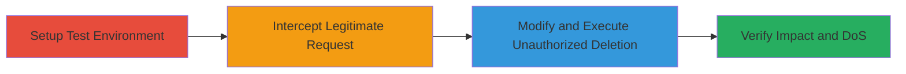

---
tags:
  - authorization-bypass
  - privilege-escalation
  - idor
  - dos
  - web
type: attack_chain
tools:
  - '[[tools/Burp-Proxy]]'
tactics:
  - '[[Privilege Escalation]]'
verified: false
platforms:
  - Web
submitted: true
complexity: medium
created_at: '2023-10-01T00:00:00Z'
procedures:
  - '[[procedures/Setup-Test-Applications-and-Users-in-Fabric-io]]'
  - '[[procedures/Intercept-Legitimate-DELETE-Request-with-Burp-Proxy]]'
  - '[[procedures/Modify-and-Replay-DELETE-Request-for-Unauthorized-Deletion]]'
  - '[[procedures/Verify-Deletion-and-Demonstrate-DoS-in-Fabric-io]]'
step_count: 4
techniques:
  - '[[Exploitation for Privilege Escalation]]'
  - '[[Exploit Public-Facing Application]]'
updated_at: '2025-12-14T17:28:44.814Z'
description: >-
  Multi-stage attack exploiting insufficient authorization checks in Fabric.io
  to delete team members from unauthorized applications, potentially leading to
  denial-of-service.
skill_level: intermediate
impact_level: high
id: 8c70d9ad-03a4-4c7b-8099-45996b9fe7a1
validated: true
mitre_tactics:
  - '[[Privilege Escalation]]'
mitre_techniques:
  - '[[Exploitation for Privilege Escalation]]'
  - '[[Exploit Public-Facing Application]]'
---
# Fabric.io Unauthorized Team Member Deletion via HTTP Parameter Tampering

Multi-stage attack chain demonstrating exploitation of authorization flaws in Fabric.io, allowing an authenticated admin to delete users from apps they do not own by tampering with HTTP DELETE request parameters.

## Chain Metrics Dashboard

| Metric | Value |
|--------|-------|
| Chain Status | Unverified |
| Total Steps | 4 |
| Execution Time | ~15 minutes |
| Skill Level | Intermediate |
| Complexity | Medium |
| Impact Level | High |

## Attack Flow Visualization

## Prerequisites & Requirements

### Required Tools

- [[tools/Burp-Proxy]]

### Target Environment

- Web platform
- Fabric.io service accessible via browser
- Valid admin credentials for at least one application

### Initial Access Requirements

- Authenticated session as an app admin in Fabric.io
- Network access to fabric.io
- Burp Proxy configured as browser proxy

## Detailed Attack Procedures

### Step 1: Setup Test Environment
procedure: [[procedures/Setup-Test-Applications-and-Users-in-Fabric-io]]

**Objective**: Create test applications and users to simulate victim and attacker environments for demonstrating the authorization bypass.

**Instructions**: Log in to Fabric.io as an admin and create two separate applications: one as the victim app (VictimApp) with users Aliceadmin and Alicemember, and one as the hacker app (HackerApp) with users Hackeradmin and Hackermember. Retrieve the app IDs and account IDs for all users.

**Expected Output**: Application IDs (e.g., VictimApp ID: 54ad5e03a25bb8136b000002) and account IDs (e.g., Alicemember ID: 54af48304d8f5b12ff0000fd) noted for later use.

**Success Indicators**:
- Two apps created with distinct users and roles
- IDs successfully retrieved from app settings

### Step 2: Intercept Legitimate Request
procedure: [[procedures/Intercept-Legitimate-DELETE-Request-with-Burp-Proxy]]

**Objective**: Capture a legitimate DELETE request while removing a team member from the attacker's own app to understand the request structure.

**Instructions**: Log in as Hackeradmin, navigate to HackerApp settings > Team members, and attempt to delete Hackermember. Use Burp Proxy to intercept the request. The original request will include account_id, app_id, and admin=true parameters.

**Expected Output**: Intercepted DELETE request like: DELETE /accounts/54aa37d8f61d7749430127ee?admin=true&app_id=54aeafc28bfc55053d000028 HTTP/1.1 Host: fabric.io

**Success Indicators**:
- Request intercepted and visible in Burp Proxy
- Legitimate deletion succeeds in HackerApp

### Step 3: Modify and Execute Unauthorized Deletion
procedure: [[procedures/Modify-and-Replay-DELETE-Request-for-Unauthorized-Deletion]]

**Objective**: Tamper with the intercepted request to target a user in the victim app, bypassing authorization checks.

**Instructions**: In Burp Proxy, modify the account_id to Alicemember's ID (54af48304d8f5b12ff0000fd), change app_id to VictimApp's ID (54ad5e03a25bb8136b000002), and remove the admin=true parameter. Forward the modified request to the server.

**Expected Output**: Server accepts the request without error, deleting the user from the unauthorized app.

**Success Indicators**:
- Modified request sent successfully
- No authorization error returned

### Step 4: Verify Impact and DoS
procedure: [[procedures/Verify-Deletion-and-Demonstrate-DoS-in-Fabric-io]]

**Objective**: Confirm the unauthorized deletion and escalate to DoS by removing the last admin, making the app inaccessible.

**Instructions**: Log in as Aliceadmin and check VictimApp team members to verify Alicemember's removal. Repeat the modification to target Aliceadmin's account_id (54aa4c616bb166b8f300134a). Attempt to access the app or reset password post-deletion.

**Expected Output**: User removed from team list; app becomes inaccessible, and password reset fails (no email sent).

**Success Indicators**:
- Deleted user no longer listed
- App login or reset fails, confirming DoS

## Attack Chain Summary

### Key Achievements

1. Bypassed app-specific authorization to delete users from foreign applications
2. Demonstrated privilege escalation from one app's admin to affect others
3. Achieved DoS by rendering victim app unmanageable

## Technique & Tactic Coverage

### MITRE ATT&CK Techniques

- [[Exploitation for Privilege Escalation]]
- [[Exploit Public-Facing Application]]

### MITRE ATT&CK Tactics

- [[Privilege Escalation]]

---

*Last updated: 2023-10-01T00:00:00Z*
