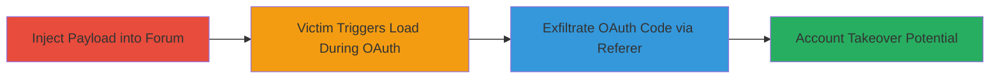

---
tags:
  - oauth-theft
  - referer-leakage
  - forum-injection
  - token-exfiltration
type: attack_chain
tools: []
tactics:
  - '[[Initial Access]]'
  - '[[Collection]]'
verified: false
platforms:
  - Web
submitted: true
complexity: medium
created_at: '2023-10-01T00:00:00Z'
procedures:
  - '[[procedures/Inject-Malicious-Image-Tag-into-Forum-Reply]]'
  - '[[procedures/Trigger-Referer-Leakage-via-Victim-Access]]'
  - '[[procedures/Exfiltrate-and-Utilize-Stolen-OAuth-Code]]'
step_count: 3
techniques:
  - '[[Steal Application Access Token]]'
  - '[[Drive-by Compromise]]'
updated_at: '2025-12-14T17:24:38.993Z'
description: >-
  Multi-stage attack exploiting referer header leakage on
  support.rockstargames.com to steal Facebook OAuth authorization codes through
  malicious image tags injected into forum replies.
skill_level: intermediate
impact_level: high
id: 41576d0c-dbcf-4802-a557-c8fd614f12f8
validated: true
mitre_tactics:
  - '[[Initial Access]]'
  - '[[Collection]]'
mitre_techniques:
  - '[[Steal Application Access Token]]'
  - '[[Drive-by Compromise]]'
---
# Facebook OAuth Code Theft via Referer Header Leakage in Rockstar Support Forum

Multi-stage attack chain demonstrating exploitation of referer header leakage on the support.rockstargames.com forum to steal Facebook OAuth authorization codes, enabling potential account takeover.

## Chain Metrics Dashboard

| Metric | Value |
|--------|-------|
| Chain Status | Unverified |
| Total Steps | 3 |
| Execution Time | ~5 minutes |
| Skill Level | Intermediate |
| Complexity | Medium |
| Impact Level | High |

## Attack Flow Visualization

## Prerequisites & Requirements

### Required Tools

- Web browser for forum interaction
- Server/domain under attacker control to receive exfiltrated data (e.g., simple HTTP logger)

### Target Environment

- Web platform
- support.rockstargames.com Support Community forum
- Active Facebook OAuth integration

### Initial Access Requirements

- Ability to create and post replies on the public forum (no authentication required for reading, but posting may need account)
- Network access to the forum and attacker's server
- No prior access needed beyond public forum participation

## Detailed Attack Procedures

### Step 1: Inject Malicious Payload
procedure: [[procedures/Inject-Malicious-Image-Tag-into-Forum-Reply]]

**Objective**: Embed a malicious  tag in a forum reply to load an external resource from the attacker's domain when viewed.

**Instructions**: Create a forum account if needed, then post a reply in an active thread containing the payload . Ensure the forum parses HTML in replies.

**Expected Output**: Reply posted successfully, visible to other users.

**Success Indicators**:
- Payload visible in the reply HTML when inspected
- No sanitization errors

### Step 2: Lure and Trigger Victim Access
procedure: [[procedures/Trigger-Referer-Leakage-via-Victim-Access]]

**Objective**: Induce victims to view the injected reply while in an active Facebook OAuth flow, causing the referer header to include the sensitive authorization code.

**Instructions**: Promote the thread or wait for natural traffic. Victims must click through Facebook OAuth login on the site, then access the forum reply, triggering the img load.

**Expected Output**: Victim's browser loads the img, sending referer with OAuth code to attacker's server.

**Success Indicators**:
- Incoming requests to attacker's server with referer containing OAuth parameters
- Logs show referer like "https://support.rockstargames.com/...&code=AUTH_CODE"

### Step 3: Exfiltrate and Utilize OAuth Code
procedure: [[procedures/Exfiltrate-and-Utilize-Stolen-OAuth-Code]]

**Objective**: Capture the leaked OAuth code from the referer header and exchange it for access tokens to hijack the victim's Facebook-linked account.

**Instructions**: Monitor server logs for incoming GET requests with referer headers. Extract the code parameter, then use it in a POST to Facebook's token endpoint to obtain tokens.

**Expected Output**: Valid access token retrieved, allowing account actions.

**Success Indicators**:
- OAuth code successfully parsed from referer
- Token exchange succeeds without errors

## Attack Chain Summary

### Key Achievements

1. Successful injection of unsanitized HTML into public forum
2. Leakage of sensitive OAuth codes via unsecured referer headers
3. Potential for unauthorized access to user accounts linked via Facebook

## Technique & Tactic Coverage

### MITRE ATT&CK Techniques

- [[Steal Application Access Token]] Steal Application Access Token
- [[Drive-by Compromise]] Drive-by Compromise

### MITRE ATT&CK Tactics

- [[Initial Access]] Initial Access
- [[Collection]] Collection

---
*Last updated: 2023-10-01T00:00:00Z*
