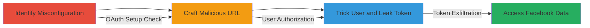

# Facebook OAuth Misconfiguration Leading to Access Token Theft via Open Redirect

Multi-stage attack chain demonstrating exploitation of Gratipay's misconfigured Facebook OAuth setup to steal user access tokens, enabling unauthorized access to Facebook profiles, emails, and friends lists.

## Chain Metrics Dashboard

| Metric | Value |
|--------|-------|
| Chain Status | Unverified |
| Total Steps | 3 |
| Execution Time | ~5 minutes |
| Skill Level | Intermediate |
| Complexity | Medium |
| Impact Level | High |

## Attack Flow Visualization

## Prerequisites & Requirements

### Required Tools

- Web browser for testing
- Access to create a Gratipay profile

### Target Environment

- Web platform with Facebook OAuth integration (e.g., Gratipay)
- No specific ports; operates over HTTPS
- Attacker needs a Gratipay account to configure a profile redirect

### Initial Access Requirements

- No prior credentials needed
- Public access to Gratipay and Facebook app details
- Ability to observe OAuth flows without authentication

## Detailed Attack Procedures

### Step 1: Identify Misconfiguration
procedure: [[procedures/Identify-Facebook-OAuth-Misconfiguration]]

**Objective**: Detect the absence of valid redirect URIs in the Facebook app configuration, enabling arbitrary redirects.

**Instructions**: Inspect Gratipay's Facebook login flow by navigating to the OAuth authorization endpoint. Note the lack of a dedicated callback like /facebook/callback. Verify in the Facebook app console (if accessible) that no redirect URIs are specified, allowing unvalidated redirect_uri parameters.

**Expected Output**: Confirmation that OAuth URLs accept arbitrary redirect_uri without validation.

**Success Indicators**:
- No dedicated redirect endpoint observed
- Arbitrary redirect_uri parameter accepted in test URLs

### Step 2: Craft Malicious OAuth Authorization URL
procedure: [[procedures/Craft-Malicious-OAuth-Authorization-URL]]

**Objective**: Construct a phishing link that redirects authorized users to an attacker-controlled Gratipay profile pointing to an external domain.

**Instructions**: Create a Gratipay profile (e.g., ~attacka/) and configure its redirect to an attacker-controlled site like example.com. Build the OAuth URL using the known client_id (144124902390407) and scopes: https://www.facebook.com/dialog/oauth?response_type=code&client_id=144124902390407&redirect_uri=https://gratipay.com/~attacka/&scope=public_profile%2Cemail%2Cuser_friends&state=mjemgKNb0s24lbEqBcyVqDEVNoYDYs. Distribute this link to potential victims via phishing.

**Expected Output**: A functional URL that, when clicked, prompts Facebook authorization and redirects to the attacker's profile.

**Success Indicators**:
- URL loads Facebook dialog without errors
- Redirect occurs to Gratipay profile after authorization

### Step 3: Exploit Redirect for Token Leak via Referrer
procedure: [[procedures/Exploit-Redirect-for-Token-Leak-via-Referrer]]

**Objective**: Leak the Facebook access token to the attacker's domain through referrer headers during page load and third-party image fetches.

**Instructions**: Once the victim authorizes, they are redirected to the attacker's Gratipay profile, which loads content from example.com. The browser's referrer header includes the access token from the OAuth callback. Additionally, profile images sourced from external domains (e.g., ls.googleusercontent.com) trigger further referrer leaks when loaded.

**Expected Output**: Access token captured on the attacker's server via HTTP referrer logs.

**Success Indicators**:
- Referrer logs show token in requests to example.com
- Token usable to query Facebook API for user data

## Attack Chain Summary

### Key Achievements

1. Identified OAuth misconfiguration allowing arbitrary redirects
2. Crafted phishing URL to hijack authorization flow
3. Exfiltrated access tokens via referrer headers, granting Facebook account access

## Technique & Tactic Coverage

### MITRE ATT&CK Techniques

- [[Exploit Public-Facing Application]]
- [[Steal Application Access Token]]

### MITRE ATT&CK Tactics

- [[Initial Access]]
- [[Credential Access]]

---
*Last updated: 2023-10-01T00:00:00Z*
