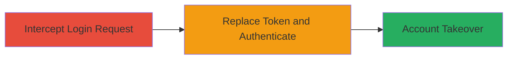

---
tags:
  - authentication-bypass
  - account-takeover
  - facebook-oauth
type: attack_chain
tools:
  - '[[tools/Burp-Suite]]'
tactics:
  - '[[Initial Access]]'
commands:
  - '[[commands/reverb-facebook-login-post]]'
platforms:
  - iOS
  - Web
complexity: medium
procedures:
  - '[[procedures/Intercept-and-Replay-Facebook-Login-Request]]'
  - '[[procedures/Replace-Access-Token-for-Authentication-Bypass]]'
step_count: 2
techniques:
  - '[[Valid Accounts]]'
description: >-
  Exploits server-side failure to validate Facebook access tokens, allowing
  tokens from other apps to authenticate as Reverb users
skill_level: intermediate
impact_level: high
id: 1db52039-57a6-4439-a040-e6b312c2343f
created_at: '2025-12-11T06:10:15.374Z'
updated_at: '2025-12-11T06:10:15.374Z'
verified: false
validated: true
submitted: true
mitre_tactics:
  - '[[TA0001]]'
mitre_techniques:
  - '[[T1078]]'
---
# Facebook Token Reuse for Reverb Account Takeover via Authentication Bypass

Multi-stage attack chain demonstrating a complete attack workflow exploiting improper validation of Facebook access tokens in Reverb.com's iOS app, leading to full account takeover.

## Chain Metrics Dashboard

| Metric | Value |
|--------|-------|
| Chain Status | Unverified |
| Total Steps | 2 |
| Execution Time | ~5 minutes |
| Skill Level | Intermediate |
| Complexity | Medium |
| Impact Level | High |

## Attack Flow Visualization



## Prerequisites & Requirements

### Required Tools

- [[tools/Burp-Suite]]

### Target Environment

- iOS application with Facebook login integration
- Web endpoint at reverb.com
- Required services/ports: HTTPS (443) to reverb.com and Facebook API
- Network access requirements: Ability to intercept HTTP traffic from iOS app

### Initial Access Requirements

- Access to a Facebook access token from another app (e.g., Lyst or Letgo) associated with the target user
- No prior credentials needed for Reverb, but token from compromised app required
- Man-in-the-middle position for traffic interception

## Detailed Attack Procedures

### Step 1: Intercept and Replay the Vulnerable Facebook Login Request - [[procedures/Intercept-and-Replay-Facebook-Login-Request]]

**Procedure**: [[procedures/Intercept-and-Replay-Facebook-Login-Request]]

**Objective**: Capture and analyze the Facebook login request to identify the vulnerability in token validation.

**Expected Output**: Successful capture of the POST request to /api/auth/facebook with the fb_token parameter.

**Success Indicators**:
- Request intercepted showing JSON body with fb_token
- Ability to replay the request without modification

First, use [[tools/Burp-Suite]] to intercept the login traffic from the Reverb iOS app. Set up Burp as a proxy and capture the POST request:

```bash
POST /api/auth/facebook HTTP/1.1
Host: reverb.com
{"fb_token":"EAAJ8Of8DF2IBAL5wChKjuRHSV2VEWpm7eCz2IMqqJy1lJJq8ooyQuKHcOXn6aZCZAIrCtClbrZBdUGhC3FbvncNYk1E0k7AOktEhDjUPwHPOh3x29JURSGIGPBlZCj5WlBHhHzI5KYAPbuXKiZBGTkKZABZATh9JjTqEDhRubYSEiTmhjeytx5moFH9naZB6XjZBRUMkmcbucFD9Vf8IoFZAD1LGngi6j5pXFGcTFPfBEudAZDZD"}
```

Replay the request to confirm it authenticates successfully. This step confirms the endpoint's behavior.

### Step 2: Use an Access Token from Another App to Login - [[procedures/Replace-Access-Token-for-Authentication-Bypass]]

**Procedure**: [[procedures/Replace-Access-Token-for-Authentication-Bypass]]

**Objective**: Substitute the fb_token with one from another Facebook-integrated app to bypass authentication and take over the account.

**Expected Output**: Successful login as the victim user, granting full account access.

**Success Indicators**:
- Response indicates successful authentication
- Access to victim's Reverb account data and functionality

Using [[tools/Burp-Suite]], modify the intercepted request by replacing the fb_token with a token obtained from another app like Lyst or Letgo:

```bash
POST /api/auth/facebook HTTP/1.1
Host: reverb.com
{"fb_token":"[TOKEN_FROM_OTHER_APP]"}
```

Send the modified request. If successful, this achieves account takeover for any user whose token is sourced from a compromised app.

## Attack Chain Summary

### Key Achievements

1. Identification of improper token validation in Facebook OAuth flow
2. Ability to impersonate users via cross-app token reuse
3. Potential for mass account compromises if linked apps are breached

## Technique & Tactic Coverage

### MITRE ATT&CK Techniques

- [[Valid Accounts]]

### MITRE ATT&CK Tactics

- [[Initial Access]]

*Last updated: [TIMESTAMP]*
