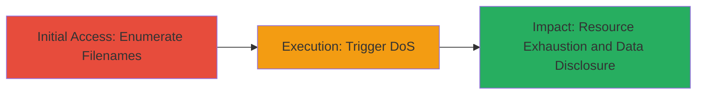

# Filename Enumeration Leading to DoS in Nextcloud Server

Multi-stage attack chain demonstrating exploitation of filename enumeration and uncontrolled resource consumption in Nextcloud Server, allowing unauthorized disclosure of filenames and potential denial of service attacks.

## Chain Metrics Dashboard

| Metric | Value |
|--------|-------|
| Chain Status | Unverified |
| Total Steps | 2 |
| Execution Time | ~5 minutes |
| Skill Level | Intermediate |
| Complexity | Low |
| Impact Level | Low |

## Attack Flow Visualization



## Prerequisites & Requirements

### Required Tools

- No specialized tools required; standard web browser or curl can be used.

### Target Environment

- Nextcloud Server (versions affected by CVE-2017-0885 and CVE-2017-0886)
- Web platform accessible over HTTP/HTTPS
- No specific ports beyond standard 80/443

### Initial Access Requirements

- Network access to the Nextcloud instance
- No authentication required for enumeration if public shares or error responses leak info
- Basic knowledge of URL structures in Nextcloud

## Detailed Attack Procedures

### Step 1: Enumerate Filenames
procedure: [[procedures/Enumerate-Filenames-in-Nextcloud]]

**Objective**: Exploit filename enumeration vulnerability to discover unauthorized sensitive filenames in the Nextcloud file structure.

**Instructions**: Identify the Nextcloud web interface and begin guessing common filenames or paths via direct URL requests. Use trial-and-error with common file extensions and names to probe for existence based on response differences (e.g., 404 vs. 200 or error message leaks).

For example, append potential filenames to the file sharing or public link endpoints:

```bash
curl -I "https://target-nextcloud.com/index.php/apps/files/?dir=/&fileid=123&filename=secret.txt"
```

Observe response headers or body for confirmation of file existence without access.

**Expected Output**: HTTP responses indicating file presence, such as custom error messages or metadata leaks revealing filenames.

**Success Indicators**:
- Different response codes or messages for existing vs. non-existing files
- Partial disclosure of directory structures or file lists

### Step 2: Trigger Denial of Service
procedure: [[procedures/Trigger-DoS-via-Uncontrolled-Resource-Consumption-in-Nextcloud]]

**Objective**: Leverage the enumeration insight or directly exploit uncontrolled resource consumption to exhaust server resources, causing DoS.

**Instructions**: Once potential filenames or paths are identified, send repeated or specially crafted requests to endpoints that trigger high resource usage, such as file preview generation or search functions that consume CPU/memory without bounds.

For instance, automate requests to a resource-intensive endpoint:

```bash
for i in {1..1000}; do curl "https://target-nextcloud.com/index.php/apps/files_sharing/ajax/publicpreview.php?x=2048&y=2048&file=largefile.jpg" & done
```

This floods the server with preview requests, leading to uncontrolled consumption.

**Expected Output**: Server slowdown, timeouts, or complete unresponsiveness after sustained requests.

**Success Indicators**:
- Increased server load metrics (if monitorable)
- Failure of legitimate requests due to resource exhaustion

## Attack Chain Summary

### Key Achievements

1. Unauthorized discovery of sensitive filenames through enumeration.
2. Induction of denial of service via resource exhaustion.
3. Low-severity impact (CVSS 3.7) but potential for chaining with other attacks.

## Technique & Tactic Coverage

### MITRE ATT&CK Techniques

- [[File and Directory Discovery]] File and Directory Discovery
- [[Network Denial of Service]] Network Denial of Service

### MITRE ATT&CK Tactics

- [[Discovery]] Discovery
- [[Impact]] Impact

---
*Last updated: 2023-10-01T00:00:00Z*
