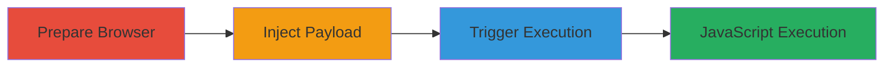

# Firefox-Specific Reflected XSS via Accesskey in ErrMsg Parameter for JavaScript Execution

Multi-stage attack chain demonstrating a complete reflected XSS workflow on a U.S. Department of Defense web asset using Firefox browser-specific behavior.

## Chain Metrics Dashboard

| Metric | Value |
|--------|-------|
| Chain Status | Unverified |
| Total Steps | 3 |
| Execution Time | ~2 minutes |
| Skill Level | Intermediate |
| Complexity | Medium |
| Impact Level | High |

## Attack Flow Visualization



## Prerequisites & Requirements

### Required Tools

- Firefox browser (version supporting accesskey and onclick in reflected HTML)

### Target Environment

- Web platform
- IBM Domino/Lotus Notes (inferred from URL structure)
- Vulnerable login page at https://www.██████.███████/852585B6003EBA25/Login.html?open

### Initial Access Requirements

- Direct network access to the target DoD web asset
- No credentials required for the login page access
- Victim must be using Firefox and tricked into pressing the key combination

## Detailed Attack Procedures

### Step 1: Prepare Firefox Browser
procedure: [[procedures/Prepare-Firefox-Browser-for-XSS-Exploit]]

**Objective**: Set up the required browser environment to exploit the Firefox-specific vulnerability in handling accesskey and onclick attributes.

**Instructions**: Launch Firefox as it is the only browser where the injected HTML attributes trigger JavaScript execution due to its parsing behavior.

**Expected Output**: Firefox browser window open and ready for navigation.

**Success Indicators**:
- Browser confirms Firefox version (e.g., via about:support)
- No extensions interfering with JavaScript execution

### Step 2: Inject XSS Payload into ErrMsg Parameter
procedure: [[procedures/Inject-XSS-Payload-into-ErrMsg-Parameter]]

**Objective**: Navigate to the login page and inject a malicious payload into the ErrMsg parameter to reflect unsanitized HTML attributes.

**Instructions**: Enter the URL with the crafted payload in the address bar:

```url
https://www.██████.███████/852585B6003EBA25/Login.html?open&ErrMsg=invalidlogin%22%20accesskey=%22X%22%20onclick=%22confirm(%27H4CK3D%20BY%20PRAKHAR0X01%27)%22
```

This injects attributes into the error message display, creating a clickable element via accesskey.

**Expected Output**: Page loads with reflected payload in the error message, visible in page source as unsanitized HTML.

**Success Indicators**:
- Error message displays without breaking the page
- Inspect element shows accesskey="X" and onclick attributes injected

### Step 3: Trigger XSS via Accesskey Key Combination
procedure: [[procedures/Trigger-XSS-via-Accesskey-Key-Combination]]

**Objective**: Activate the injected payload to execute arbitrary JavaScript in the victim's browser context.

**Instructions**: With the page loaded, press the Firefox-specific key combination: ALT+SHIFT+X on Windows/Linux or CTRL+ALT+X on macOS. This focuses the accesskey='X' element and fires the onclick handler.

**Expected Output**: Alert dialog appears with "H4CK3D BY PRAKHAR0X01", confirming JavaScript execution.

**Success Indicators**:
- JavaScript alert or confirm dialog triggers
- Browser console logs execution (if enhanced payload used)
- Potential for session hijacking if payload modified to steal cookies

## Attack Chain Summary

### Key Achievements

1. Successful injection of reflected XSS payload exploiting lack of sanitization in ErrMsg.
2. Browser-specific trigger via accesskey leading to onclick JavaScript execution.
3. Demonstration of high-impact client-side compromise requiring minimal user interaction beyond key press.

## Technique & Tactic Coverage

### MITRE ATT&CK Techniques

- [[JavaScript]]

### MITRE ATT&CK Tactics

- [[Execution]]
- [[Collection]]

---
*Last updated: 2023-10-01T00:00:00Z*
