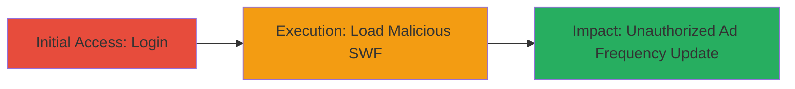

# Flash CSRF to Unauthorizedly Update User Ad Frequency via SWF and PHP Redirector

Multi-stage attack chain demonstrating a complete attack workflow exploiting CSRF via Flash to update user ad frequency on cp-ng.pinion.gg.

## Chain Metrics Dashboard

| Metric | Value |
|--------|-------|
| Chain Status | Unverified |
| Total Steps | 2 |
| Execution Time | ~5 minutes |
| Skill Level | Intermediate |
| Complexity | Medium |
| Impact Level | High |

## Attack Flow Visualization

## Prerequisites & Requirements

### Required Tools

- [[tools/Flash-SWF]]
- [[tools/PHP-Redirector]]

### Target Environment

- Web platform
- Target URL: https://cp-ng.pinion.gg/
- Required services/ports: HTTPS (443)
- Network access requirements: Internet access to load external SWF and PHP redirector

### Initial Access Requirements

- Valid credentials for the target application
- Network position: External attacker with ability to host malicious files
- Prior access needed: None, but victim must be logged in

## Detailed Attack Procedures

### Step 1: Initial Access
procedure: [[procedures/Login-to-Target-Application]]

**Objective**: Establish an authenticated session with the target application to enable the CSRF exploit.

**Instructions**: Navigate to the login page and authenticate using valid credentials. This sets the necessary session cookies for the subsequent CSRF request.

**Expected Output**: Successful login redirect to the dashboard or main page, with authentication cookies set in the browser.

**Success Indicators**:
- Authentication successful, user profile accessible
- Session cookies (e.g., session ID) present in browser developer tools

### Step 2: Execution
procedure: [[procedures/Execute-Flash-CSRF-Attack]]

**Objective**: Exploit the CSRF vulnerability by loading a malicious Flash SWF that sends a POST request via a PHP redirector to update the ad frequency.

**Instructions**: While logged in, load the malicious SWF file in the browser. The SWF will automatically send a POST request with the JSON payload to the PHP redirector, which forwards it to the target endpoint.

**Expected Output**: The ad frequency setting updated to 60% (or specified value) without user interaction, verifiable by checking the user's profile or ad display behavior.

**Success Indicators**:
- Ad frequency modified in the application settings
- No CSRF token errors or blocks during the request

## Attack Chain Summary

### Key Achievements

1. Bypassed browser CSRF protections using Flash's cross-origin capabilities
2. Unauthorized update of sensitive user settings site-wide
3. Demonstrated potential for broader impact on unprotected POST endpoints

## Technique & Tactic Coverage

### MITRE ATT&CK Techniques

- [[Exploit Public-Facing Application]]

### MITRE ATT&CK Tactics

- [[Initial Access]]

---
*Last updated: 2023-10-01T00:00:00Z*
