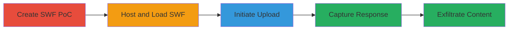

# Flash Cross Domain Policy Bypass via File Upload Redirection in Chrome

Multi-stage attack chain demonstrating a complete attack workflow exploiting Flash Player in Google Chrome to bypass cross-domain policies.

## Chain Metrics Dashboard

| Metric | Value |
|--------|-------|
| Chain Status | Unverified |
| Total Steps | 4 |
| Execution Time | ~10 minutes |
| Skill Level | Intermediate |
| Complexity | Medium |
| Impact Level | High |

## Attack Flow Visualization

## Prerequisites & Requirements

### Required Tools

- [[tools/ActionScript-Compiler]]
- [[tools/PHP-Redirect-Server]]

### Target Environment

- Google Chrome browser with Flash Player enabled
- Attacker-controlled web server for hosting SWF and redirect scripts
- Victim site (e.g., https://plus.google.com) for cross-domain access

### Initial Access Requirements

- User interaction to load the malicious SWF in the browser
- No prior credentials needed; relies on browser vulnerability
- Network access to host files and target site

## Detailed Attack Procedures

### Step 1: Create SWF PoC File
procedure: [[procedures/Create-SWF-PoC-File-Using-ActionScript]]

**Objective**: Develop a Flash SWF file that uses the FileReference class to handle file uploads to a redirect URL, setting up the bypass mechanism.

**Instructions**: Compile an ActionScript file into SWF using the ActionScript Compiler. The script should parse a URL parameter and initiate an upload via FileReference.upload().

**Expected Output**: A functional SWF file named chromeFileUploadCrossDomain.swf.

**Success Indicators**:
- SWF file compiles without errors
- Script correctly handles URL parameter for upload target

### Step 2: Host and Load SWF with Redirect URL
procedure: [[procedures/Host-and-Load-SWF-with-Redirect-URL]]

**Objective**: Host the SWF on an attacker server and load it in the victim's browser with a redirect URL pointing to the target site.

**Instructions**: Upload the SWF to your server and access it via a URL like http://attacker.com/chromeFileUploadCrossDomain.swf?url=redirect.php?input=https://plus.google.com/u/0/. The redirect.php should be configured to perform an open redirect.

**Expected Output**: SWF loads in the browser, prompting for file selection or directly initiating the upload process.

**Success Indicators**:
- SWF loads successfully in Chrome
- Redirect URL is parsed and ready for upload

### Step 3: Initiate File Upload from SWF
procedure: [[procedures/Initiate-File-Upload-from-SWF]]

**Objective**: Trigger the file upload from the SWF to the redirect endpoint, causing a 307 or 308 redirect to the target site.

**Instructions**: In the SWF, call FileReference.upload() with the provided redirect URL. Ensure the redirect script uses HTTP status 307 or 308 to forward the request.

**Expected Output**: Upload request sent to redirect endpoint, which redirects to the target.

**Success Indicators**:
- Upload initiates without errors
- Redirect is followed by Flash/Chrome

### Step 4: Capture Response After Redirect
procedure: [[procedures/Capture-Response-After-Redirect]]

**Objective**: Have Flash follow the redirect, resend the request to the target without cross-domain checks, and capture the response data.

**Instructions**: Listen for the UPLOAD_COMPLETE_DATA event in the SWF to retrieve the target's response content, which is disclosed due to the policy bypass.

**Expected Output**: Target site's content (e.g., HTML from plus.google.com) captured in the event handler.

**Success Indicators**:
- UPLOAD_COMPLETE_DATA event fires with cross-origin content
- Content can be logged or exfiltrated

## Attack Chain Summary

### Key Achievements

1. Bypassed Flash cross-domain policy in Chrome via upload redirects
2. Read unauthorized content from target websites
3. Demonstrated potential for further attacks like unauthorized uploads

## Technique & Tactic Coverage

### MITRE ATT&CK Techniques

- [[Exploit Public-Facing Application]]
- [[JavaScript]]

### MITRE ATT&CK Tactics

- [[Initial Access]]
- [[Collection]]

---

*Last updated: 2023-10-01T00:00:00Z*
