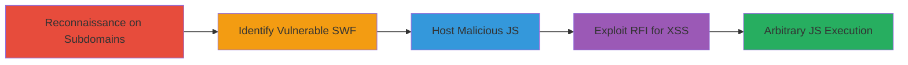

# Flash XSS via Remote File Inclusion in Outdated FlowPlayer SWF

Multi-stage attack chain demonstrating exploitation of a Flash-based XSS vulnerability in an outdated FlowPlayer SWF file (version 3.2.15), allowing remote file inclusion (RFI) via the 'config' parameter. This leads to arbitrary JavaScript execution in the context of the bin.pinion.gg subdomain, potentially enabling defacement, open redirects, cross-domain cookie setting, and persistent XSS if embedded elsewhere. The attack begins with reconnaissance on outscope subdomains, identifies the vulnerable asset through a cache manifest, hosts a malicious payload, and triggers execution by modifying the SWF URL.

## Chain Metrics Dashboard

| Metric | Value |
|--------|-------|
| Chain Status | Unverified |
| Total Steps | 4 |
| Execution Time | ~10 minutes |
| Skill Level | Intermediate |
| Complexity | Medium |
| Impact Level | High |

## Attack Flow Visualization

## Prerequisites & Requirements

### Required Tools

- Web browser for manual inspection
- Web server to host malicious JS (e.g., Apache or Python SimpleHTTPServer)

### Target Environment

- Web platform with embedded Flash content
- Outdated FlowPlayer SWF (version 3.2.15 or similar vulnerable versions)
- Accessible subdomains for reconnaissance

### Initial Access Requirements

- No credentials required
- Public network access to target subdomains
- Knowledge of subdomain enumeration techniques

## Detailed Attack Procedures

### Step 1: Reconnaissance on Target Subdomains
procedure: [[procedures/Reconnaissance-on-Target-Subdomains]]

**Objective**: Identify outscope subdomains to expand the attack surface and locate potential vulnerable assets.

**Instructions**: Manually enumerate and examine subdomains of the target domain, such as *.pinion.gg, focusing on assets like cache manifests or embedded media files. Use browser developer tools or direct URL access to inspect files.

**Expected Output**: List of subdomains and referenced files, e.g., templ4d2.pinion.gg/motd2.manifest.

**Success Indicators**:
- Subdomains like templ4d2.pinion.gg discovered
- Interesting files (e.g., manifest files) identified for further inspection

### Step 2: Identify Vulnerable FlowPlayer SWF Reference
procedure: [[procedures/Identify-Vulnerable-FlowPlayer-SWF-Reference]]

**Objective**: Locate references to outdated and vulnerable SWF files that can be exploited for XSS.

**Instructions**: Access the identified cache manifest file, such as http://templ4d2.pinion.gg/motd2.manifest, and parse its contents to find references to SWF files. Verify the version against known vulnerabilities (e.g., FlowPlayer 3.2.15 is susceptible to Flash XSS via ExternalInterface.Call).

**Expected Output**: URL of the vulnerable SWF, e.g., http://bin.pinion.gg/bin/flowplayer.commercial-3.2.15.swf.

**Success Indicators**:
- SWF file reference found in manifest
- Version confirmed as vulnerable (3.2.15)

### Step 3: Host Malicious JavaScript Payload
procedure: [[procedures/Host-Malicious-JavaScript-Payload]]

**Objective**: Prepare a remote JavaScript file containing payloads to execute arbitrary code upon inclusion.

**Instructions**: Create a JavaScript file (e.g., test.js) with test payloads like `alert(document.cookie);` and `alert(document.domain);`. Host it on a controllable remote server, ensuring it's publicly accessible via HTTP.

**Expected Output**: Accessible URL for the malicious JS, e.g., http://[redacted]/test.js.

**Success Indicators**:
- JS file hosted and verifiable via browser
- Payloads confirm execution context (cookies, domain)

### Step 4: Exploit Flash XSS via Remote File Inclusion
procedure: [[procedures/Exploit-Flash-XSS-via-Remote-File-Inclusion]]

**Objective**: Trigger the RFI vulnerability to load and execute the malicious JS in the target's subdomain context.

**Instructions**: Append the 'config' parameter to the vulnerable SWF URL, pointing to the hosted malicious JS. Access the modified URL in a browser supporting Flash.

**Expected Output**: Popups or alerts displaying document.cookie and document.domain, confirming JS execution in bin.pinion.gg context.

**Success Indicators**:
- Arbitrary JS executes without errors
- Domain and cookie access demonstrated
- Potential for further impacts like defacement or redirects

## Attack Chain Summary

### Key Achievements

1. Discovered vulnerable SWF through subdomain recon and manifest inspection
2. Hosted and loaded malicious JS via RFI in the 'config' parameter
3. Achieved arbitrary JS execution, bypassing Flash security for XSS
4. Highlighted risks of outdated embedded Flash content

## Technique & Tactic Coverage

### MITRE ATT&CK Techniques

- [[Exploit Public-Facing Application]] Exploit Public-Facing Application
- [[JavaScript]] JavaScript

### MITRE ATT&CK Tactics

- [[Initial Access]] Initial Access
- [[Execution]] Execution

---

*Last updated: 2023-10-01T00:00:00Z*
