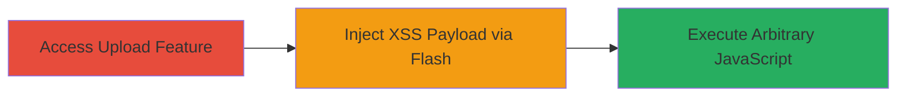

# Flash-based SOME XSS via Plupload on Uber Newsroom

## Overview

This attack chain demonstrates a 'SOME' XSS vulnerability (likely Stored or Similar Origin Method Execution) on newsroom.uber.com, exploited through the plupload.flash.swf file used in Flash-based file upload functionality. Discovered by jamesclyde on July 10, 2016, and reported via HackerOne (Report #150375), the vulnerability allows attackers to inject malicious code via the Flash uploader, leading to arbitrary JavaScript execution in the context of users' browsers. The impact includes potential code injection, session hijacking, or data theft, though specific exploitation outcomes depend on the payload. This chain focuses on the core exploitation step, as detailed attack steps were not publicly disclosed in the report.

## Chain Metrics Dashboard

| Metric | Value |
|--------|-------|
| Chain Status | Unverified |
| Total Steps | 1 |
| Execution Time | ~5 minutes |
| Skill Level | Intermediate |
| Complexity | Medium |
| Impact Level | High |

## Attack Flow Visualization

## Prerequisites & Requirements

### Required Tools

- Web browser with Flash support (e.g., legacy Chrome or Firefox with Flash enabled)
- Developer tools for payload crafting

### Target Environment

- Platform: Web application (newsroom.uber.com)
- Required services/ports: HTTP/HTTPS on port 80/443
- Tech stack: Flash-based uploads via Plupload library
- Network access requirements: Public internet access to the target site

### Initial Access Requirements

- No credentials required (public-facing vulnerability)
- Direct access to the file upload interface on newsroom.uber.com
- Flash player enabled in the browser (note: Flash is deprecated post-2020, but relevant for historical context)

## Detailed Attack Procedures

### Step 1: Exploit Flash XSS in Upload
procedure: [[procedures/Exploit-Flash-based-XSS-in-Plupload]]

**Objective**: Inject a malicious payload through the Plupload Flash uploader to execute arbitrary JavaScript in the victim's browser context.

**Instructions**: Navigate to the file upload section on newsroom.uber.com, which uses plupload.flash.swf for handling uploads. Craft an XSS payload that exploits the Flash file's handling of user-supplied input (e.g., filename or metadata parameters passed to the SWF). Use browser developer tools to intercept and modify the Flash upload request, injecting JavaScript such as `alert('XSS')` or more advanced payloads for data exfiltration. Trigger the upload to execute the payload.

**Expected Output**: Successful payload execution, visible as a JavaScript alert or network request to an attacker-controlled server.

**Success Indicators**:
- JavaScript code executes without errors in the browser console
- Arbitrary code runs in the context of newsroom.uber.com domain
- Potential for cookie theft or DOM manipulation confirmed via payload response

## Attack Chain Summary

### Key Achievements

1. Bypassed input sanitization in Flash-based upload to inject XSS payload
2. Achieved arbitrary JavaScript execution in user browsers visiting the site
3. Demonstrated code injection impact on a public-facing Uber subdomain

## Technique & Tactic Coverage

### MITRE ATT&CK Techniques

- [[Exploit Public-Facing Application]] Exploit Public-Facing Application
- [[JavaScript]] JavaScript

### MITRE ATT&CK Tactics

- [[Initial Access]] Initial Access
- [[Execution]] Execution

---
*Last updated: 2023-10-01T00:00:00Z*
