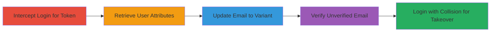

---
tags:
  - account-takeover
  - aws-cognito
  - email-collision
  - auth-bypass
  - misconfiguration
type: attack_chain
tools:
  - '[[tools/AWS-CLI]]'
tactics:
  - '[[Initial Access]]'
  - '[[Persistence]]'
verified: false
platforms:
  - Web
  - AWS
submitted: true
complexity: medium
created_at: '2023-10-01T00:00:00Z'
procedures:
  - '[[procedures/Intercept-Flickr-Login-to-Obtain-Access-Token]]'
  - '[[procedures/Retrieve-Cognito-User-Attributes]]'
  - '[[procedures/Update-Cognito-Email-to-Case-Variant]]'
  - '[[procedures/Verify-Cognito-Email-Update]]'
  - '[[procedures/Perform-Flickr-Account-Takeover-Login]]'
step_count: 5
techniques:
  - '[[Valid Accounts]]'
  - '[[T1078.004]]'
  - '[[Account Manipulation]]'
updated_at: '2025-12-14T17:33:34.451Z'
description: >-
  Multi-stage attack exploiting AWS Cognito misconfigurations in Flickr to
  enable account takeover through unverified email changes and case-sensitive
  collisions.
skill_level: intermediate
impact_level: high
id: 7992b34a-e87c-4a82-84be-6dbaa2ce092c
validated: true
mitre_tactics:
  - '[[Initial Access]]'
  - '[[Persistence]]'
mitre_techniques:
  - '[[Valid Accounts]]'
  - '[[T1078.004]]'
  - '[[Account Manipulation]]'
---
# Flickr Account Takeover via AWS Cognito Email Collision

Multi-stage attack chain demonstrating a complete workflow for taking over a Flickr account by exploiting AWS Cognito's lack of email verification and Flickr's case-insensitive email normalization, allowing attackers to create colliding email variants.

## Chain Metrics Dashboard

| Metric | Value |
|--------|-------|
| Chain Status | Unverified |
| Total Steps | 5 |
| Execution Time | ~10 minutes |
| Skill Level | Intermediate |
| Complexity | Medium |
| Impact Level | High |

## Attack Flow Visualization



## Prerequisites & Requirements

### Required Tools

- [[tools/AWS-CLI]]

### Target Environment

- Web platform with Flickr authentication via AWS Cognito
- AWS region: us-east-1
- Attacker must have their own Flickr account credentials

### Initial Access Requirements

- Knowledge of victim's email address
- Attacker's Flickr login credentials (email and password)
- Network access to intercept requests (e.g., via proxy like Burp Suite)
- AWS CLI configured with no credentials (token-based auth)

## Detailed Attack Procedures

### Step 1: Obtain Access Token
procedure: [[procedures/Intercept-Flickr-Login-to-Obtain-Access-Token]]

**Objective**: Intercept the login process to extract an AWS Cognito access token for API access.

**Instructions**: Use a proxy tool to intercept the POST request to https://identity.flickr.com/ during login. Capture the access token from the response.

**Expected Output**: JSON response containing "AuthenticationResult" with "AccessToken" (e.g., eyJraWQiOiJPVj...").

**Success Indicators**:
- Access token obtained and valid for Cognito API calls
- Token includes necessary scopes for user attribute management

### Step 2: Retrieve User Attributes
procedure: [[procedures/Retrieve-Cognito-User-Attributes]]

**Objective**: Fetch the attacker's current user details from Cognito to inspect email and verification status.

**Instructions**: Execute [[commands/aws-cognito-get-user]] with the obtained access token:

```bash
aws cognito-idp get-user --region us-east-1 --access-token eyJraWQiOiJPVj[...] (redacted token)
```

**Expected Output**: JSON with UserAttributes including email, email_verified: true, and other details.

**Success Indicators**:
- User attributes retrieved successfully
- Current email confirmed

### Step 3: Update Email to Case-Variant
procedure: [[procedures/Update-Cognito-Email-to-Case-Variant]]

**Objective**: Change the attacker's email to a case-sensitive variant of the victim's email, creating a collision opportunity.

**Instructions**: Use [[commands/aws-cognito-update-user-attributes]] to set the email:

```bash
aws cognito-idp update-user-attributes --region us-east-1 --access-token eyJraWQ[...] (redacted token) --user-attributes Name=email,Value=flickr-Benign@lauritz-holtmann.de
```

**Expected Output**: JSON response with CodeDeliveryDetailsList indicating verification email sent (but not required).

**Success Indicators**:
- Update succeeds without errors
- No immediate verification enforcement

### Step 4: Verify Email Update
procedure: [[procedures/Verify-Cognito-Email-Update]]

**Objective**: Confirm the email change and note the lack of verification enforcement.

**Instructions**: Re-execute [[commands/aws-cognito-get-user]] to check the update:

```bash
aws cognito-idp get-user --region us-east-1 --access-token eyJraWQi[...] (redacted token)
```

**Expected Output**: JSON showing updated email and email_verified: false.

**Success Indicators**:
- Email updated to variant
- email_verified remains false, allowing unverified login

### Step 5: Perform Account Takeover Login
procedure: [[procedures/Perform-Flickr-Account-Takeover-Login]]

**Objective**: Log in using the modified email variant and attacker's password to access the victim's account due to normalization.

**Instructions**: Send a login POST request to https://identity.flickr.com/ using the exact case-variant email and attacker's password. Flickr normalizes the email, matching the victim's normalized address.

**Expected Output**: Successful authentication and access to the victim's Flickr account dashboard.

**Success Indicators**:
- Login succeeds without verification prompt
- Access to victim's photos, settings, and data

## Attack Chain Summary

### Key Achievements

1. Bypassed email verification in AWS Cognito via API
2. Exploited case-insensitive normalization for email collisions
3. Achieved full account takeover with only victim's email knowledge

## Technique & Tactic Coverage

### MITRE ATT&CK Techniques

- [[Valid Accounts]] Valid Accounts
- [[T1078.004]] Cloud Accounts
- [[Account Manipulation]] Account Manipulation

### MITRE ATT&CK Tactics

- [[Initial Access]] Initial Access
- [[Persistence]] Persistence

---
*Last updated: 2023-10-01T00:00:00Z*
