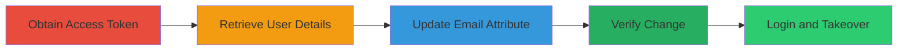

# Flickr Account Takeover via AWS Cognito Email Manipulation

Multi-stage attack chain demonstrating a complete account takeover workflow by exploiting improper authentication in Flickr's AWS Cognito setup.

## Chain Metrics Dashboard

| Metric | Value |
|--------|-------|
| Chain Status | Unverified |
| Total Steps | 5 |
| Execution Time | ~10 minutes |
| Skill Level | Intermediate |
| Complexity | Medium |
| Impact Level | High |

## Attack Flow Visualization



## Prerequisites & Requirements

### Required Tools

- [[tools/AWS-Command-Line-Interface]]

### Target Environment

- Platform: Web, AWS
- Services: Amazon Cognito User Pool
- Tech Stack: AWS Cognito

### Initial Access Requirements

- Attacker-controlled Flickr account credentials
- Victim's email address
- Network access to Flickr and AWS Cognito endpoints

## Detailed Attack Procedures

### Step 1: Obtain Access Token - [[procedures/Obtain-Cognito-Access-Token]]

**Procedure**: [[procedures/Obtain-Cognito-Access-Token]]

**Objective**: Log in with an attacker-controlled account to obtain an AWS Cognito access token by intercepting the login request.

**Expected Output**: Captured access token from the POST request to AWS Cognito.

**Success Indicators**:
- Successful login and interception of the access token.
- Token is valid for subsequent API calls.

Intercept the POST request to AWS Cognito during login from https://identity.flickr.com/, providing username, password, and device key in the AuthParameters.

### Step 2: Retrieve User Details - [[procedures/Retrieve-User-Details-via-AWS-CLI]]

**Procedure**: [[procedures/Retrieve-User-Details-via-AWS-CLI]]

**Objective**: Use the access token to fetch current user attributes via AWS CLI.

**Expected Output**: JSON object with user attributes including email.

**Success Indicators**:
- Retrieval of user details confirms the token is working.
- Email attribute is visible and can be targeted for update.

Use [[commands/aws-cognito-get-user]] to retrieve details:

```bash
aws cognito-idp get-user --region us-east-1 --access-token eyJraWQiOiJPVj[...]]
```

### Step 3: Update Email Attribute - [[procedures/Update-User-Email-Attribute]]

**Procedure**: [[procedures/Update-User-Email-Attribute]]

**Objective**: Change the email attribute to a case-varied version of the victim's email.

**Expected Output**: JSON with CodeDeliveryDetailsList indicating email change.

**Success Indicators**:
- Email is updated without verification.
- No errors from the API call.

Execute [[commands/aws-cognito-update-user-attributes]]:

```bash
aws cognito-idp update-user-attributes --region us-east-1 --access-token eyJraWQ[...]] --user-attributes Name=email,Value=flickr-Benign@lauritz-holtmann.de
```

### Step 4: Verify Email Change - [[procedures/Verify-Email-Change]]

**Procedure**: [[procedures/Verify-Email-Change]]

**Objective**: Confirm the email change and that it is unverified.

**Expected Output**: JSON showing updated email with email_verified=false.

**Success Indicators**:
- Confirmation of unverified status.
- Email matches the case-varied victim email.

Run [[commands/aws-cognito-get-user-post-update]]:

```bash
aws cognito-idp get-user --region us-east-1 --access-token eyJraWQi[...]]
```

### Step 5: Login with Manipulated Email - [[procedures/Login-with-Manipulated-Email]]

**Procedure**: [[procedures/Login-with-Manipulated-Email]]

**Objective**: Log in to the victim's account using the manipulated email and attacker's password.

**Expected Output**: Successful login to the victim's Flickr account.

**Success Indicators**:
- Access to victim's account data.
- No victim interaction required.

Log in to Flickr using the case-sensitive victim email and attacker's password, ensuring the HTTP request preserves exact capitalization.

## Attack Chain Summary

### Key Achievements

1. Bypassed UI restrictions on email changes via Cognito API.
2. Exploited case-insensitivity in email normalization for collision.
3. Achieved full account takeover without victim interaction.

## Technique & Tactic Coverage

### MITRE ATT&CK Techniques

- [[Valid Accounts]]
- [[Modify Authentication Process]]

### MITRE ATT&CK Tactics

- [[Initial Access]]
- [[Persistence]]

---

*Last updated: 2023-10-01T00:00:00Z*
