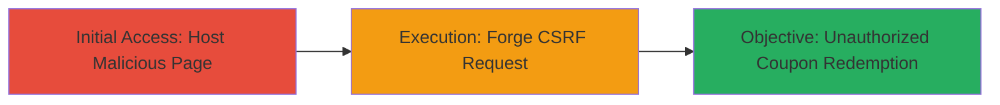

# Force Unauthorized Coupon Redemption via CSRF in Instacart

Multi-stage attack chain demonstrating a CSRF vulnerability in Instacart's redeem coupon feature, allowing attackers to forge requests from malicious sites to redeem coupons on behalf of authenticated users. Reported on June 30, 2016, via HackerOne, but deemed low-impact due to fraud prevention limits on single-entity abuse.

## Chain Metrics Dashboard

| Metric | Value |
|--------|-------|
| Chain Status | Unverified |
| Total Steps | 2 |
| Execution Time | ~5 minutes |
| Skill Level | Intermediate |
| Complexity | Medium |
| Impact Level | Medium |

## Attack Flow Visualization

## Prerequisites & Requirements

### Required Tools

- Web browser for testing
- Text editor for crafting HTML

### Target Environment

- Web platform
- Authenticated Instacart user session
- Access to host malicious content (e.g., phishing site)

### Initial Access Requirements

- Victim must be authenticated to Instacart
- Network access to Instacart's web app
- No prior access needed beyond social engineering to visit malicious site

## Detailed Attack Procedures

### Step 1: Prepare Malicious Page
procedure: [[procedures/Exploit-CSRF-in-Coupon-Redemption]]

**Objective**: Create a webpage that automatically submits a forged request to Instacart's coupon redemption endpoint when visited by an authenticated user.

**Instructions**: Craft an HTML page with an auto-submitting form targeting the vulnerable endpoint. Host it on a controllable server (e.g., via GitHub Pages or a simple HTTP server). Include social engineering to lure the victim (e.g., via email or link in a forum).

**Expected Output**: A hosted HTML page that, when loaded in a browser with an active Instacart session, triggers the redemption.

**Success Indicators**:
- Page loads and form submits silently
- No user interaction required beyond visiting the page

### Step 2: Trigger Redemption and Verify
procedure: [[procedures/Exploit-CSRF-in-Coupon-Redemption]]

**Objective**: Force the redemption and confirm impact, noting limitations from fraud controls.

**Instructions**: Direct the victim to the malicious page. Monitor for redemption confirmation via Instacart's response or user account changes. Test locally by authenticating to Instacart and loading the page in the same browser.

**Expected Output**: Coupon redeemed in the victim's account without direct interaction; potential fraud flags if abused excessively.

**Success Indicators**:
- Coupon applied to account
- Request succeeds (HTTP 200 or success response)
- Limited by Instacart's fraud prevention (e.g., rate limits per entity)

## Attack Chain Summary

### Key Achievements

1. Forged cross-origin request to redeem coupon without CSRF token validation
2. Demonstrated potential for unauthorized actions on authenticated sessions
3. Highlighted mitigation via backend fraud controls reducing real-world impact

## Technique & Tactic Coverage

### MITRE ATT&CK Techniques

- [[Exploit Public-Facing Application]]

### MITRE ATT&CK Tactics

- [[Initial Access]]

---
*Last updated: 2023-10-01T00:00:00Z*
