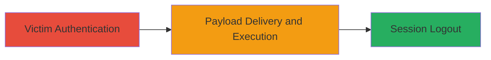

---
tags:
  - csrf
  - logout
  - denial-of-service
  - web
type: attack_chain
tools: []
tactics:
  - '[[Initial Access]]'
commands: []
platforms:
  - Web
complexity: low
procedures:
  - '[[procedures/Access-Weblate-Login-and-Authenticate]]'
  - '[[procedures/Trigger-Logout-with-Malicious-CSRF-Payload]]'
step_count: 2
techniques:
  - '[[Drive-by Compromise]]'
description: >-
  An attack chain exploiting a CSRF protection misconfiguration in Weblate's
  profile page to force logged-in users to log out by submitting invalid CSRF
  tokens, leading to session disruption and potential loss of unsaved
  translation work.
skill_level: low
impact_level: medium
id: b1bd89e3-9f4c-4369-bcd7-9487231cd4b4
created_at: '2025-12-14T17:27:15.914Z'
updated_at: '2025-12-14T17:27:15.914Z'
verified: false
validated: true
submitted: true
mitre_tactics:
  - '[[Initial Access]]'
mitre_techniques:
  - '[[Drive-by Compromise]]'
---
# Force User Logout via CSRF Misconfiguration in Weblate Profile

Multi-stage attack chain demonstrating a complete attack workflow exploiting a CSRF token handling flaw in Weblate to disrupt user sessions.

## Chain Metrics Dashboard

| Metric | Value |
|--------|-------|
| Chain Status | Unverified |
| Total Steps | 2 |
| Execution Time | ~1 minute |
| Skill Level | Low |
| Complexity | Low |
| Impact Level | Medium |

## Attack Flow Visualization



## Prerequisites & Requirements

### Required Tools

- None (uses basic HTML file creation)

### Target Environment

- Web platform running Weblate (e.g., https://hosted.weblate.org)
- Required services/ports: HTTPS on port 443
- Network access requirements: Internet access for attacker and victim

### Initial Access Requirements

- No prior credentials for attacker; victim must have a valid Weblate account
- Network position: Attacker hosts or distributes HTML file via email/link
- Prior access needed: None, relies on social engineering to get victim to click

## Detailed Attack Procedures

### Step 1: Victim Accesses Weblate and Authenticates
procedure: [[procedures/Access-Weblate-Login-and-Authenticate]]

**Objective**: Ensure the victim is logged into their Weblate account, establishing an active session that can be targeted for disruption.

**Instructions**: The victim navigates to the Weblate login page and enters valid credentials to authenticate. This step sets up the authenticated session vulnerable to the CSRF exploit.

**Expected Output**: Successful login redirect to the Weblate dashboard, with an active user session.

**Success Indicators**:
- Victim sees personalized dashboard or profile elements
- Session cookies are set in the browser

### Step 2: Deliver and Execute Malicious CSRF Payload
procedure: [[procedures/Trigger-Logout-with-Malicious-CSRF-Payload]]

**Objective**: Trick the victim into submitting a POST request to the profile endpoint with an invalid or empty CSRF token, triggering an unintended logout due to the misconfiguration.

**Instructions**: The attacker creates an HTML file (CSRF.html) containing a form that auto-submits a POST to https://hosted.weblate.org/accounts/profile without a valid CSRF token. Distribute this file via email, link, or hosted website. When the logged-in victim interacts with it (e.g., opens and clicks), the form submits, causing the server to log out the user.

Example HTML content for CSRF.html:

```html
<!DOCTYPE html>
<html>
<body>
<form id="csrfForm" action="https://hosted.weblate.org/accounts/profile" method="post">
    <input type="hidden" name="csrfmiddlewaretoken" value="">
    <input type="submit" value="Click to Update Profile">
</form>
<script>
    document.getElementById('csrfForm').submit();
</script>
</body>
</html>
```

Host the file or send it to the victim. Upon execution in the victim's browser while logged in, the request processes the empty token as a logout trigger.

**Expected Output**: Victim is redirected to the login page with an error message indicating logout; session is terminated.

**Success Indicators**:
- Victim loses access to their session
- Browser shows login prompt after the request
- Potential loss of unsaved translation project data

## Attack Chain Summary

### Key Achievements

1. Successfully crafts a simple HTML payload exploiting CSRF misconfiguration
2. Forces authenticated user logout without direct access
3. Disrupts user workflow, potentially causing data loss in translation tasks

## Technique & Tactic Coverage

### MITRE ATT&CK Techniques

- [[Drive-by Compromise]]

### MITRE ATT&CK Tactics

- [[Initial Access]]

---
*Last updated: 2023-10-01*
