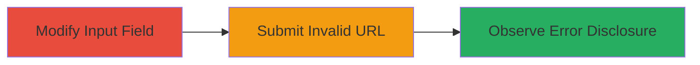

---
tags:
  - information-disclosure
  - full-path-disclosure
  - php-error
  - web-vulnerability
type: attack_chain
tools: []
tactics:
  - '[[Discovery]]'
commands: []
platforms:
  - Web
complexity: low
procedures:
  - '[[procedures/Exploit-Full-Path-Disclosure-in-XML-Import]]'
step_count: 3
techniques:
  - '[[File and Directory Discovery]]'
description: >-
  Demonstrates exploiting a full path disclosure vulnerability in the Localize
  application's XML import by modifying the input field to accept URLs and
  triggering a PHP error with an invalid URL.
skill_level: beginner
impact_level: medium
id: 13bbbde7-1068-48ff-9c89-74f6428198fd
created_at: '2025-12-14T17:26:06.215Z'
updated_at: '2025-12-14T17:26:06.215Z'
verified: false
validated: true
submitted: true
mitre_tactics:
  - '[[Discovery]]'
mitre_techniques:
  - '[[File and Directory Discovery]]'
---
# Full Path Disclosure via Modified XML Import in Localize

## Overview

This attack chain exploits a vulnerability in the Localize application's XML import functionality, where modifying the HTML input field allows URL-based imports. Submitting an invalid XML URL triggers a PHP notice that discloses the full server filesystem path, such as '/var/www/vhosts/lvps178-77-99-228.dedicated.hosteurope.de/httpdocs_localize/index.php'. This information can aid in further attacks like path traversal or reconnaissance.

## Chain Metrics Dashboard

| Metric | Value |
|--------|-------|
| Chain Status | Unverified |
| Total Steps | 3 |
| Execution Time | ~2 minutes |
| Skill Level | Beginner |
| Complexity | Low |
| Impact Level | Medium |

## Attack Flow Visualization

## Prerequisites & Requirements

### Required Tools

- Web browser with developer tools (e.g., Chrome DevTools)

### Target Environment

- Localize web application
- PHP-based web server
- Access to the XML import page

### Initial Access Requirements

- Valid access to the Localize application (no special credentials needed beyond user access)
- Network connectivity to the target
- No prior access required

## Detailed Attack Procedures

### Step 1: Modify the XML Import Input Field
procedure: [[procedures/Exploit-Full-Path-Disclosure-in-XML-Import]]

**Objective**: Alter the HTML input to allow URL submission instead of file upload, enabling remote XML import attempts.

**Instructions**: Open the browser's developer tools (F12), navigate to the XML import form, locate the input element with type='file' and name='importFileXML', and change it to type='url'.

**Expected Output**: The input field now accepts URL strings instead of file selection.

**Success Indicators**:
- Input field type changed successfully without form errors
- Form remains functional for submission

### Step 2: Submit an Invalid XML URL
procedure: [[procedures/Exploit-Full-Path-Disclosure-in-XML-Import]]

**Objective**: Trigger the import process with a non-XML URL to cause a processing error.

**Instructions**: In the modified input field, enter an invalid XML URL such as 'http://www.swarthmore.edu/libraries.xml' (which is not valid XML), then submit the form.

**Expected Output**: The application attempts to fetch and process the URL, leading to an error due to invalid content or undefined index.

**Success Indicators**:
- Form submission accepted
- Error page or message displayed

### Step 3: Observe the Full Path Disclosure
procedure: [[procedures/Exploit-Full-Path-Disclosure-in-XML-Import]]

**Objective**: Capture the PHP error message revealing the server's full filesystem path.

**Instructions**: Review the error output from the submission, which includes a PHP notice about an undefined index.

**Expected Output**: Error message like "Notice: Undefined index: importFileXML in /var/www/vhosts/lvps178-77-99-228.dedicated.hosteurope.de/httpdocs_localize/index.php on line 421".

**Success Indicators**:
- Full server path visible in the error (e.g., /var/www/...)
- Sensitive filesystem details exposed

## Attack Chain Summary

### Key Achievements

1. Bypassed file-only restriction by modifying client-side HTML
2. Triggered server-side PHP error through invalid input
3. Disclosed full server path for potential further exploitation

## Technique & Tactic Coverage

### MITRE ATT&CK Techniques

- [[File and Directory Discovery]]

### MITRE ATT&CK Tactics

- [[Discovery]]

---
*Last updated: [TIMESTAMP]*
