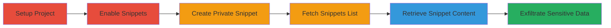

---
tags:
  - gitlab
  - api
  - information-disclosure
  - snippets
  - access-control-bypass
  - token-leak
type: attack_chain
tools:
  - '[[tools/curl]]'
tactics:
  - '[[Initial Access]]'
  - '[[Collection]]'
commands:
  - '[[commands/curl-fetch-gitlab-snippets]]'
  - '[[commands/curl-retrieve-gitlab-snippet-raw]]'
platforms:
  - Web
  - GitLab
complexity: medium
procedures:
  - '[[procedures/Create-and-Configure-Public-GitLab-Project]]'
  - '[[procedures/Create-Private-Snippet-in-GitLab-Project]]'
  - '[[procedures/Fetch-All-Snippets-via-GitLab-API]]'
  - '[[procedures/Retrieve-Private-Snippet-Content-via-API]]'
step_count: 5
techniques:
  - '[[Valid Accounts]]'
  - '[[T1213.003]]'
description: >-
  Multi-stage attack exploiting GitLab API access control flaw to disclose
  private snippets containing sensitive data like API tokens from public or
  internal projects.
skill_level: intermediate
impact_level: high
id: e962124d-b234-478d-a3a2-30cb4aa13340
created_at: '2025-12-14T17:32:10.413Z'
updated_at: '2025-12-14T17:32:10.413Z'
verified: false
validated: true
submitted: true
mitre_tactics:
  - '[[Initial Access]]'
  - '[[Collection]]'
mitre_techniques:
  - '[[Valid Accounts]]'
  - '[[T1213.003]]'
---
# GitLab API Disclosure of Private Snippets in Public Projects

Multi-stage attack chain demonstrating exploitation of an information disclosure vulnerability in the GitLab API, where private snippets in public or internal projects can be accessed without proper authorization using a valid API token.

## Chain Metrics Dashboard

| Metric | Value |
|--------|-------|
| Chain Status | Unverified |
| Total Steps | 5 |
| Execution Time | ~10 minutes |
| Skill Level | Intermediate |
| Complexity | Medium |
| Impact Level | High |

## Attack Flow Visualization



## Prerequisites & Requirements

### Required Tools

- [[tools/curl]]

### Target Environment

- GitLab CE or EE instance (version vulnerable to CVE-2017-9181 or similar)
- Required services/ports: GitLab API on port 80/443
- Network access requirements: Authenticated access to GitLab API with a personal access token

### Initial Access Requirements

- Valid GitLab user account with API token (e.g., Reporter role or higher)
- Network position: Direct access to GitLab instance
- Prior access needed: Ability to create projects in the instance

## Detailed Attack Procedures

### Step 1: Create Public Project
procedure: [[procedures/Create-and-Configure-Public-GitLab-Project]]

**Objective**: Establish a public or internal project to host the vulnerable snippets feature.

**Instructions**: Log in to GitLab as a user and create a new project set to public or internal visibility. Note the project ID (e.g., 1) for API calls.

**Expected Output**: Project created with ID 1, visible in the GitLab dashboard.

**Success Indicators**:
- Project ID obtained
- Visibility confirmed as public/internal

### Step 2: Enable Snippets Feature
procedure: [[procedures/Create-and-Configure-Public-GitLab-Project]]

**Objective**: Activate the snippets functionality in the project settings to allow snippet creation.

**Instructions**: Navigate to project settings and enable the snippets feature under repository settings.

**Expected Output**: Snippets option available in the project sidebar.

**Success Indicators**:
- Snippets enabled in project configuration
- No errors in settings update

### Step 3: Create Private Snippet
procedure: [[procedures/Create-Private-Snippet-in-GitLab-Project]]

**Objective**: Add a private snippet containing sensitive data to the project.

**Instructions**: Use the GitLab UI to create a new snippet, mark it as private, and input sensitive content like an API token.

**Expected Output**: Snippet created with ID (e.g., 6), marked private.

**Success Indicators**:
- Snippet visible only to owner in UI
- Sensitive data stored

### Step 4: Fetch All Snippets via API
procedure: [[procedures/Fetch-All-Snippets-via-GitLab-API]]

**Objective**: Query the API to list all snippets, revealing private ones without authorization checks.

**Instructions**: Use [[commands/curl-fetch-gitlab-snippets]] to send a GET request to the snippets endpoint with your API token:

```bash
curl --header "PRIVATE-TOKEN: XXXXXXXXXXXXXX" "http://gitlab-instance/api/v3/projects/1/snippets"
```

**Expected Output**: JSON array including private snippet details like ID, title, and author.

**Success Indicators**:
- Private snippet metadata returned (e.g., {"id":6,"title":"Secret snippet"})
- No access denied error

### Step 5: Retrieve Private Snippet Content
procedure: [[procedures/Retrieve-Private-Snippet-Content-via-API]]

**Objective**: Access the raw contents of the leaked private snippet to exfiltrate sensitive information.

**Instructions**: Using the snippet ID from Step 4, execute [[commands/curl-retrieve-gitlab-snippet-raw]]:

```bash
curl --header "PRIVATE-TOKEN: XXXXXXXXXXXXXX" "http://gitlab-instance/api/v3/projects/1/snippets/6/raw"
```

**Expected Output**: Plain text content of the snippet, e.g., API tokens or secrets.

**Success Indicators**:
- Sensitive data retrieved
- Potential for further compromise (e.g., use leaked token)

## Attack Chain Summary

### Key Achievements

1. Bypassed access controls on private snippets in public projects
2. Disclosed metadata and contents via unauthenticated API queries (with valid token)
3. Enabled potential lateral movement using leaked credentials

## Technique & Tactic Coverage

### MITRE ATT&CK Techniques

- [[Valid Accounts]]
- [[T1213.003]]

### MITRE ATT&CK Tactics

- [[Initial Access]]
- [[Collection]]

---
*Last updated: 2023-10-01T00:00:00Z*
