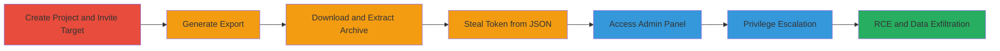

# GitLab Authentication Token Theft via Project Export Leading to RCE

Multi-stage attack chain demonstrating exploitation of GitLab's project export vulnerability to steal authentication tokens from any user, including admins, resulting in full administrative access, remote code execution, and exposure of sensitive data like private repositories, hashed passwords, and OTP secrets.

## Chain Metrics Dashboard

| Metric | Value |
|--------|-------|
| Chain Status | Unverified |
| Total Steps | 7 |
| Execution Time | ~10 minutes |
| Skill Level | Intermediate |
| Complexity | Medium |
| Impact Level | High |

## Attack Flow Visualization



## Prerequisites & Requirements

### Required Tools

- [[tools/tar]]

### Target Environment

- GitLab instance (self-hosted or SaaS)
- Required services/ports: Web interface on port 80/443
- Network access requirements: Attacker must have a registered account on the GitLab instance

### Initial Access Requirements

- Low-privilege user account on GitLab
- Ability to create projects and invite members
- Email access for export notifications

## Detailed Attack Procedures

### Step 1: Create Project and Invite Target

procedure: [[procedures/Create-GitLab-Project-and-Invite-Target]]

**Objective**: Establish a project to lure the target user (e.g., admin) into membership, setting up for token serialization in export.

**Instructions**: Register a new account if needed, create a repository via UI, and invite the target by username/email with member permissions.

**Expected Output**: Target user added to project members list.

**Success Indicators**:
- Invitation sent and accepted by target
- Target appears in project members

### Step 2: Generate Project Export

procedure: [[procedures/Generate-and-Download-Project-Export]]

**Objective**: Trigger the export process to serialize project data, including full user objects with tokens.

**Instructions**: Navigate to project settings > Export project in the GitLab UI to initiate serialization into project.json.

**Expected Output**: Export process starts; email notification received with download link.

**Success Indicators**:
- Export status shows "ready"
- Download email arrives

### Step 3: Download and Extract Export Archive

procedure: [[procedures/Extract-Token-from-Export-Archive]]

**Objective**: Retrieve the .tar.gz archive and unpack it to access the unredacted project.json.

**Instructions**: Click the download link from email (e.g., http://gitlab-instance/account/repo/download_export). Use [[commands/tar-extract-export]] to unpack:

```bash
tar -xzf ~/Downloads/export-file.tar.gz -C /tmp/export
```

Then inspect project.json for project_members array.

**Expected Output**: Extracted files including project.json with user authentication_token.

**Success Indicators**:
- Archive downloaded successfully
- JSON file contains target user's token

### Step 4: Use Stolen Token for Admin Access

procedure: [[procedures/Use-Stolen-Token-for-Admin-Access]]

**Objective**: Leverage the token to bypass authentication and gain admin privileges, enabling RCE.

**Instructions**: Append the token to admin URL, e.g., https://gitlab.com/admin/users?authentication_token=<stolen_token>. From admin panel, execute commands or access private repos.

**Expected Output**: Admin dashboard access; ability to run RCE commands or view sensitive data.

**Success Indicators**:
- Admin panel loads without further auth
- Access to private repositories and user data confirmed

## Attack Chain Summary

### Key Achievements

1. Stolen authentication token from any user via project export
2. Privilege escalation to admin level
3. Remote code execution and full data exfiltration (private repos, hashed passwords, OTP secrets)

## Technique & Tactic Coverage

### MITRE ATT&CK Techniques

- [[Credentials In Files]] Credentials In Files
- [[Valid Accounts]] Valid Accounts
- [[Windows Command Shell]] Windows Command Shell (adapted for web/RCE)
- [[Exploit Public-Facing Application]] Exploit Public-Facing Application

### MITRE ATT&CK Tactics

- [[Credential Access]] Credential Access
- [[Privilege Escalation]] Privilege Escalation
- [[Execution]] Execution
- [[Initial Access]] Initial Access

---
*Last updated: 2023-10-01T00:00:00Z*
