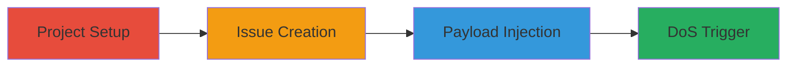

---
tags:
  - dos
  - gitlab
  - mermaid
  - markdown
  - resource-exhaustion
type: attack_chain
tools: []
tactics:
  - '[[Impact]]'
verified: false
platforms:
  - Web
submitted: true
complexity: low
created_at: '2023-10-01T00:00:00Z'
procedures:
  - '[[procedures/Exploit-Mermaid-DoS-in-GitLab-Markdown]]'
step_count: 7
techniques:
  - '[[Endpoint Denial of Service]]'
updated_at: '2025-12-14T17:26:56.563Z'
description: >-
  A denial-of-service attack exploiting uncontrolled resource consumption in
  GitLab's Mermaid diagram rendering within Markdown comments, causing browser
  freezes for all users viewing the affected issue.
skill_level: beginner
impact_level: high
id: 658300c5-c98e-453b-9859-661ab2164c48
validated: true
mitre_tactics:
  - '[[Impact]]'
mitre_techniques:
  - '[[Endpoint Denial of Service]]'
---
# GitLab DoS via Malicious Mermaid Diagram in Issue Comments

Multi-stage attack chain demonstrating a complete denial-of-service workflow against GitLab's issue tracking system by exploiting Mermaid diagram rendering in Markdown comments.

## Chain Metrics Dashboard

| Metric | Value |
|--------|-------|
| Chain Status | Unverified |
| Total Steps | 7 |
| Execution Time | ~5 minutes |
| Skill Level | Beginner |
| Complexity | Low |
| Impact Level | High |

## Attack Flow Visualization



## Prerequisites & Requirements

### Required Tools

- None (uses GitLab web interface)

### Target Environment

- GitLab instance (self-hosted or SaaS)
- Web browser access to GitLab
- Markdown-enabled features like issues

### Initial Access Requirements

- Valid GitLab account (any role, as public projects can be created)
- No special privileges needed
- Internet access to the GitLab instance

## Detailed Attack Procedures

### Step 1: Create a New Public Project
procedure: [[procedures/Exploit-Mermaid-DoS-in-GitLab-Markdown]]

**Objective**: Establish a test environment by creating a public GitLab project to host the vulnerable issue.

**Instructions**: Log in to your GitLab account. Navigate to the dashboard and click "New project". Select "Create blank project", name it (e.g., "Test-DoS-Project"), set visibility to "Public", and click "Create project".

**Expected Output**: A new public repository is created, accessible via its URL.

**Success Indicators**:
- Project dashboard loads successfully
- Project is marked as public

### Step 2: Create an Issue in the Project
procedure: [[procedures/Exploit-Mermaid-DoS-in-GitLab-Markdown]]

**Objective**: Set up an issue where the malicious comment can be added.

**Instructions**: From the project dashboard, click "Issues" in the left sidebar, then "New issue". Enter a title (e.g., "Test Issue for DoS") and an initial description if desired, then click "Submit issue".

**Expected Output**: The issue is created and opens in the web interface.

**Success Indicators**:
- Issue page loads with the new issue details
- Issue ID is assigned (e.g., #1)

### Step 3: Add Initial Comments to the Issue
procedure: [[procedures/Exploit-Mermaid-DoS-in-GitLab-Markdown]]

**Objective**: Populate the issue thread to simulate normal activity and ensure the page renders Markdown correctly before exploitation.

**Instructions**: On the issue page, type a simple comment (e.g., "Initial comment") in the comment box at the bottom and click "Comment" or press Enter to submit.

**Expected Output**: The comment appears in the thread without errors.

**Success Indicators**:
- Comment is posted and visible
- Page remains responsive

### Step 4: Navigate to the Issue Page
procedure: [[procedures/Exploit-Mermaid-DoS-in-GitLab-Markdown]]

**Objective**: Access the specific issue for payload injection.

**Instructions**: Ensure you are on the issue's dedicated page (e.g., /issues/1). If not, click the issue title from the project issues list to open it.

**Expected Output**: The full issue view loads, showing title, description, and comments.

**Success Indicators**:
- Issue details are fully visible
- Comment input form is available at the bottom

### Step 5: Obtain the Malicious Payload
procedure: [[procedures/Exploit-Mermaid-DoS-in-GitLab-Markdown]]

**Objective**: Prepare the specially crafted Mermaid diagram syntax that causes rendering overload.

**Instructions**: Copy the payload from a prepared text file or source. Example payload (complex graph causing infinite recursion or excessive nodes): ```mermaid
graph TD
    A --> B
    B --> A
    A --> C
    C --> D
    ... (repeat extensively to overload, e.g., 1000+ nodes with recursive links)```

**Expected Output**: Payload text is ready in clipboard or editor.

**Success Indicators**:
- Payload syntax is valid Mermaid but computationally intensive
- No errors in copying

### Step 6: Paste the Payload into the Comment Form
procedure: [[procedures/Exploit-Mermaid-DoS-in-GitLab-Markdown]]

**Objective**: Inject the malicious Mermaid diagram into a new comment using Markdown syntax.

**Instructions**: In the comment input box on the issue page, paste the payload wrapped in Markdown code block for Mermaid rendering: ````markdown```mermaid
[PASTE PAYLOAD HERE]
``` ````

**Expected Output**: The payload appears in the comment preview (if enabled) without immediate rendering.

**Success Indicators**:
- Text pastes correctly
- No syntax errors in input

### Step 7: Submit the Comment
procedure: [[procedures/Exploit-Mermaid-DoS-in-GitLab-Markdown]]

**Objective**: Trigger the Mermaid rendering process, causing browser resource exhaustion and DoS.

**Instructions**: Click the "Comment" button or press Enter to submit. The GitLab frontend will attempt to render the Mermaid diagram.

**Expected Output**: The attacker's browser may freeze briefly, but upon page reload or access by other users, the issue page becomes unresponsive due to excessive computation in diagram rendering.

**Success Indicators**:
- Browser tab freezes or becomes unresponsive when viewing the issue
- Other users (or incognito session) experience the same freeze, confirming DoS

## Attack Chain Summary

### Key Achievements

1. Successful creation of a public project and issue in GitLab
2. Injection of a malicious Mermaid payload via Markdown comment
3. Achievement of client-side DoS, freezing browsers for all viewers of the affected issue page

## Technique & Tactic Coverage

### MITRE ATT&CK Techniques

- [[Endpoint Denial of Service]]

### MITRE ATT&CK Tactics

- [[Impact]]

---
*Last updated: 2023-10-01T00:00:00Z*
