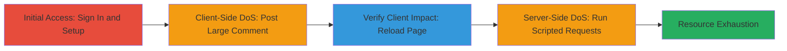

---
tags:
  - dos
  - resource-exhaustion
  - gitlab
  - web
type: attack_chain
tools:
  - '[[tools/Curl-HTTP-Client]]'
  - '[[tools/Sed-Stream-Editor]]'
  - '[[tools/Head-File-Extractor]]'
tactics:
  - '[[Impact]]'
verified: false
platforms:
  - Web
submitted: true
complexity: medium
created_at: '2023-10-01T00:00:00Z'
procedures:
  - '[[procedures/Setup-GitLab-Project-and-Issue]]'
  - '[[procedures/Trigger-Client-Side-DoS-with-Large-Comment]]'
  - '[[procedures/Execute-Server-Side-DoS-with-Script]]'
step_count: 8
techniques:
  - '[[Endpoint Denial of Service]]'
  - '[[OS Exhaustion Flood]]'
updated_at: '2025-12-14T17:26:56.019Z'
description: >-
  A multi-stage denial-of-service attack exploiting the absence of character
  limits on GitLab issue comments, leading to client-side rendering failures and
  server-side CPU exhaustion.
skill_level: intermediate
impact_level: high
id: 335c46a8-557d-44a8-abea-e51a88f6703f
validated: true
mitre_tactics:
  - '[[Impact]]'
mitre_techniques:
  - '[[Endpoint Denial of Service]]'
  - '[[OS Exhaustion Flood]]'
---
# GitLab DoS via Oversized Issue Comments

Multi-stage attack chain demonstrating a denial-of-service vulnerability in GitLab by posting oversized comments on issues, causing client-side rendering crashes and server-side resource exhaustion.

## Chain Metrics Dashboard

| Metric | Value |
|--------|-------|
| Chain Status | Unverified |
| Total Steps | 8 |
| Execution Time | ~5 minutes |
| Skill Level | Intermediate |
| Complexity | Medium |
| Impact Level | High |

## Attack Flow Visualization



## Prerequisites & Requirements

### Required Tools

- [[tools/Curl-HTTP-Client]]
- [[tools/Sed-Stream-Editor]]
- [[tools/Head-File-Extractor]]

### Target Environment

- GitLab instance (e.g., GitLab.com or self-hosted, version 11.10.2 or similar)
- Required services: PostgreSQL, Redis, Git
- Tech stack: Ruby 2.5.3, Sidekiq 5.2.5
- Network access: Valid user account with project creation permissions

### Initial Access Requirements

- Authenticated GitLab account
- Browser for UI interactions or curl for API
- No special privileges beyond standard user

## Detailed Attack Procedures

### Step 1: Sign In to GitLab
procedure: [[procedures/Setup-GitLab-Project-and-Issue]]

**Objective**: Authenticate to gain access for creating projects and issues.

**Instructions**: Use the GitLab web interface to log in with valid credentials.

**Expected Output**: Successful login, dashboard access.

**Success Indicators**:
- User session established
- Access to project creation UI

### Step 2: Create a New Project
procedure: [[procedures/Setup-GitLab-Project-and-Issue]]

**Objective**: Set up a test project to host the vulnerable issue.

**Instructions**: In the GitLab UI, create a new project named "test01" with public visibility and initialize with a README.

**Expected Output**: Project created with slug "test01".

**Success Indicators**:
- Project page loads
- README file present

### Step 3: Create a New Issue in the Project
procedure: [[procedures/Setup-GitLab-Project-and-Issue]]

**Objective**: Establish an issue to target for comment posting.

**Instructions**: Navigate to the project and use the UI to create a new issue (title and description arbitrary).

**Expected Output**: Issue created with an ID (e.g., #1).

**Success Indicators**:
- Issue page accessible
- Empty comments section

### Step 4: Post Some Initial Comments on the Issue
procedure: [[procedures/Setup-GitLab-Project-and-Issue]]

**Objective**: Add baseline comments to observe normal behavior.

**Instructions**: Use the issue UI to post 1-2 short comments.

**Expected Output**: Comments appear and render correctly.

**Success Indicators**:
- Comments visible on reload
- No errors in rendering

### Step 5: Post a Large Comment to Trigger Client-Side DoS
procedure: [[procedures/Trigger-Client-Side-DoS-with-Large-Comment]]

**Objective**: Submit an oversized markdown comment to crash client-side rendering.

**Instructions**: Generate a 50,000-character payload using [[commands/head-sed-generate-payload]]:

```bash
head -c 50000 /dev/zero | sed -e 's/\x00/\/a/g'
```

Then post it via browser or [[commands/curl-post-large-comment]] to the /notes endpoint with note[note]="[a](/a/a/...)", replacing placeholders for CSRF token and session.

**Expected Output**: Comment posts successfully, but page hangs on rendering.

**Success Indicators**:
- POST response 200
- Browser tab unresponsive

### Step 6: Reload the Issue Page for Client-Side Impact
procedure: [[procedures/Trigger-Client-Side-DoS-with-Large-Comment]]

**Objective**: Confirm client-side denial by attempting to view the issue.

**Instructions**: Refresh the issue page in the browser.

**Expected Output**: Error message: "Something went wrong while fetching comments. Please try again." Comments inaccessible.

**Success Indicators**:
- Rendering failure
- Comments not loading

### Step 7: For Server-Side DoS, Prepare and Run the Script
procedure: [[procedures/Execute-Server-Side-DoS-with-Script]]

**Objective**: Automate repeated large requests to exhaust server CPU.

**Instructions**: Create poc.sh with the provided script content, including payload generation and curl loop. Then execute [[commands/poc-sh-run-dos-script]]:

```bash
./poc.sh gitlab.com /projects/test01 1 100
```

**Expected Output**: Multiple background curl processes sending requests.

**Success Indicators**:
- Script runs without errors
- High CPU usage on server

### Step 8: Monitor Server-Side DoS Impact
procedure: [[procedures/Execute-Server-Side-DoS-with-Script]]

**Objective**: Verify resource exhaustion and service denial.

**Instructions**: Observe GitLab instance metrics or attempt normal operations during the attack.

**Expected Output**: CPU at 100%, requests timing out, service unavailable to all users.

**Success Indicators**:
- Server logs show high load
- Denial of service for other users

## Attack Chain Summary

### Key Achievements

1. Client-side DoS rendering issue comments inaccessible
2. Server-side CPU exhaustion via automated large payloads
3. Demonstration of uncontrolled resource consumption in GitLab issue comments

## Technique & Tactic Coverage

### MITRE ATT&CK Techniques

- [[Endpoint Denial of Service]] Endpoint Denial of Service
- [[OS Exhaustion Flood]] OS Exhaustion Floods

### MITRE ATT&CK Tactics

- [[Impact]] Impact

---

*Last updated: 2023-10-01T00:00:00Z*
