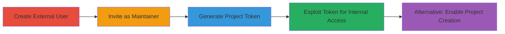

---
tags:
  - gitlab
  - privilege-escalation
  - token-abuse
  - external-user
  - bot-user
type: attack_chain
tools:
  - '[[tools/curl]]'
tactics:
  - '[[Privilege Escalation]]'
  - '[[Initial Access]]'
verified: false
platforms:
  - Web
  - GitLab
submitted: true
complexity: medium
created_at: '2023-10-01T00:00:00Z'
procedures:
  - '[[procedures/Create-External-User-in-GitLab]]'
  - '[[procedures/Invite-External-User-as-Maintainer]]'
  - '[[procedures/Generate-Project-Access-Token-as-External-User]]'
  - '[[procedures/Exploit-Token-for-Internal-Access]]'
  - '[[procedures/Enable-Project-Creation-for-External-User]]'
step_count: 5
techniques:
  - '[[Valid Accounts]]'
  - '[[Use Alternate Authentication Material]]'
  - '[[Exploitation for Privilege Escalation]]'
updated_at: '2025-12-14T17:30:27.335Z'
description: >-
  Escalates external user privileges to internal access in GitLab by creating a
  project access token linked to an internal bot user, allowing access to
  internal projects, source code, and limited creation actions.
skill_level: intermediate
impact_level: high
id: 38990382-b4bb-4b83-b888-cdd3d38a7578
validated: true
mitre_tactics:
  - '[[Privilege Escalation]]'
  - '[[Initial Access]]'
mitre_techniques:
  - '[[Valid Accounts]]'
  - '[[Use Alternate Authentication Material]]'
  - '[[Exploitation for Privilege Escalation]]'
---
# GitLab External User Privilege Escalation via Project Access Token

Multi-stage attack chain demonstrating privilege escalation in GitLab where an external user with maintainer access creates a project token that grants internal privileges through association with a bot user.

## Chain Metrics Dashboard

| Metric | Value |
|--------|-------|
| Chain Status | Unverified |
| Total Steps | 5 |
| Execution Time | ~10 minutes |
| Skill Level | Intermediate |
| Complexity | Medium |
| Impact Level | High |

## Attack Flow Visualization



## Prerequisites & Requirements

### Required Tools

- [[tools/curl]]

### Target Environment

- GitLab instance (version 13.10.4 or similar)
- Admin access for setup
- Web browser for UI interactions
- Required services: PostgreSQL 13.2, Redis 6.2.3, Git 2.31.1
- Tech stack: Ruby on Rails, Ruby 3.0.1, Sidekiq 5.2.9

### Initial Access Requirements

- Admin privileges to create and configure external user
- Internal user account to invite external user
- Network access to GitLab UI and API (e.g., https://gitlab.domain.com)

## Detailed Attack Procedures

### Step 1: Create External User
procedure: [[procedures/Create-External-User-in-GitLab]]

**Objective**: Set up an external user account with limited visibility to test privilege inheritance.

**Instructions**: Use admin privileges to mark a user as external in the GitLab admin panel.

Navigate to `/admin/users/<username>/edit` and enable the external user status.

**Expected Output**: User profile updated with external flag activated, restricting visibility to invited projects only.

**Success Indicators**:
- User marked as external in admin panel
- Login as external user shows limited dashboard

### Step 2: Invite External User as Maintainer
procedure: [[procedures/Invite-External-User-as-Maintainer]]

**Objective**: Grant the external user maintainer role on a project to enable token creation.

**Instructions**: As an internal user, invite the external user via project settings.

Go to project settings > Members > Invite member, select the external user, and assign Maintainer role.

**Expected Output**: Invitation accepted, external user has maintainer access to the project.

**Success Indicators**:
- External user can access project settings
- Maintainer permissions confirmed (e.g., view access tokens page)

### Step 3: Generate Project Access Token as External User
procedure: [[procedures/Generate-Project-Access-Token-as-External-User]]

**Objective**: Create a project access token scoped to API and repository access.

**Instructions**: Login as external user, navigate to `/<namespace>/<project>/-/settings/access_tokens`, and generate token with scopes like `api` and `read_repository`.

**Expected Output**: Token generated and displayed (copy before it hides).

**Success Indicators**:
- Token string obtained
- Token valid for project-specific actions

### Step 4: Exploit Token for Internal Access
procedure: [[procedures/Exploit-Token-for-Internal-Access]]

**Objective**: Use the token to access internal resources, escalating to Guest-level internal privileges.

**Instructions**: Authenticate API requests with the token. First, list internal projects using [[commands/curl-gitlab-list-projects-with-token]]:

```bash
curl --header "Authorization: Bearer <TOKEN>" "https://gitlab.domain.com/api/v4/projects?visibility=internal"
```

Then, access source code or create issues, e.g., using [[commands/curl-gitlab-create-issue]] on an internal project.

**Expected Output**: JSON responses showing internal projects, source code blobs, or created issues.

**Success Indicators**:
- Internal projects listed
- Source code retrieved from internal repos
- Issues created on internal projects

### Step 5: Alternative: Enable Project Creation for External User
procedure: [[procedures/Enable-Project-Creation-for-External-User]]

**Objective**: Allow external user to create their own project for token generation without invitation.

**Instructions**: As admin, set project limit >0 for the external user in `/admin/users/<username>/edit`.

Then, as external user, create a project at `/projects/new#blank_project` and generate token there.

**Expected Output**: Personal project created, token generated independently.

**Success Indicators**:
- External user can create projects
- Token works for internal access as in Step 4

## Attack Chain Summary

### Key Achievements

1. External user gains visibility into all internal projects and snippets
2. Source code disclosure from internal repositories
3. Ability to create issues and limited groups/projects internally
4. Bypasses external user restrictions via bot user token linkage

## Technique & Tactic Coverage

### MITRE ATT&CK Techniques

- [[Valid Accounts]] Valid Accounts
- [[Use Alternate Authentication Material]] Use Alternate Authentication Material
- [[Exploitation for Privilege Escalation]] Exploitation for Privilege Escalation

### MITRE ATT&CK Tactics

- [[Privilege Escalation]] Privilege Escalation
- [[Initial Access]] Initial Access

---

*Last updated: 2023-10-01T00:00:00Z*
