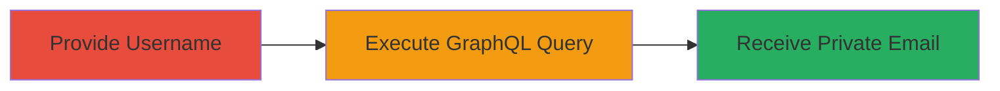

---
tags:
  - information-disclosure
  - graphql
  - gitlab
  - email-leak
  - reconnaissance
type: attack_chain
tools: []
tactics:
  - '[[Reconnaissance]]'
commands:
  - '[[commands/curl-gitlab-graphql-user-query]]'
platforms:
  - Web
complexity: low
procedures:
  - '[[procedures/Exploit-GitLab-GraphQL-User-Query-to-Leak-Private-Email]]'
step_count: 1
techniques:
  - '[[Gather Victim Identity Information]]'
description: >-
  An information disclosure attack exploiting GitLab's GraphQL API to leak
  private user email addresses using only the username, bypassing privacy
  settings.
skill_level: low
impact_level: high
id: 348c5ed3-bd2b-45d3-8402-1bb61671c58c
created_at: '2025-12-14T17:25:53.465Z'
updated_at: '2025-12-14T17:25:53.465Z'
verified: false
validated: true
submitted: true
mitre_tactics:
  - '[[Reconnaissance]]'
mitre_techniques:
  - '[[Gather Victim Identity Information]]'
---
# GitLab GraphQL API Private Email Disclosure via Username

Multi-stage attack chain demonstrating a complete attack workflow.

## Chain Metrics Dashboard

| Metric | Value |
|--------|-------|
| Chain Status | Unverified |
| Total Steps | 1 |
| Execution Time | ~1 minute |
| Skill Level | Low |
| Complexity | Low |
| Impact Level | High |

## Attack Flow Visualization



## Prerequisites & Requirements

### Required Tools

- curl (or equivalent HTTP client)

### Target Environment

- Web platform
- GitLab service (self-hosted or GitLab.com)
- GraphQL API endpoint accessible (/api/graphql)

### Initial Access Requirements

- Network access to the GitLab instance
- Knowledge of the target user's username
- No special credentials required if API allows unauthenticated queries; otherwise, a low-privilege access token

## Detailed Attack Procedures

### Step 1: Leak Private Email via GraphQL Query
procedure: [[procedures/Exploit-GitLab-GraphQL-User-Query-to-Leak-Private-Email]]

**Objective**: Retrieve the private email address of any GitLab user by exploiting the lack of access controls in the GraphQL 'user' query resolver, enabling data leakage for phishing or spam.

**Expected Output**: A JSON response from the API containing the user's private email address and username.

**Success Indicators**:
- The response includes the 'email' field with a non-public email address.
- The email matches the private setting but is still disclosed.

**Instructions**: Identify a target username (e.g., from public profiles or enumeration). Then, execute the GraphQL query using [[commands/curl-gitlab-graphql-user-query]] to send a POST request to the API:

```bash
curl -X POST https://gitlab.com/api/graphql \
  -H "Content-Type: application/json" \
  -d '{"query": "query { user(username: \"exampleuser\") { email username } }"}'
```

Replace `gitlab.com` with the target instance URL and `exampleuser` with the victim's username. If authentication is required, add `-H "Authorization: Bearer <token>"`. Parse the JSON response to extract the email.

## Attack Chain Summary

### Key Achievements

1. Bypassed GitLab's private email visibility settings through the GraphQL API.
2. Enabled mass enumeration of private emails for any user with a known username, facilitating phishing, spam, or targeted attacks.
3. Demonstrated a simple, low-effort information disclosure vulnerability.

## Technique & Tactic Coverage

### MITRE ATT&CK Techniques

- [[Gather Victim Identity Information]]

### MITRE ATT&CK Tactics

- [[Reconnaissance]]

---
*Last updated: 2024-10-01*
