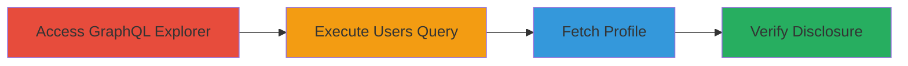

---
tags:
  - information-disclosure
  - graphql
  - gitlab
  - email-leak
  - reconnaissance
type: attack_chain
tools: []
tactics:
  - '[[Discovery]]'
verified: false
platforms:
  - Web
  - GitLab
submitted: true
complexity: low
created_at: '2024-10-01T00:00:00Z'
procedures:
  - '[[procedures/Access-GitLab-GraphQL-Explorer]]'
  - '[[procedures/Execute-GitLab-Users-GraphQL-Query]]'
  - '[[procedures/Verify-User-Profile-Email-Hiding]]'
step_count: 4
techniques:
  - '[[Account Discovery]]'
  - '[[Exploit Public-Facing Application]]'
updated_at: '2025-12-14T17:25:53.095Z'
description: >-
  Unauthenticated information disclosure via GitLab's public GraphQL Explorer,
  revealing private user email addresses not visible on public profiles.
skill_level: beginner
impact_level: medium
id: 76e7f304-f137-4f0f-8acb-76a744456ed4
validated: true
mitre_tactics:
  - '[[Discovery]]'
mitre_techniques:
  - '[[Account Discovery]]'
  - '[[Exploit Public-Facing Application]]'
---
# GitLab GraphQL API Private Email Disclosure

Multi-stage attack chain demonstrating unauthenticated access to private user email addresses through GitLab's misconfigured GraphQL API. This vulnerability allows attackers to query sensitive user data, including emails, via the public GraphQL Explorer, enabling phishing, brute-force attacks, or account takeovers. Discovered in GitLab's public instance, it highlights a lack of authorization controls on the 'users' query field.

## Chain Metrics Dashboard

| Metric | Value |
|--------|-------|
| Chain Status | Unverified |
| Total Steps | 4 |
| Execution Time | ~2 minutes |
| Skill Level | Beginner |
| Complexity | Low |
| Impact Level | Medium |

## Attack Flow Visualization

## Prerequisites & Requirements

### Required Tools

- Web browser (e.g., Chrome or Firefox)

### Target Environment

- GitLab public instance (e.g., gitlab.com)
- Publicly accessible GraphQL API
- No authentication required

### Initial Access Requirements

- Internet access
- No credentials needed
- Target must expose GraphQL Explorer publicly

## Detailed Attack Procedures

### Step 1: Access GraphQL Explorer
procedure: [[procedures/Access-GitLab-GraphQL-Explorer]]

**Objective**: Gain access to the public GraphQL interface to prepare for querying user data.

**Instructions**: Open a web browser and navigate to the GitLab GraphQL Explorer URL.

**Expected Output**: The GraphQL Explorer interface loads, allowing query input without login prompts.

**Success Indicators**:
- Page loads successfully
- Query editor is visible and interactive

### Step 2: Execute Users Query
procedure: [[procedures/Execute-GitLab-Users-GraphQL-Query]]

**Objective**: Retrieve a list of users including their private email addresses via the unauthenticated query.

**Instructions**: In the GraphQL Explorer, paste and execute the users query to fetch data.

**Expected Output**: JSON response containing user nodes with usernames, emails, avatar URLs, and status details.

**Success Indicators**:
- Query executes without errors
- Email fields are populated in the response

### Step 3: Fetch Public Profile
procedure: [[procedures/Verify-User-Profile-Email-Hiding]]

**Objective**: Inspect a user's public profile to confirm the email is not visible there.

**Instructions**: Use a username from the query results to visit the public profile page.

**Expected Output**: Profile page displays username and public info, but no email address.

**Success Indicators**:
- Profile loads
- Email is absent from visible content

### Step 4: Verify Disclosure

**Objective**: Compare query results against public profile to confirm information disclosure.

**Instructions**: Manually compare the email from the GraphQL response with the profile page content.

**Expected Output**: Confirmation that the email is private and only accessible via the API query.

**Success Indicators**:
- Email present in API but not on profile
- Potential for further exploitation identified (e.g., phishing targets)

## Attack Chain Summary

### Key Achievements

1. Unauthenticated access to private emails
2. Demonstration of API misconfiguration
3. Validation of disclosure impact on user privacy

## Technique & Tactic Coverage

### MITRE ATT&CK Techniques

- [[Account Discovery]] Account Discovery
- [[Exploit Public-Facing Application]] Exploit Public-Facing Application

### MITRE ATT&CK Tactics

- [[Discovery]] Discovery

---

*Last updated: 2024-10-01T00:00:00Z*
