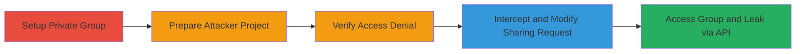

---
tags:
  - idor
  - gitlab
  - privilege-escalation
  - information-disclosure
type: attack_chain
tools: []
tactics:
  - '[[Discovery]]'
  - '[[Collection]]'
verified: false
platforms:
  - Web
submitted: true
complexity: medium
created_at: '2023-10-01T00:00:00Z'
procedures:
  - '[[procedures/Create-Private-Group-and-Project-in-GitLab]]'
  - '[[procedures/Prepare-Unauthorized-User-Project]]'
  - '[[procedures/Verify-No-Direct-Access-to-Private-Group]]'
  - '[[procedures/Intercept-and-Modify-Group-Sharing-Request]]'
  - '[[procedures/Exploit-IDOR-to-Access-Private-Group-and-Leak-Info]]'
step_count: 5
techniques:
  - '[[Exploit Public-Facing Application]]'
  - '[[Account Discovery]]'
updated_at: '2025-12-14T17:29:28.232Z'
description: >-
  Multi-stage attack exploiting Insecure Direct Object Reference (IDOR) in
  GitLab's project group sharing feature to gain unauthorized read access to
  private groups, leaking repository details via API.
skill_level: intermediate
impact_level: high
id: 2cd0efc5-6961-4d9d-a0ad-dd6f1b71d406
validated: true
mitre_tactics:
  - '[[Discovery]]'
  - '[[Collection]]'
mitre_techniques:
  - '[[Exploit Public-Facing Application]]'
  - '[[Account Discovery]]'
---
# GitLab IDOR in Group Sharing to Access Private Groups and Repositories

Multi-stage attack chain demonstrating exploitation of an Insecure Direct Object Reference (IDOR) vulnerability in GitLab's group sharing feature for projects. An unauthorized user can modify the 'link_group_id' parameter in a POST request to share a project with a private group they do not belong to, gaining read access to the group's details, including private repositories, issues, milestones, and members. This enables enumeration and information disclosure via the GitLab API, potentially compromising the entire private namespace.

## Chain Metrics Dashboard

| Metric | Value |
|--------|-------|
| Chain Status | Unverified |
| Total Steps | 5 |
| Execution Time | ~10 minutes |
| Skill Level | Intermediate |
| Complexity | Medium |
| Impact Level | High |

## Attack Flow Visualization

## Prerequisites & Requirements

### Required Tools

- Web browser with developer tools or proxy like Burp Suite for request interception

### Target Environment

- GitLab instance (self-hosted or SaaS)
- Required services/ports: HTTP/HTTPS on port 80/443
- Network access requirements: Direct access to GitLab web interface and API

### Initial Access Requirements

- Valid low-privilege user account (e.g., regular user without group membership)
- Network position: External or internal user
- Prior access needed: Ability to create projects and use sharing features

## Detailed Attack Procedures

### Step 1: Setup Private Group
procedure: [[procedures/Create-Private-Group-and-Project-in-GitLab]]

**Objective**: Establish a private group and project to serve as the target for unauthorized access.

**Instructions**: As an admin or authorized user, create a private group and nest a private project within it. Note the group ID for later use.

**Expected Output**: Private group created with ID (e.g., 7) and project visible only to members.

**Success Indicators**:
- Group page shows private visibility
- Project is hidden from unauthorized users

### Step 2: Prepare Attacker Project
procedure: [[procedures/Prepare-Unauthorized-User-Project]]

**Objective**: Create a dummy project as an unauthorized user to use in the sharing exploit.

**Instructions**: Sign in as the attacking user and create a new project. This project will be shared to trigger the IDOR.

**Expected Output**: Dummy project created and accessible to the attacker.

**Success Indicators**:
- Project page loads successfully for the attacker
- No membership in the target private group

### Step 3: Verify Access Denial
procedure: [[procedures/Verify-No-Direct-Access-to-Private-Group]]

**Objective**: Confirm the attacker has no legitimate access to the private group.

**Instructions**: Attempt to visit the private group page directly as the unauthorized user.

**Expected Output**: 404 error or access denied message.

**Success Indicators**:
- Page returns 404, confirming isolation

### Step 4: Intercept Sharing Request
procedure: [[procedures/Intercept-and-Modify-Group-Sharing-Request]]

**Objective**: Capture the legitimate group sharing request and prepare for parameter tampering.

**Instructions**: Navigate to the dummy project's group sharing page, select a public group, and intercept the POST request using a proxy.

**Expected Output**: Intercepted request with 'link_group_id' parameter visible.

**Success Indicators**:
- Request body shows form parameters including group ID

### Step 5: Exploit IDOR and Leak Information
procedure: [[procedures/Exploit-IDOR-to-Access-Private-Group-and-Leak-Info]]

**Objective**: Modify the request to target the private group, gain access, and use the API to exfiltrate data.

**Instructions**: Change the 'link_group_id' to the private group's ID, forward the request, then access the group page and query the API with the attacker's token.

**Expected Output**: Private group page loads; API returns JSON with project details.

**Success Indicators**:
- Group name visible on page
- API response includes private project names, descriptions, and URLs

## Attack Chain Summary

### Key Achievements

1. Bypassed authorization to share project with private group via IDOR
2. Gained read access to private group metadata
3. Leaked sensitive project information through GitLab API

## Technique & Tactic Coverage

### MITRE ATT&CK Techniques

- [[Exploit Public-Facing Application]]
- [[Account Discovery]]

### MITRE ATT&CK Tactics

- [[Discovery]]
- [[Collection]]

---

*Last updated: 2023-10-01T00:00:00Z*
