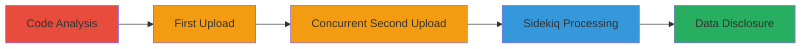

---
tags:
  - race-condition
  - gitlab
  - information-disclosure
  - file-upload
  - sidekiq
type: attack_chain
tools: []
tactics:
  - '[[Initial Access]]'
  - '[[Collection]]'
commands:
  - '[[commands/curl-upload-import-file]]'
platforms:
  - Web
  - Linux
complexity: medium
procedures:
  - '[[procedures/Analyze-GitLab-Import-Code-for-Race-Condition]]'
  - '[[procedures/Upload-Import-File-to-GitLab]]'
  - '[[procedures/Exploit-Filename-Collision-for-Overwrite]]'
  - '[[procedures/Trigger-Sidekiq-Processing-to-Disclose-Data]]'
step_count: 4
techniques:
  - '[[Exploit Public-Facing Application]]'
description: >-
  A multi-step attack exploiting a race condition in GitLab's project import
  feature to overwrite and access other users' confidential import files via
  filename collisions during concurrent uploads.
skill_level: intermediate
impact_level: high
id: 9e2f67a6-5c7d-45be-bec1-bda1fae1a632
created_at: '2025-12-14T17:24:19.306Z'
updated_at: '2025-12-14T17:24:19.306Z'
verified: false
validated: true
submitted: true
mitre_tactics:
  - '[[Initial Access]]'
  - '[[Collection]]'
mitre_techniques:
  - '[[Exploit Public-Facing Application]]'
---
# GitLab Import Race Condition Leading to Cross-User Repository Data Disclosure

## Overview

This attack chain exploits a race condition in GitLab's import feature, specifically in the Import::GitlabProjectsController#create endpoint. Attackers can upload import files with colliding filenames from different user accounts concurrently, overwriting files in a shared directory before Sidekiq processes them asynchronously. This leads to the first user's job restoring the second user's confidential repository data into the attacker's project, resulting in unauthorized information disclosure.

The vulnerability arises because uploaded files are stored using original filenames without randomization or project-specific paths, creating a brief window of exposure during the delay between upload and Sidekiq job execution.

## Chain Metrics Dashboard

| Metric | Value |
|--------|-------|
| Chain Status | Unverified |
| Total Steps | 4 |
| Execution Time | ~5 minutes |
| Skill Level | Intermediate |
| Complexity | Medium |
| Impact Level | High |

## Attack Flow Visualization



## Prerequisites & Requirements

### Required Tools

- Web browser or curl for API interactions
- Access to two GitLab accounts (attacker and victim simulation)

### Target Environment

- GitLab CE/EE instance (Ruby on Rails backend)
- Sidekiq background job processor enabled
- Web interface or API access to /import/gitlab_projects/create endpoint

### Initial Access Requirements

- Valid credentials for at least two user accounts on the same GitLab instance
- Ability to create projects and initiate imports
- No special privileges required beyond standard user access

## Detailed Attack Procedures

### Step 1: Analyze Import Code
procedure: [[procedures/Analyze-GitLab-Import-Code-for-Race-Condition]]

**Objective**: Identify the race condition in the import upload handling by reviewing source code.

**Instructions**: Access the GitLab source code (e.g., via GitHub mirror or instance repo) and examine app/controllers/import/gitlab_projects_controller.rb lines 15-18 and the Gitlab::ImportExport.import_upload_path method. Look for file copying using original_filename without uniqueness checks.

**Expected Output**: Confirmation that files are stored in /var/opt/gitlab/gitlab-rails/shared/tmp/project_exports/uploads/ using predictable names like 'import.tar.gz'.

**Success Indicators**:
- Identified lack of randomization in file paths
- Noted delay between upload and Sidekiq processing

### Step 2: Upload First Import File
procedure: [[procedures/Upload-Import-File-to-GitLab]]

**Objective**: Initiate an import under the attacker's account with a common filename to set up the race window.

**Instructions**: Create a new project in GitLab and navigate to the import section. Prepare a tar.gz export file named 'import.tar.gz' containing benign data. Use the web UI or API to upload it via the /import/gitlab_projects/create endpoint. This schedules a Sidekiq job but does not process immediately.

Execute [[commands/curl-upload-import-file]] to simulate the upload:

```bash
curl -X POST -H "Authorization: Bearer $GITLAB_TOKEN" -F "file=@import.tar.gz" https://gitlab.example.com/api/v4/import/gitlab_projects/create
```

**Expected Output**: HTTP 200/201 response confirming upload, file copied to shared uploads directory, Sidekiq job enqueued.

**Success Indicators**:
- File upload succeeds
- No immediate processing; job pending in Sidekiq queue

### Step 3: Exploit Filename Collision
procedure: [[procedures/Exploit-Filename-Collision-for-Overwrite]]

**Objective**: Overwrite the first file by uploading an identical filename from a second account before processing.

**Instructions**: Quickly, from a different user account, upload another 'import.tar.gz' file containing target confidential data (e.g., a real repository export) to a new project using the same endpoint. The shared directory allows overwrite due to identical paths.

Execute [[commands/curl-upload-import-file]] again with the second account's token:

```bash
curl -X POST -H "Authorization: Bearer $VICTIM_GITLAB_TOKEN" -F "file=@victim-import.tar.gz" https://gitlab.example.com/api/v4/import/gitlab_projects/create
```

**Expected Output**: Second upload succeeds, overwriting the file in /var/opt/gitlab/gitlab-rails/shared/tmp/project_exports/uploads/import.tar.gz.

**Success Indicators**:
- File overwritten in shared storage
- First account's pending job now references the victim's file

### Step 4: Trigger Sidekiq Processing
procedure: [[procedures/Trigger-Sidekiq-Processing-to-Disclose-Data]]

**Objective**: Wait for or force the Sidekiq job to process the overwritten file, restoring victim data to attacker's project.

**Instructions**: Monitor the first project's import status. The Sidekiq job will unpack the overwritten tar.gz, importing the victim's repository contents (commits, files, etc.) into the attacker's project.

For local testing, stop Sidekiq workers, perform uploads, then restart to control timing.

**Expected Output**: Attacker's project now contains victim's repository data, visible in the GitLab UI or repo clone.

**Success Indicators**:
- Import completes with unexpected data
- Victim's confidential files accessible in attacker's repo

## Attack Chain Summary

### Key Achievements

1. Identified race condition in file handling without uniqueness.
2. Overwrote shared import file via concurrent uploads.
3. Achieved cross-user data disclosure by hijacking Sidekiq processing.
4. Demonstrated potential for leaking entire repositories.

## Technique & Tactic Coverage

### MITRE ATT&CK Techniques

- [[Exploit Public-Facing Application]]

### MITRE ATT&CK Tactics

- [[Initial Access]]
- [[Collection]]

*Last updated: 2023-10-01*
