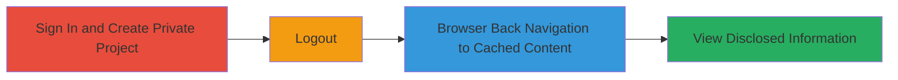

# GitLab Private Project Information Disclosure via Browser Cache Bypass

Multi-stage attack chain demonstrating a complete attack workflow exploiting GitLab's cache handling to access private project data without authentication.

## Chain Metrics Dashboard

| Metric | Value |
|--------|-------|
| Chain Status | Unverified |
| Total Steps | 8 |
| Execution Time | ~2 minutes |
| Skill Level | Beginner |
| Complexity | Low |
| Impact Level | High |

## Attack Flow Visualization

## Prerequisites & Requirements

### Required Tools

- [[tools/Web-Browser]]

### Target Environment

- GitLab web application (self-hosted or SaaS)
- Required services/ports: HTTPS on port 443
- Network access requirements: Direct browser access to GitLab instance

### Initial Access Requirements

- Valid user credentials for GitLab
- Network position: Internal or external with login access
- Prior access needed: None beyond authentication

## Detailed Attack Procedures

### Step 1: Authenticate to GitLab
procedure: [[procedures/Exploit-GitLab-Cache-Vulnerability-for-Private-Project-Access]]

**Objective**: Gain authenticated access to the GitLab web interface to create a private project.

**Instructions**: Open a web browser and navigate to the GitLab login page. Enter valid credentials to sign in.

**Expected Output**: Successful login, redirect to the GitLab dashboard.

**Success Indicators**:
- User is logged in and can access the project creation menu.
- No authentication errors displayed.

### Step 2: Access Project Creation Menu
procedure: [[procedures/Exploit-GitLab-Cache-Vulnerability-for-Private-Project-Access]]

**Objective**: Navigate to the new project creation interface.

**Instructions**: Click the '+' icon in the top navigation bar to open the project creation menu.

**Expected Output**: Dropdown or menu showing 'New Project' option.

**Success Indicators**:
- Project creation UI is accessible.
- No permission errors.

### Step 3: Initiate New Project Creation
procedure: [[procedures/Exploit-GitLab-Cache-Vulnerability-for-Private-Project-Access]]

**Objective**: Start the process of creating a new project.

**Instructions**: Select 'New Project' from the menu to load the project creation form.

**Expected Output**: Form fields for project name, visibility, etc., are displayed.

**Success Indicators**:
- Creation form is loaded without errors.

### Step 4: Enter Project Details
procedure: [[procedures/Exploit-GitLab-Cache-Vulnerability-for-Private-Project-Access]]

**Objective**: Specify the project name to set up the target for exploitation.

**Instructions**: In the 'Project name' field, enter 'PoC'.

**Expected Output**: Project name field populated with 'PoC'.

**Success Indicators**:
- Form accepts the input.

### Step 5: Set Project Visibility to Private
procedure: [[procedures/Exploit-GitLab-Cache-Vulnerability-for-Private-Project-Access]]

**Objective**: Ensure the project is private to test sensitive content access.

**Instructions**: Check the 'Private' checkbox in the visibility settings.

**Expected Output**: Visibility set to Private, restricting access to authenticated users only.

**Success Indicators**:
- Checkbox is selected and form reflects private status.

### Step 6: Create the Project
procedure: [[procedures/Exploit-GitLab-Cache-Vulnerability-for-Private-Project-Access]]

**Objective**: Submit and load the private project page, which will be cached by the browser.

**Instructions**: Click the 'Create project' button to submit the form.

**Expected Output**: Project dashboard loads, showing files, commits, issues, and wiki if applicable.

**Success Indicators**:
- Private project is created and accessible while logged in.
- Page content includes sensitive project details.

### Step 7: Log Out of GitLab
procedure: [[procedures/Exploit-GitLab-Cache-Vulnerability-for-Private-Project-Access]]

**Objective**: End the authenticated session to simulate unauthorized access.

**Instructions**: Navigate to the user profile menu and select 'Sign out'.

**Expected Output**: Redirect to login page, session terminated.

**Success Indicators**:
- User is logged out and prompted for credentials on refresh.

### Step 8: Access Cached Private Content
procedure: [[procedures/Exploit-GitLab-Cache-Vulnerability-for-Private-Project-Access]]

**Objective**: Exploit browser cache to view private project data without re-authentication.

**Instructions**: Use the browser's back button to navigate to the previously viewed private project page.

**Expected Output**: Cached page loads, displaying private project details like file names, source code, commit logs, issues, and wiki contents.

**Success Indicators**:
- Unauthorized access to private information is granted via cache.
- Content persists despite logout.

## Attack Chain Summary

### Key Achievements

1. Successful creation of a private GitLab project while authenticated.
2. Bypass of authentication via browser cache after logout.
3. Disclosure of sensitive private project information to unauthorized viewers.

## Technique & Tactic Coverage

### MITRE ATT&CK Techniques

- [[Exploit Public-Facing Application]]

### MITRE ATT&CK Tactics

- [[Collection]]

---
*Last updated: 2023-10-01T00:00:00Z*
