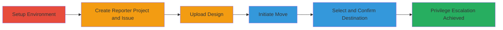

---
tags:
  - gitlab
  - privilege-escalation
  - design-management
  - issue-move
type: attack_chain
tools: []
tactics:
  - '[[Privilege Escalation]]'
verified: false
platforms:
  - Web
  - GitLab
submitted: true
complexity: medium
created_at: '2023-10-01T00:00:00Z'
procedures:
  - '[[procedures/Setup-GitLab-Projects-and-Roles]]'
  - '[[procedures/Create-Issue-with-Design-in-Reporter-Project]]'
  - '[[procedures/Move-Issue-to-Private-Project-for-Escalation]]'
step_count: 7
techniques:
  - '[[Exploitation for Privilege Escalation]]'
updated_at: '2025-12-14T05:32:13.171Z'
description: >-
  A multi-step privilege escalation attack exploiting GitLab's issue 'Move to'
  feature, allowing Reporter role users to upload Design Management files to
  private projects without Developer permissions.
skill_level: intermediate
impact_level: high
id: 194c2ffa-ca35-4c12-9414-e4f6db63c2b8
validated: true
mitre_tactics:
  - '[[Privilege Escalation]]'
mitre_techniques:
  - '[[Exploitation for Privilege Escalation]]'
---
# GitLab Privilege Escalation via Issue Move Feature to Upload Designs in Private Projects

Multi-stage attack chain demonstrating a complete privilege escalation workflow in GitLab, where a Reporter can bypass permissions to upload designs to private projects.

## Chain Metrics Dashboard

| Metric | Value |
|--------|-------|
| Chain Status | Unverified |
| Total Steps | 7 |
| Execution Time | ~10 minutes |
| Skill Level | Intermediate |
| Complexity | Medium |
| Impact Level | High |

## Attack Flow Visualization

## Prerequisites & Requirements

### Required Tools

- GitLab account with Reporter role
- Access to GitLab UI (web browser)

### Target Environment

- GitLab instance (self-hosted or SaaS)
- Private project requiring Developer+ for design uploads
- Network access to GitLab web interface

### Initial Access Requirements

- Valid Reporter credentials in the target GitLab instance
- Ability to create projects (Reporter permissions allow this in personal namespace)
- No prior Developer access to the private project

## Detailed Attack Procedures

### Step 1: Set up a private project with a Reporter member
procedure: [[procedures/Setup-GitLab-Projects-and-Roles]]

**Objective**: Prepare the environment by creating a private project and assigning Reporter role to the attacking user.

**Instructions**: Log in to GitLab as an administrator or project owner. Create a new private project via the GitLab dashboard (New Project > Create blank project > Set visibility to Private). Add the target user as a member with Reporter role (Project > Members > Invite member > Select Reporter).

**Expected Output**: Private project created, user added with Reporter access confirmed in the members list.

**Success Indicators**:
- Private project visibility set correctly
- Reporter role assigned without errors

### Step 2: Log in as Reporter and create a new project
procedure: [[procedures/Setup-GitLab-Projects-and-Roles]]

**Objective**: Establish a source project owned by the Reporter for attaching designs.

**Instructions**: Log in to GitLab using the Reporter account credentials. Navigate to New Project > Create blank project, name it 'Reporter Project', and set visibility to public or internal as needed (Reporter permissions allow project creation).

**Expected Output**: 'Reporter Project' created and accessible in the Reporter's dashboard.

**Success Indicators**:
- Project creation succeeds
- Reporter can view and edit the project

### Step 3: Create an issue in the Reporter Project
procedure: [[procedures/Create-Issue-with-Design-in-Reporter-Project]]

**Objective**: Set up an issue in the Reporter's project to attach a design file.

**Instructions**: In the 'Reporter Project', click Issues > New Issue. Enter a title and description, then submit to create the issue.

**Expected Output**: New issue appears in the project's issue list.

**Success Indicators**:
- Issue created successfully
- Issue is editable by Reporter

### Step 4: Upload a design to the issue
procedure: [[procedures/Create-Issue-with-Design-in-Reporter-Project]]

**Objective**: Attach a Design Management file to the issue, which is allowed in the Reporter's own project.

**Instructions**: Open the created issue. In the right sidebar, locate the Designs section (if enabled) or use the attachment feature to upload a design file (e.g., .png or .pdf) via drag-and-drop or the upload button in Design Management.

**Expected Output**: Design file attached and visible in the issue's design panel.

**Success Indicators**:
- Design upload completes without permission errors
- File is listed in the issue's designs

### Step 5: Click the Move button in the issue's right panel
procedure: [[procedures/Move-Issue-to-Private-Project-for-Escalation]]

**Objective**: Initiate the migration process to transfer the issue.

**Instructions**: In the issue view, scroll to the bottom of the right-hand sidebar and click the 'Move' button to open the move dialog.

**Expected Output**: Move dialog opens, listing available projects.

**Success Indicators**:
- Dialog appears without restrictions
- Source project is selectable

### Step 6: Select the Private Project as the destination
procedure: [[procedures/Move-Issue-to-Private-Project-for-Escalation]]

**Objective**: Choose the target private project for the move, bypassing permission checks.

**Instructions**: In the move dialog, search for and select the private project from the list of accessible projects (Reporter has read access, so it appears).

**Expected Output**: Private project selected as destination.

**Success Indicators**:
- Private project is available in the dropdown
- No immediate permission denial

### Step 7: Confirm the move, resulting in the issue and design being migrated
procedure: [[procedures/Move-Issue-to-Private-Project-for-Escalation]]

**Objective**: Complete the migration, escalating privileges by uploading the design to the restricted project.

**Instructions**: Review the move summary and click 'Move' to confirm. The issue and attached design will transfer.

**Expected Output**: Issue and design appear in the private project's issues, with the design uploaded despite lacking Developer permissions.

**Success Indicators**:
- Move completes successfully
- Design is now in the private project, verifiable by viewing the issue there
- No post-move permission errors for the design

## Attack Chain Summary

### Key Achievements

1. Bypassed GitLab's role-based restrictions for Design Management uploads
2. Escalated Reporter read access to effective write access for designs in private projects
3. Demonstrated unauthorized file upload via feature abuse without code changes

## Technique & Tactic Coverage

### MITRE ATT&CK Techniques

- [[Exploitation for Privilege Escalation]]

### MITRE ATT&CK Tactics

- [[Privilege Escalation]]

---
*Last updated: 2023-10-01T00:00:00Z*
