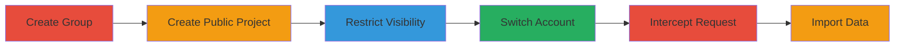

# GitLab Project Template Bypass to Copy Private Data

Multi-stage attack chain demonstrating a complete attack workflow exploiting three vulnerabilities in GitLab Enterprise Edition to copy private project data, including repositories, issues, snippets, and merge requests, from restricted projects.

## Chain Metrics Dashboard

| Metric | Value |
|--------|-------|
| Chain Status | Unverified |
| Total Steps | 6 |
| Execution Time | ~10 minutes |
| Skill Level | Intermediate |
| Complexity | Medium |
| Impact Level | High |

## Attack Flow Visualization



## Prerequisites & Requirements

### Required Tools

- [[tools/Burp-Suite]]

### Target Environment

- Web platform running GitLab EE
- Required services: GitLab EE, Sidekiq
- Network access requirements: Access to GitLab instance via web browser

### Initial Access Requirements

- Two GitLab user accounts (one for setup, one for exploitation)
- Network position: External access to GitLab instance
- Prior access needed: Authenticated user sessions

## Detailed Attack Procedures

### Step 1: Create Group - [[procedures/Create-Group-and-Public-Project-in-GitLab]]

**Procedure**: [[procedures/Create-Group-and-Public-Project-in-GitLab]]

**Objective**: Set up a group and public project to host the restricted data.

**Expected Output**: A new group with ID 1 and a public project named 'test_project'.

**Success Indicators**:
- Group creation confirmed in GitLab dashboard
- Project appears under the group

First, sign in as a normal user and create a group with ID 1.

Then, create a public project named 'test_project' within the group.

### Step 2: Create Public Project - [[procedures/Create-Group-and-Public-Project-in-GitLab]]

**Procedure**: [[procedures/Create-Group-and-Public-Project-in-GitLab]]

**Objective**: Establish the base project for restricting access.

**Expected Output**: Public project created successfully.

**Success Indicators**:
- Project visible in group
- No errors during creation

Create the project as described in the procedure.

### Step 3: Restrict Visibility - [[procedures/Restrict-Project-Visibility-in-GitLab]]

**Procedure**: [[procedures/Restrict-Project-Visibility-in-GitLab]]

**Objective**: Limit access to project features to only members.

**Expected Output**: Visibility settings updated to 'Only Project Members' for Issues, Repository, Wiki, and Snippets.

**Success Indicators**:
- Settings saved without errors
- Non-members cannot access restricted features

Update project settings under Settings > General to restrict visibility.

### Step 4: Switch Account

**Procedure**: [[procedures/Create-Group-and-Public-Project-in-GitLab]] (adapted for new account)

**Objective**: Prepare for exploitation from an unauthorized account.

**Expected Output**: Logged into second account and navigated to project creation page.

**Success Indicators**:
- Successful login
- At http://instance/projects/new

Sign into another account and go to the project creation page.

### Step 5: Intercept Request - [[procedures/Intercept-and-Modify-Project-Creation-Request-in-GitLab]]

**Procedure**: [[procedures/Intercept-and-Modify-Project-Creation-Request-in-GitLab]]

**Objective**: Manipulate the project creation request to bypass authorizations.

**Expected Output**: Modified POST request sent, importing data from restricted project.

**Success Indicators**:
- Request intercepted and modified successfully
- Parameters set: project[use_custom_template]=true, project[template_name]='test_project', project[group_with_project_templates_id]=1

Use [[tools/Burp-Suite]] to intercept the POST /projects request.

Modify parameters as follows using [[commands/curl-gitlab-project-create]] for reference:

```bash
curl -X POST "http://instance/projects" -d "project[use_custom_template]=true&project[template_name]=test_project&project[group_with_project_templates_id]=1" -H "Authorization: Bearer [token]"
```

### Step 6: Forward Request and Import

**Procedure**: [[procedures/Intercept-and-Modify-Project-Creation-Request-in-GitLab]]

**Objective**: Complete the import of private data to the attacker's project.

**Expected Output**: Data copied after import process completes.

**Success Indicators**:
- Server redirects and shows import in progress
- After a few minutes, repositories, issues, snippets, and merge requests appear in the new project

Forward the modified request and wait for the import to finish.

## Attack Chain Summary

### Key Achievements

1. Bypassed namespace validation for custom templates
2. Selected unauthorized templates due to improper access control
3. Exported confidential data without authorization checks

## Technique & Tactic Coverage

### MITRE ATT&CK Techniques

- [[Exploit Public-Facing Application]]
- [[Valid Accounts]]

### MITRE ATT&CK Tactics

- [[Initial Access]]
- [[Privilege Escalation]]

---

*Last updated: [TIMESTAMP]*
