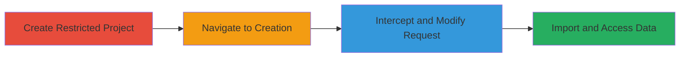

---
tags:
  - gitlab
  - authorization-bypass
  - data-exfiltration
  - web-vulnerability
type: attack_chain
tools:
  - '[[tools/HTTP-Proxy]]'
tactics:
  - '[[Initial Access]]'
  - '[[Credential Access]]'
commands:
  - '[[commands/gitlab-project-creation-post]]'
platforms:
  - Web
  - GitLab
complexity: medium
procedures:
  - '[[procedures/Create-Restricted-Public-Project-in-GitLab]]'
  - '[[procedures/Navigate-to-Project-Creation-in-GitLab]]'
  - '[[procedures/Intercept-and-Modify-GitLab-Project-Creation-Request]]'
  - '[[procedures/Complete-GitLab-Project-Import-and-Access-Data]]'
step_count: 4
techniques:
  - '[[Exploit Public-Facing Application]]'
  - '[[Data from Cloud Storage]]'
description: >-
  Chaining authorization bypasses in GitLab EE to unauthorizedly copy private
  project data from restricted public projects
skill_level: intermediate
impact_level: high
id: 39325ed9-8bca-48a9-ac74-e02f71d09269
created_at: '2025-12-11T06:10:15.878Z'
updated_at: '2025-12-11T06:10:15.878Z'
verified: false
validated: true
submitted: true
mitre_tactics:
  - '[[TA0001]]'
  - '[[TA0006]]'
mitre_techniques:
  - '[[T1190]]'
  - '[[T1530]]'
---
# GitLab Project Template Bypass to Copy Restricted Project Data

Multi-stage attack chain demonstrating how to chain three minor vulnerabilities in GitLab's Enterprise Edition project template functionality to allow unauthorized copying of private project data from public projects with restricted access levels. This exploit bypasses namespace validation, access control checks, and export authorization, enabling attackers to export and import restricted data like repositories, confidential issues, snippets, and merge requests into their own projects.

## Chain Metrics Dashboard

| Metric | Value |
|--------|-------|
| Chain Status | Unverified |
| Total Steps | 4 |
| Execution Time | ~5 minutes |
| Skill Level | Intermediate |
| Complexity | Medium |
| Impact Level | High |

## Attack Flow Visualization



## Prerequisites & Requirements

### Required Tools

- [[tools/HTTP-Proxy]]

### Target Environment

- GitLab EE or CE instance
- Required services: GitLab web interface, Sidekiq for background jobs
- Network access: Standard HTTP/HTTPS access to the GitLab instance

### Initial Access Requirements

- Two GitLab user accounts (one for creating the restricted project, one for exploiting)
- No elevated privileges required; normal user access suffices
- Network position: External access to the public GitLab instance

## Detailed Attack Procedures

### Step 1: Create Restricted Public Project - [[procedures/Create-Restricted-Public-Project-in-GitLab]]

**Objective**: Set up a public project with restricted visibility to simulate a target with sensitive data.

**Instructions**: Sign in to GitLab with a normal user account. Create a new group (e.g., with ID 1). Then create a project named 'test_project' within that group. Navigate to Settings > General and restrict Issues, Repository, Wiki, and Snippets to 'Only Project Members'.

**Expected Output**: A public project with restricted features that non-members cannot access directly.

**Success Indicators**:
- Project is visible publicly but features show access denied to non-members
- Group and project IDs are noted for later use

### Step 2: Navigate to Project Creation - [[procedures/Navigate-to-Project-Creation-in-GitLab]]

**Objective**: Prepare to create a new project using the second account to initiate the exploit.

**Instructions**: Sign in to GitLab with a different user account. Navigate to http://instance/projects/new and begin the process of creating a new project.

**Expected Output**: The project creation form is loaded, ready for request interception.

**Success Indicators**:
- Successful navigation to the creation page without errors
- User is in their own namespace

### Step 3: Intercept and Modify Request - [[procedures/Intercept-and-Modify-GitLab-Project-Creation-Request]]

**Objective**: Bypass authorization by modifying the project creation request to use the restricted project as a template.

**Instructions**: Use [[tools/HTTP-Proxy]] to intercept the POST request to /projects. Modify parameters: set project[use_custom_template] to true, project[template_name] to 'test_project', project[group_with_project_templates_id] to 1 (the target group ID), project[name] and project[path] to desired values, and project[namespace_id] to the attacker's namespace. Execute the modified request using [[commands/gitlab-project-creation-post]].

```http
POST /projects HTTP/1.1
Host: instance
Content-Type: application/x-www-form-urlencoded

project[use_custom_template]=true&project[template_name]=test_project&project[group_with_project_templates_id]=1&project[name]=new_project&project[path]=new_project&project[namespace_id]=attacker_namespace_id
```

**Expected Output**: The request is sent successfully, initiating the import process.

**Success Indicators**:
- Server responds with a redirect to the import progress page
- No immediate authorization errors

### Step 4: Complete Import and Access Data - [[procedures/Complete-GitLab-Project-Import-and-Access-Data]]

**Objective**: Wait for the background import to complete and verify access to the copied sensitive data.

**Instructions**: Forward the modified request and monitor the import progress. After a few minutes, refresh the new project page to access the copied repository, issues, snippets, and merge requests.

**Expected Output**: The new project in the attacker's namespace contains all restricted data from the target project.

**Success Indicators**:
- Imported data is visible and accessible
- Confidential issues and snippets are present without authorization errors

## Attack Chain Summary

### Key Achievements

1. Bypassed namespace validation to use arbitrary templates
2. Exposed restricted project features without proper access checks
3. Exported and imported confidential data via unauthorized jobs

## Technique & Tactic Coverage

### MITRE ATT&CK Techniques

- [[Exploit Public-Facing Application]]
- [[Data from Cloud Storage]]

### MITRE ATT&CK Tactics

- [[Initial Access]]
- [[Credential Access]]

*Last updated: 2023-10-01*
