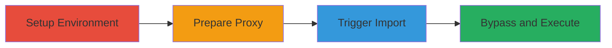

---
tags:
  - rce
  - command-injection
  - gitlab
  - bulk-import
type: attack_chain
tools:
  - '[[tools/Flask]]'
  - '[[tools/Burp-Suite]]'
tactics:
  - '[[Initial Access]]'
  - '[[Execution]]'
commands: []
platforms:
  - Linux
  - GitLab
complexity: medium
procedures:
  - '[[procedures/Setup-GitLab-Environment-for-Testing]]'
  - '[[procedures/Prepare-Malicious-Import-Proxy]]'
  - '[[procedures/Trigger-Bulk-Import-Exploitation]]'
  - '[[procedures/Bypass-Feature-Flag-and-Verify-RCE]]'
step_count: 4
techniques:
  - '[[Exploit Public-Facing Application]]'
  - '[[Command-Line Interface]]'
description: >-
  Exploitation of a command injection vulnerability in GitLab's bulk import
  feature leading to remote code execution on the server
skill_level: advanced
impact_level: high
id: bfde1c7a-01f5-4026-91c7-a6f32282f13f
created_at: '2025-12-11T03:48:06.018Z'
updated_at: '2025-12-11T03:48:06.018Z'
verified: false
validated: true
submitted: true
mitre_tactics:
  - '[[TA0001]]'
  - '[[TA0002]]'
mitre_techniques:
  - '[[T1190]]'
  - '[[T1059]]'
---
# GitLab RCE via Command Injection in DecompressedArchiveSizeValidator

Multi-stage attack chain exploiting a command injection flaw in GitLab's DecompressedArchiveSizeValidator through the Project BulkImports pipeline, leading to remote code execution on the server.

## Chain Metrics Dashboard

| Metric | Value |
|--------|-------|
| Chain Status | Unverified |
| Total Steps | 4 |
| Execution Time | ~30 minutes |
| Skill Level | Advanced |
| Complexity | Medium |
| Impact Level | High |

## Attack Flow Visualization



## Prerequisites & Requirements

### Required Tools

- #gitlab-rails
- #gitlab-ctl
- [[tools/Flask]]
- #ngrok
- #curl
- #nc

### Target Environment

- Linux (Ubuntu 20.04)
- GitLab instance with Ruby 2.7.5, Rails, PostgreSQL 12.10, Redis 6.2.7, Sidekiq 6.4.0
- Ports: 5000, 12345, 8080
- Services: GitLab, PostgreSQL, Redis, Sidekiq

### Initial Access Requirements

- Access to a GitLab instance (local or remote)
- Ability to create API tokens and projects
- Network access to expose local services via ngrok

## Detailed Attack Procedures

### Step 1: Environment Setup - [[procedures/Setup-GitLab-Environment-for-Testing]]

**Objective**: Prepare a testable GitLab instance with necessary features enabled and monitoring in place.

**Instructions**:

Spin up a GitLab instance and enable the bulk import feature using [[commands/gitlab-rails-console]]:

```bash
sudo gitlab-rails console
```

Then execute [[commands/enable-feature-flag]]:

```bash
::Feature.enable(:bulk_import_projects)
```

Start monitoring logs with [[commands/gitlab-ctl-tail]]:

```bash
sudo gitlab-ctl tail
```

Create an API token and set up a new group and project via the GitLab UI.

**Expected Output**: Feature enabled, logs streaming, API token generated, project created.

**Success Indicators**:
- Feature flag confirmation: true
- Logs showing activity
- Successful project creation

### Step 2: Prepare Malicious Proxy - [[procedures/Prepare-Malicious-Import-Proxy]]

**Objective**: Set up a proxy to deliver the malicious import payload injecting commands.

**Instructions**:

Download and modify the api_project_ql.py script to inject a malicious import_source parameter (e.g., '; echo lala > /tmp/1234').

Run the Flask app with [[commands/flask-run]]:

```bash
FLASK_APP=api_project_ql.py flask run
```

Expose it via ngrok using [[commands/ngrok-http]]:

```bash
ngrok http 5000
```

**Expected Output**: Flask server running on port 5000, ngrok tunnel URL generated.

**Success Indicators**:
- Server listening on 127.0.0.1:5000
- Public ngrok URL available

### Step 3: Trigger Import - [[procedures/Trigger-Bulk-Import-Exploitation]]

**Objective**: Initiate the bulk import to trigger the vulnerable pipeline.

**Instructions**:

Use the GitLab UI to import a group from the ngrok URL, triggering the Project BulkImports pipeline.

Wait for the import to timeout, which activates the DecompressedArchiveSizeValidator and injects the command.

**Expected Output**: Import process starts, times out, and command executes (e.g., file created in /tmp).

**Success Indicators**:
- Logs show command execution
- Verification file present on server

### Step 4: Bypass and Verify RCE - [[procedures/Bypass-Feature-Flag-and-Verify-RCE]]

**Objective**: Bypass the feature flag and confirm remote code execution with a reverse shell.

**Instructions**:

Bypass the feature flag using [[commands/curl-bulk-import]]:

```bash
curl 'https://gitlab.com/import/bulk_imports.json' -H ... --data-raw '{"bulk_import":[{"source_type":"project_entity","source_full_path":"group1/project1","destination_namespace":"secret-vakzz","destination_name":"group1aaa"}]}'
```

Set up a listener with [[commands/nc-listen]]:

```bash
nc -vnlkp 12345
```

Verify shell by running commands like [[commands/id]], [[commands/hostname-f]], [[commands/ls-asl]], [[commands/cat-file]], [[commands/ps-auxww]].

**Expected Output**: Reverse shell connection, command outputs confirming server access.

**Success Indicators**:
- Connection received on listener
- Outputs like uid=1000(git), hostname, file contents, process list

## Attack Chain Summary

### Key Achievements

1. Enabled vulnerable feature and monitored execution
2. Injected malicious command via proxy import
3. Triggered RCE leading to server compromise
4. Bypassed restrictions for broader applicability

## Technique & Tactic Coverage

### MITRE ATT&CK Techniques

- [[Exploit Public-Facing Application]]
- [[Command-Line Interface]]

### MITRE ATT&CK Tactics

- [[Initial Access]]
- [[Execution]]

*Last updated: [TIMESTAMP]*
