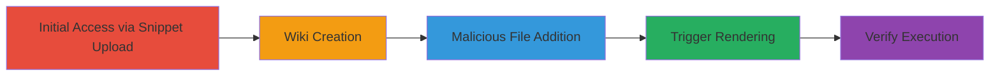

# GitLab RCE via Unsafe Kramdown Inline Options in Wiki Rendering

Multi-stage attack chain demonstrating exploitation of unsafe inline Kramdown options in GitLab Wiki rendering, allowing arbitrary Ruby class instantiation and code execution via uploaded payloads or direct command injection.

## Chain Metrics Dashboard

| Metric | Value |
|--------|-------|
| Chain Status | Unverified |
| Total Steps | 5 |
| Execution Time | ~10 minutes |
| Skill Level | Intermediate |
| Complexity | Medium |
| Impact Level | High |

## Attack Flow Visualization



## Prerequisites & Requirements

### Required Tools

- [[tools/git]]
- [[tools/Kramdown]]
- [[tools/Rouge]]
- [[tools/Redis-rb]]
- [[tools/GetProcessMem]]
- [[tools/nc]]

### Target Environment

- GitLab 13.9.1-ee on Linux
- Required services/ports: GitLab UI (8080), Redis (9100), etc.
- Network access requirements: Access to GitLab instance with wiki push permissions

### Initial Access Requirements

- Credential requirements: GitLab user account with snippet creation and wiki push access
- Network position: External access to GitLab web interface
- Prior access needed: None beyond user account

## Detailed Attack Procedures

### Step 1: Upload Payload - [[procedures/Upload-Ruby-Payload-via-GitLab-Snippet]]

**Procedure**: [[procedures/Upload-Ruby-Payload-via-GitLab-Snippet]]

**Objective**: Upload a malicious Ruby payload to a predictable path on the GitLab server.

**Expected Output**: Payload file uploaded to /uploads/-/system/user/.../payload.rb.

**Success Indicators**:
- Snippet created successfully
- File attachment visible in snippet description

First, create a new snippet using GitLab UI and attach the Ruby payload containing [[commands/ruby-puts-hello]] and [[commands/ruby-echo-tmp-file]]:

```ruby
puts "hello from ruby"
`echo vakzz was here > /tmp/vakzz`
```

Note the upload path for later use.

### Step 2: Create Wiki - [[procedures/Create-and-Initialize-GitLab-Project-Wiki]]

**Procedure**: [[procedures/Create-and-Initialize-GitLab-Project-Wiki]]

**Objective**: Set up a new project and initialize its wiki for payload triggering.

**Expected Output**: Wiki repository created and cloned.

**Success Indicators**:
- New project visible in GitLab
- Default wiki home page created

Create a new project in GitLab UI, then initialize the wiki with a default page. Obtain the clone command.

### Step 3: Add Malicious File - [[procedures/Clone-Wiki-Repository-and-Add-Malicious-RMD-File]]

**Procedure**: [[procedures/Clone-Wiki-Repository-and-Add-Malicious-RMD-File]]

**Objective**: Clone the wiki repo and add a .rmd file with malicious Kramdown options referencing the payload.

**Expected Output**: Malicious page1.rmd added to repo.

**Success Indicators**:
- Repo cloned successfully
- File staged for commit

Clone the repo using [[commands/git-clone-wiki-repo]]:

```bash
git clone git@gitlab-docker.local:root/proj1.wiki.git
```

Add the .rmd file with syntax_highlighter_opts exploiting [[tools/Rouge]] and [[tools/Redis-rb]].

### Step 4: Push and Trigger - [[procedures/Push-Changes-and-Trigger-Wiki-Rendering]]

**Procedure**: [[procedures/Push-Changes-and-Trigger-Wiki-Rendering]]

**Objective**: Commit and push changes, then load the wiki page to trigger rendering and execution.

**Expected Output**: Payload executed during rendering.

**Success Indicators**:
- Changes pushed without errors
- Wiki page loads with potential error in logs

Stage and commit using [[commands/git-add-all]] and [[commands/git-commit-message]]:

```bash
git add -A .
git commit -m "page1.rmd"
```

Then push with [[commands/git-push]]:

```bash
git push
```

Refresh and load page1 in GitLab UI to trigger.

### Step 5: Verify Execution - [[procedures/Verify-Payload-Execution-and-RCE]]

**Procedure**: [[procedures/Verify-Payload-Execution-and-RCE]]

**Objective**: Check logs and filesystem for evidence of code execution.

**Expected Output**: Files like /tmp/vakzz created.

**Success Indicators**:
- Log entries showing execution
- File content verifiable via [[commands/cat-tmp-vakzz]]

Check /tmp with [[commands/cat-tmp-vakzz]]:

```bash
cat /tmp/vakzz
```

For command injection variant, use [[commands/ps-memory-injection]] or [[commands/ruby-echo-inject-tmp]].

## Attack Chain Summary

### Key Achievements

1. Arbitrary Ruby code execution on GitLab server
2. Potential compromise of entire instance
3. Demonstration of chained vulnerabilities in rendering pipeline

## Technique & Tactic Coverage

### MITRE ATT&CK Techniques

- [[Exploit Public-Facing Application]]
- [[Command-Line Interface]]
- [[Exploitation for Client Execution]]

### MITRE ATT&CK Tactics

- [[Initial Access]]
- [[Execution]]
- [[Persistence]]

---

*Last updated: [TIMESTAMP]*
