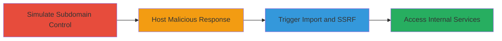

# GitLab SSRF via FogBugz Import Attachment Download

Multi-stage attack chain demonstrating SSRF exploitation in GitLab's FogBugz import feature, where domain whitelisting fails to prevent redirects to localhost, allowing access to internal services like metadata APIs when combined with a vulnerability in a fogbugz.com subdomain.

## Chain Metrics Dashboard

| Metric | Value |
|--------|-------|
| Chain Status | Unverified |
| Total Steps | 3 |
| Execution Time | ~15 minutes |
| Skill Level | Intermediate |
| Complexity | Medium |
| Impact Level | High |

## Attack Flow Visualization



## Prerequisites & Requirements

### Required Tools

- None (relies on manual setup and GitLab instance access)

### Target Environment

- GitLab server running Ruby 2.7.2, Rails, CarrierWave gem
- Services: PostgreSQL 12.4, Redis 5.0.9, Git
- Platforms: Web, Linux
- Network access to fogbugz.com and control over a VPS

### Initial Access Requirements

- Access to a GitLab instance with import permissions
- Control over a VPS to simulate fogbugz.com subdomain
- Vulnerability in fogbugz.com subdomain (e.g., SQLi or takeover) to inject attachment URLs in real scenarios

## Detailed Attack Procedures

### Step 1: Simulate Subdomain Control
procedure: [[procedures/Simulate-FogBugz-Subdomain-Control-via-Hosts-File]]

**Objective**: Redirect a fogbugz.com subdomain to an attacker-controlled VPS to simulate subdomain compromise.

**Instructions**: Modify the GitLab server's /etc/hosts file to point poc.fogbugz.com to the VPS IP using [[commands/add-hosts-entry-for-subdomain-redirect]]:

```bash
echo "198.211.125.160 poc.fogbugz.com" | sudo tee -a /etc/hosts
```

**Expected Output**: The entry is added, and domain resolution now points to the VPS.

**Success Indicators**:
- ping poc.fogbugz.com resolves to 198.211.125.160
- No DNS errors on resolution

### Step 2: Host Malicious Response
procedure: [[procedures/Host-Malicious-FogBugz-API-Response]]

**Objective**: Serve a crafted FogBugz API response containing an attachment URL that points to localhost internal services.

**Instructions**: On the VPS (198.211.125.160), set up a simple HTTP server to respond with XML or JSON simulating FogBugz data, including an attachment URL like http://127.0.0.1:9090/api/v1/targets. Use Python's http.server or nginx for hosting.

**Expected Output**: When accessed via http://poc.fogbugz.com, the server returns the malicious response with the SSRF-triggering URL.

**Success Indicators**:
- curl http://198.211.125.160 returns the crafted response
- The attachment URL is embedded and points to localhost

### Step 3: Trigger SSRF via Import
procedure: [[procedures/Trigger-SSRF-via-GitLab-FogBugz-Import]]

**Objective**: Import a FogBugz repository into GitLab, causing the attachment download to trigger SSRF and store internal content.

**Instructions**: In the GitLab UI, initiate an HTTP import from http://poc.fogbugz.com for the 'SSRF Repository'. GitLab validates the domain but uses Kernel.open to download, resolving to localhost.

**Expected Output**: The imported issue contains content fetched from the internal localhost API (e.g., /api/v1/targets response).

**Success Indicators**:
- Import completes without domain validation errors
- Attached file or issue description includes internal service data

## Attack Chain Summary

### Key Achievements

1. Bypassed GitLab's fogbugz.com whitelisting via hosts file simulation
2. Injected SSRF payload through controlled API response
3. Achieved full GET-based SSRF to localhost, exfiltrating internal metadata

## Technique & Tactic Coverage

### MITRE ATT&CK Techniques

- [[Exploit Public-Facing Application]]

### MITRE ATT&CK Tactics

- [[Initial Access]]
- [[Discovery]]

---
*Last updated: 2023-10-01T00:00:00Z*
