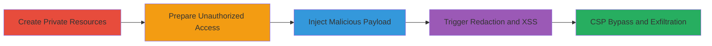

# GitLab Stored XSS via Reference Redaction in Markdown Links

Multi-stage attack chain demonstrating a stored XSS vulnerability in GitLab's markdown rendering, allowing arbitrary HTML/JS injection into public issues/comments by exploiting the ReferenceRedactorFilter's handling of inaccessible private references.

## Chain Metrics Dashboard

| Metric | Value |
|--------|-------|
| Chain Status | Unverified |
| Total Steps | 5 |
| Execution Time | ~15 minutes |
| Skill Level | Intermediate |
| Complexity | Medium |
| Impact Level | High |

## Attack Flow Visualization



## Prerequisites & Requirements

### Required Tools

- GitLab account with project creation permissions
- Second GitLab account without access to private projects
- Access to a public GitLab project for commenting

### Target Environment

- GitLab instance (self-hosted or SaaS)
- Web browser for viewing rendered markdown
- Network access to GitLab API and raw file endpoints
- Services: PostgreSQL 10.12, Redis 5.0.7, GitLab Shell 12.0.0
- Tech stack: Ruby 2.6.5, Rails, Git 2.24.1, Markdown processing

### Initial Access Requirements

- Valid GitLab credentials for two accounts: one with private project access, one without
- Ability to create issues and comments in public projects
- No prior elevated privileges needed, but attacker must control the victim viewer's session indirectly via public content

## Detailed Attack Procedures

### Step 1: Create Private Resources
procedure: [[procedures/Create-Private-Project-and-Issue-for-XSS]]

**Objective**: Set up a private project and issue to serve as the inaccessible reference for redaction-based injection.

**Instructions**: Use the GitLab web interface to create a new private project and add an issue within it. No specific commands are needed; this is done via UI navigation to Projects > New Project > Private visibility, then Issues > New Issue.

**Expected Output**: A private project (e.g., /wbowling/private-project) with issue #1 created.

**Success Indicators**:
- Private project exists and is not visible to unauthorized users
- Issue #1 is present in the private project

### Step 2: Prepare Unauthorized Access
procedure: [[procedures/Prepare-Unauthorized-Account]]

**Objective**: Log in with an account lacking permissions to the private project to simulate a victim viewer.

**Instructions**: Sign out of the privileged account and log in to GitLab using a secondary account that has no membership or visibility to the private project. Verify by attempting to access the private project URL, which should return a 404 or access denied.

**Expected Output**: Successful login with the unauthorized account; private project inaccessible.

**Success Indicators**:
- Unauthorized account active
- Confirmation of no access to private resources

### Step 3: Inject Malicious Payload
procedure: [[procedures/Inject-Malicious-Link-in-Public-Comment]]

**Objective**: Comment on a public issue with a markdown link to the private issue, embedding an HTML-encoded XSS payload in the link text.

**Instructions**: In a public project's issue, add a comment using markdown like: `[link](https://gitlab.com/wbowling/private-project/-/issues/1 "title")xss &lt;img onerror=alert(1) src=x&gt;`. The payload is HTML-encoded in the link text to evade initial sanitization.

**Expected Output**: Comment posted successfully in the public issue.

**Success Indicators**:
- Malicious comment visible in public issue
- Link appears as plain text initially for authorized viewers

### Step 4: Trigger XSS Execution
procedure: [[procedures/Trigger-XSS-via-Redaction]]

**Objective**: View the comment as an unauthorized user, triggering the ReferenceRedactorFilter to unencode and inject the payload as executable HTML.

**Instructions**: Refresh or load the public issue page while logged in as the unauthorized account. The filter will redact the inaccessible link, extracting the 'data-original' attribute content without re-encoding, injecting `` which executes the alert.

**Expected Output**: JavaScript alert(1) pops up on the page load.

**Success Indicators**:
- XSS payload executes (e.g., alert dialog)
- Arbitrary HTML/JS renders in the comment

### Step 5: Advanced Exploitation
procedure: [[procedures/Bypass-CSP-and-Exfiltrate-Access-Token]]

**Objective**: Bypass CSP to load external scripts and exfiltrate sensitive data like personal access tokens.

**Instructions**: Enhance the payload for CSP bypass, e.g., using `<script src="/vakzz-h1/public/-/raw/master/test.js"></script>` hosted via Git LFS for application/javascript MIME type. Verify MIME with [[commands/curl-check-javascript-mime]]:

```bash
curl -I 'https://gitlab.com/vakzz-h1/public/-/raw/master/test.js'
```

Then deploy a payload that prompts token creation and sends it to a remote server, as demonstrated in https://gitlab.com/vakzz-h1/stored-xss/-/issues/4.

**Expected Output**: Script loads and executes, potentially sending token to attacker-controlled server.

**Success Indicators**:
- CSP bypassed; self-hosted JS executes
- Token exfiltrated or prompt appears

## Attack Chain Summary

### Key Achievements

1. Injected stored XSS into public GitLab content via private reference links
2. Bypassed CSP using domain-relative script loading with proper MIME types
3. Demonstrated high-impact exfiltration of personal access tokens for account takeover

## Technique & Tactic Coverage

### MITRE ATT&CK Techniques

- [[JavaScript]]
- [[Drive-by Compromise]]

### MITRE ATT&CK Tactics

- [[Execution]]
- [[Collection]]

---

*Last updated: 2023-10-01T12:00:00Z*
