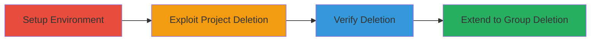

---
tags:
  - gitlab
  - graphql
  - type-confusion
  - unauthorized-deletion
  - privilege-escalation
type: attack_chain
tools:
  - '[[tools/GraphQL-Explorer]]'
  - '[[tools/IRB]]'
tactics:
  - '[[Privilege Escalation]]'
  - '[[Impact]]'
verified: false
platforms:
  - Web
  - GitLab
submitted: true
complexity: medium
created_at: '2023-10-01T00:00:00Z'
procedures:
  - '[[procedures/Create-Private-Project-and-Add-Developer-User]]'
  - '[[procedures/Execute-deleteAnnotation-Mutation-on-Project]]'
  - '[[procedures/Observe-Project-and-Repository-Deletion]]'
  - '[[procedures/Exploit-deleteAnnotation-on-Group]]'
step_count: 4
techniques:
  - '[[Exploit Public-Facing Application]]'
  - '[[Exploitation for Privilege Escalation]]'
updated_at: '2025-12-14T17:29:20.444Z'
description: >-
  Multi-stage attack exploiting insufficient type checking in GitLab's GraphQL
  deleteAnnotation mutation, allowing developers to delete projects,
  repositories, and groups unauthorized.
skill_level: intermediate
impact_level: high
id: 33f9e28b-646b-4fb4-98b8-2f740e2a9c6a
validated: true
mitre_tactics:
  - '[[Privilege Escalation]]'
  - '[[Impact]]'
mitre_techniques:
  - '[[Exploit Public-Facing Application]]'
  - '[[Exploitation for Privilege Escalation]]'
---
# GitLab Type Confusion in deleteAnnotation GraphQL Mutation for Unauthorized Project and Group Deletion

Multi-stage attack chain demonstrating exploitation of a type confusion vulnerability in GitLab's GraphQL API, where developers can delete projects, repositories, and groups by abusing the deleteAnnotation mutation due to missing type validation.

## Chain Metrics Dashboard

| Metric | Value |
|--------|-------|
| Chain Status | Unverified |
| Total Steps | 4 |
| Execution Time | ~5 minutes |
| Skill Level | Intermediate |
| Complexity | Medium |
| Impact Level | High |

## Attack Flow Visualization



## Prerequisites & Requirements

### Required Tools

- [[tools/GraphQL-Explorer]]
- [[tools/IRB]]

### Target Environment

- GitLab instance (e.g., self-hosted or SaaS)
- Required services: PostgreSQL 11.7, Redis 5.0.9, Git 2.27.0, Sidekiq 5.2.9
- Tech stack: Ruby on Rails, Ruby 2.6.6, GraphQL
- Network access: Authenticated access to GitLab GraphQL API

### Initial Access Requirements

- Admin or owner credentials to create projects/groups
- Developer role on target resources
- Access to GitLab Rails console for IRB verification

## Detailed Attack Procedures

### Step 1: Setup Test Environment
procedure: [[procedures/Create-Private-Project-and-Add-Developer-User]]

**Objective**: Establish a controlled environment with a private project and developer user to simulate the vulnerability.

**Instructions**: As an admin or project owner, create a private project and invite a developer user. Use the GitLab UI or API to add the user with Developer role.

**Expected Output**: Project created with ID, user added successfully.

**Success Indicators**:
- Private project exists
- Developer user has access

### Step 2: Exploit Project Deletion
procedure: [[procedures/Execute-deleteAnnotation-Mutation-on-Project]]

**Objective**: Craft and execute the deleteAnnotation GraphQL mutation using the project's global ID to trigger unauthorized deletion.

**Instructions**: Log in as the developer user and use the GraphQL Explorer to send the mutation with the project's GID. Replace <project-id> with the actual ID.

Execute [[commands/deleteAnnotation-Project-Mutation]]:

```graphql
mutation { deleteAnnotation(input: {id: "gid://GitLab/Project/<project-id>"}) { clientMutationId } }
```

**Expected Output**: Successful response with clientMutationId.

**Success Indicators**:
- Mutation returns without error
- Project becomes inaccessible

### Step 3: Verify Deletion Impact
procedure: [[procedures/Observe-Project-and-Repository-Deletion]]

**Objective**: Confirm the deletion of the project and its associated repository due to the type confusion.

**Instructions**: Attempt to access the project via UI or API. Check logs or database if accessible to verify removal.

**Expected Output**: Project and repository no longer exist.

**Success Indicators**:
- 404 error on project access
- Repository contents gone

### Step 4: Extend Exploitation to Groups
procedure: [[procedures/Exploit-deleteAnnotation-on-Group]]

**Objective**: Repeat the exploitation on a group to demonstrate broader impact, using the group's GID.

**Instructions**: Ensure developer permissions on the group, then execute the modified mutation. Replace <group-id> with the actual ID.

Execute [[commands/deleteAnnotation-Group-Mutation]]:

```graphql
mutation { deleteAnnotation(input: {id: "gid://GitLab/Group/<group-id>"}) { clientMutationId } }
```

**Expected Output**: Successful response with clientMutationId.

**Success Indicators**:
- Group deleted
- Associated projects inaccessible

## Attack Chain Summary

### Key Achievements

1. Unauthorized deletion of projects and repositories by developers
2. Extension to group-level deletions, causing widespread data loss
3. Verification of broad permission checks without type validation

## Technique & Tactic Coverage

### MITRE ATT&CK Techniques

- [[Exploit Public-Facing Application]]
- [[Exploitation for Privilege Escalation]]

### MITRE ATT&CK Tactics

- [[Privilege Escalation]]
- [[Impact]]

---

*Last updated: 2023-10-01T00:00:00Z*
