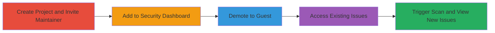

# GitLab Unauthorized Access to Private Project Security Dashboard After Maintainer Demotion

Multi-stage attack chain demonstrating an authorization bypass in GitLab where a user demoted from maintainer to guest retains access to the private project's security dashboard, exposing sensitive vulnerability details, file names, dependencies, and internal structure.

## Chain Metrics Dashboard

| Metric | Value |
|--------|-------|
| Chain Status | Unverified |
| Total Steps | 5 |
| Execution Time | ~10 minutes |
| Skill Level | Intermediate |
| Complexity | Medium |
| Impact Level | High |

## Attack Flow Visualization

## Prerequisites & Requirements

### Required Tools

- GitLab account with project creation privileges
- Second GitLab account for the target user

### Target Environment

- GitLab.com or self-hosted GitLab instance (version affected by CVE or similar, e.g., pre-fix for this issue)
- Private project with security scanning enabled
- Network access to GitLab web interface

### Initial Access Requirements

- Valid GitLab credentials for project owner (User A)
- Valid GitLab credentials for maintainer-turned-guest (User B)
- No prior access needed beyond standard user roles

## Detailed Attack Procedures

### Step 1: Create Private Project and Invite Maintainer
procedure: [[procedures/Create-Private-Project-and-Invite-Maintainer]]

**Objective**: Establish a private project and grant maintainer access to the target user to set up the scenario.

**Instructions**: Log in as User A, create a new private project, and invite User B as a maintainer via the project members settings.

**Expected Output**: User B receives an invitation and can access the project with maintainer permissions.

**Success Indicators**:
- Project created and set to private
- User B added as maintainer and can view/edit project

### Step 2: Add Project to Personal Security Dashboard
procedure: [[procedures/Add-Project-to-Personal-Security-Dashboard]]

**Objective**: Allow the target user to include the project in their personal security dashboard before demotion.

**Instructions**: As User B, navigate to the personal profile, access the security dashboard feature, and add the project to track its security scans.

**Expected Output**: The project appears in User B's personal security dashboard with any existing scan results.

**Success Indicators**:
- Project listed in User B's security dashboard
- Dashboard shows project security status

### Step 3: Demote User to Guest Access
procedure: [[procedures/Demote-User-to-Guest-Access]]

**Objective**: Reduce the target user's permissions to guest level, which should revoke access to sensitive features.

**Instructions**: As User A (project owner), go to project settings > members, and change User B's role from maintainer to guest.

**Expected Output**: User B's role updated to guest; direct project access limited to read-only basics.

**Success Indicators**:
- User B's role changed to guest in project members list
- User B cannot edit project or access maintainer-only features directly

### Step 4: Access Project Security Issues as Guest
procedure: [[procedures/Access-Project-Security-Issues-as-Guest]]

**Objective**: Verify that the demoted user can still view existing security issues via the personal dashboard despite limited project access.

**Instructions**: As User B (now guest), navigate to the personal security dashboard and attempt to view the project's security issues.

**Expected Output**: Dashboard displays vulnerabilities, file locations, and issue details from the project, even though direct project access is restricted.

**Success Indicators**:
- Security issues visible in personal dashboard
- Details include file names and vulnerability specifics

### Step 5: Trigger Security Scan and View New Issues
procedure: [[procedures/Trigger-Security-Scan-and-View-New-Issues]]

**Objective**: Generate new security scan results and confirm unauthorized access to them post-demotion.

**Instructions**: As User A, upload files like .gitlab-ci.yml and package.json to trigger a CI/CD pipeline with security scanning (e.g., using yarn audit for dependencies). Then, as User B, refresh the personal security dashboard.

**Expected Output**: New scan results (e.g., 1 critical, 8 medium, 8 low vulnerabilities) appear in User B's dashboard, revealing dependencies and internal structure.

**Success Indicators**:
- Pipeline completes with security scan
- New issues visible to User B without direct project access

## Attack Chain Summary

### Key Achievements

1. Bypassed permission downgrade to retain security dashboard access
2. Exposed new and existing vulnerabilities, file names, and dependencies
3. Enabled potential exploitation by malicious ex-maintainers through unauthorized disclosure

## Technique & Tactic Coverage

### MITRE ATT&CK Techniques

- [[Valid Accounts]]

### MITRE ATT&CK Tactics

- [[Initial Access]]

---
*Last updated: 2023-10-01T00:00:00Z*
