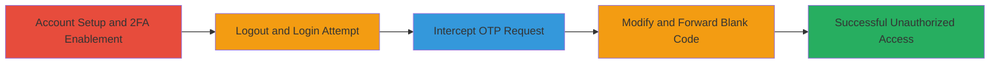

# Glassdoor 2FA Bypass via Blank OTP Code Submission

Multi-stage attack chain demonstrating a complete 2FA bypass workflow on Glassdoor by exploiting a null check failure in OTP verification.

## Chain Metrics Dashboard

| Metric | Value |
|--------|-------|
| Chain Status | Unverified |
| Total Steps | 7 |
| Execution Time | ~5 minutes |
| Skill Level | Intermediate |
| Complexity | Medium |
| Impact Level | High |

## Attack Flow Visualization

## Prerequisites & Requirements

### Required Tools

- [[tools/Burp-Suite]]

### Target Environment

- Web platform (Glassdoor website)
- Required services/ports: HTTPS (443)
- Network access requirements: Internet access to glassdoor.com

### Initial Access Requirements

- Valid Glassdoor account credentials for setup (attacker must have initial access to enable 2FA)
- Network position: Direct internet connectivity
- Prior access needed: Ability to log in to the target account

## Detailed Attack Procedures

### Step 1: Login to Glassdoor and Navigate to Security Settings
procedure: [[procedures/Bypass-Glassdoor-2FA-with-Blank-Code]]

**Objective**: Gain initial access to the account and access 2FA settings to enable protection for later bypass.

**Instructions**: Open a web browser and navigate to https://www.glassdoor.com. Log in using valid credentials. Once logged in, go to the account settings by visiting https://www.glassdoor.com/member/account/securitySettings_input.htm.

**Expected Output**: Security settings page loaded, displaying 2FA options.

**Success Indicators**:
- Successfully logged in to the account.
- Security settings page accessible.

### Step 2: Enable 2FA
procedure: [[procedures/Bypass-Glassdoor-2FA-with-Blank-Code]]

**Objective**: Activate two-factor authentication to set up the vulnerable verification flow.

**Instructions**: In the security settings, locate and enable two-factor authentication (2FA). Follow the prompts to set up an authenticator app or SMS, and verify the initial setup code.

**Expected Output**: 2FA enabled confirmation, with future logins requiring OTP.

**Success Indicators**:
- 2FA status shows as enabled.
- Logout prompt appears after setup.

### Step 3: Logout
procedure: [[procedures/Bypass-Glassdoor-2FA-with-Blank-Code]]

**Objective**: Simulate a fresh login attempt to trigger the 2FA prompt.

**Instructions**: Click the logout button in the account menu to end the current session.

**Expected Output**: Redirected to the login page.

**Success Indicators**:
- Account logged out successfully.
- No active session remains.

### Step 4: Login Again and Observe OTP Prompt
procedure: [[procedures/Bypass-Glassdoor-2FA-with-Blank-Code]]

**Objective**: Initiate the login process to reach the 2FA verification stage.

**Instructions**: Enter credentials on the login page and submit. When prompted for the OTP, enter an incorrect code to trigger the POST request without completing verification.

**Expected Output**: OTP input prompt appears after credential submission.

**Success Indicators**:
- Login form accepts credentials.
- 2FA OTP prompt displayed.

### Step 5: Intercept the POST Request with Incorrect Code Using Burp Suite
procedure: [[procedures/Bypass-Glassdoor-2FA-with-Blank-Code]]

**Objective**: Capture the 2FA verification request for modification.

**Instructions**: Configure your browser to proxy through [[tools/Burp-Suite]]. With intercept enabled, submit an incorrect OTP code. Burp will capture the POST request to the 2FA endpoint (typically containing parameters like username, code, etc.). Do not forward yet.

**Expected Output**: Burp Suite intercepts the request, showing the full HTTP POST body with the 'code' parameter.

**Success Indicators**:
- Request intercepted in Burp.
- 'code' parameter visible with incorrect value.

### Step 6: Remove the Code Parameter and Forward the Request
procedure: [[procedures/Bypass-Glassdoor-2FA-with-Blank-Code]]

**Objective**: Exploit the null check failure by submitting a blank code.

**Instructions**: In the Burp Repeater or Intercept tab, edit the POST request body to remove or empty the 'code' parameter (e.g., delete 'code=wrongcode' entirely). Forward the modified request to the server.

**Expected Output**: Server processes the blank code request without validation error, proceeding to login.

**Success Indicators**:
- Request forwarded successfully.
- No OTP validation error returned.

### Step 7: Disable Intercept and Verify Successful Login
procedure: [[procedures/Bypass-Glassdoor-2FA-with-Blank-Code]]

**Objective**: Confirm the bypass allows full account access.

**Instructions**: Turn off intercept in Burp Suite and refresh the page or continue the login flow. The session should complete without further 2FA prompts.

**Expected Output**: Dashboard or account page loads, indicating authenticated session.

**Success Indicators**:
- Full access to the victim's account.
- No additional verification required.

## Attack Chain Summary

### Key Achievements

1. Enabled 2FA on a target account to simulate protected state.
2. Intercepted and modified OTP verification request to bypass null checks.
3. Achieved unauthorized access despite 2FA being active.

## Technique & Tactic Coverage

### MITRE ATT&CK Techniques

- [[Exploit Public-Facing Application]]
- [[Modify Authentication Process]]

### MITRE ATT&CK Tactics

- [[Initial Access]]

---
*Last updated: 2023-10-01T00:00:00Z*
