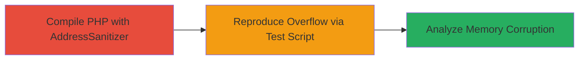

---
tags:
  - buffer-overflow
  - php
  - memory-corruption
  - rce
  - vulnerability-exploitation
type: attack_chain
tools:
  - '[[tools/AddressSanitizer]]'
tactics:
  - '[[Execution]]'
verified: false
platforms:
  - Linux
  - PHP
submitted: true
complexity: medium
created_at: '2023-10-01T00:00:00Z'
procedures:
  - '[[procedures/Reproduce-Buffer-Overflow-in-PHP-mkgmtime]]'
step_count: 2
techniques:
  - '[[Exploitation for Client Execution]]'
updated_at: '2025-12-14T17:28:13.043Z'
description: >-
  A vulnerability chain demonstrating the detection and potential exploitation
  of a global buffer overflow in PHP's mkgmtime() function, which can cause
  memory corruption and enable denial of service or remote code execution in PHP
  applications handling time data.
skill_level: intermediate
impact_level: high
id: 468ac890-69d2-4c62-9029-139b657bfbcb
validated: true
mitre_tactics:
  - '[[Execution]]'
mitre_techniques:
  - '[[Exploitation for Client Execution]]'
---
# Global Buffer Overflow in PHP mkgmtime() Function Leading to Memory Corruption

Multi-stage attack chain demonstrating the detection and reproduction of a global buffer overflow in PHP's internal mkgmtime() function, which processes time data and can lead to memory corruption, crashes, or code execution in vulnerable PHP applications.

## Chain Metrics Dashboard

| Metric | Value |
|--------|-------|
| Chain Status | Unverified |
| Total Steps | 2 |
| Execution Time | ~30 minutes |
| Skill Level | Intermediate |
| Complexity | Medium |
| Impact Level | High |

## Attack Flow Visualization



## Prerequisites & Requirements

### Required Tools

- [[tools/AddressSanitizer]]

### Target Environment

- Linux OS
- PHP source code (version affected, e.g., pre-patch versions)
- C/C++ compiler with AddressSanitizer support (e.g., Clang or GCC)

### Initial Access Requirements

- Access to compile and run PHP binaries
- No network access required; local testing environment

## Detailed Attack Procedures

### Step 1: Compile PHP with AddressSanitizer

procedure: [[procedures/Compile-PHP-with-AddressSanitizer]]

**Objective**: Enable memory error detection in PHP to identify buffer overflows during runtime.

**Instructions**: Download PHP source code and compile it with AddressSanitizer flags using your C/C++ compiler.

First, install dependencies and configure:

```bash
./configure --enable-debug --disable-all
make clean
CC=clang CXX=clang++ CFLAGS="-fsanitize=address -g" LDFLAGS="-fsanitize=address" ./configure --enable-debug --disable-all
make
```

Then build the PHP binary:

```bash
make -j$(nproc)
```

**Expected Output**: A sanitized PHP executable (e.g., sapi/cli/php) ready for testing.

**Success Indicators**:
- Compilation completes without errors
- Binary size increases due to ASan instrumentation

### Step 2: Reproduce Buffer Overflow in mkgmtime()

procedure: [[procedures/Reproduce-Buffer-Overflow-in-PHP-mkgmtime]]

**Objective**: Trigger the global buffer overflow in the mkgmtime() function by processing malformed time data, leading to detectable memory corruption.

**Instructions**: Create a PHP test script that calls functions relying on mkgmtime(), such as gmmktime() with oversized or invalid inputs to overflow the buffer.

Use [[commands/php-run-test]] to execute the script:

```bash
./sapi/cli/php test_overflow.php
```

The script example (test_overflow.php) might include:

```php
<?php
echo gmmktime(0, 0, 0, 1, 1, 2147483647 + 100000); // Overflow trigger
?>
```

AddressSanitizer will report the overflow during execution.

**Expected Output**: ASan error message indicating global buffer overflow in mkgmtime(), such as "AddressSanitizer: global-buffer-overflow on address..." with stack trace pointing to time parsing code.

**Success Indicators**:
- Memory corruption detected
- Crash or ASan report confirms vulnerability

## Attack Chain Summary

### Key Achievements

1. Successful compilation of instrumented PHP binary
2. Reproduction of buffer overflow leading to memory corruption
3. Identification of root cause in improper bounds checking for time manipulation

## Technique & Tactic Coverage

### MITRE ATT&CK Techniques

- [[Exploitation for Client Execution]]

### MITRE ATT&CK Tactics

- [[Execution]]

---
*Last updated: 2023-10-01T00:00:00Z*
