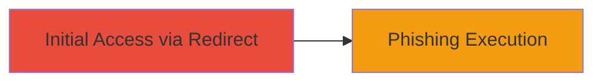

# Goodhire Open Redirect for Phishing Redirection

Multi-stage attack chain demonstrating a complete attack workflow.

## Chain Metrics Dashboard

| Metric | Value |
|--------|-------|
| Chain Status | Unverified |
| Total Steps | 1 |
| Execution Time | ~1 minutes |
| Skill Level | Beginner |
| Complexity | Low |
| Impact Level | Medium |

## Attack Flow Visualization



## Prerequisites & Requirements

### Required Tools

- None specific (browser or curl sufficient)

### Target Environment

- Web application (Goodhire platform)
- No specific ports required (HTTPS/80/443)
- Internet access to craft and test redirect URLs

### Initial Access Requirements

- No credentials needed for testing
- Ability to craft malicious URLs
- Victim interaction (e.g., clicking a link)

## Detailed Attack Procedures

### Step 1: Craft and Test Malicious Redirect
procedure: [[procedures/Exploiting-Open-Redirect-in-Goodhire]]

**Objective**: Identify and exploit the open redirect to send users to a phishing site.

**Instructions**: Construct a URL with a malicious redirect parameter pointing to a controlled phishing domain. Test the redirect using a browser or curl to verify it bypasses validation and lands on the target site.

For example, if the vulnerable endpoint is something like `https://goodhire.com/redirect?url=`, append `evil.com`:

```bash
curl -L "https://goodhire.com/redirect?url=https://evil.com/phish" -o /dev/null -w "%{url_effective}\n"
```

Distribute the crafted link via email or social engineering to trick users into clicking.

**Expected Output**: The response redirects to `https://evil.com/phish` without validation errors.

**Success Indicators**:
- HTTP 302 redirect status to malicious site
- No error messages blocking the redirect
- User browser navigates to phishing page

## Attack Chain Summary

### Key Achievements

1. Successful open redirect exploitation confirming vulnerability
2. Potential for phishing attacks leading to credential compromise
3. Demonstration of low-effort social engineering vector

## Technique & Tactic Coverage

### MITRE ATT&CK Techniques

- [[Drive-by Compromise]]
- [[T1566.002]]

### MITRE ATT&CK Tactics

- [[Initial Access]]

---
*Last updated: 2023-10-01T00:00:00Z*
