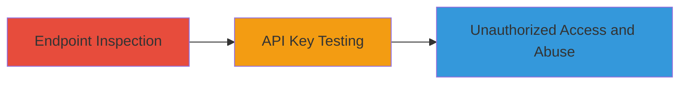

# Google API Key Exposure Leading to Unauthorized Geocode API Access

Multi-stage attack chain demonstrating the discovery of a publicly exposed Google API key in FetLife web endpoints and its exploitation for unauthorized API access, resulting in potential billing costs and denial-of-service risks.

## Chain Metrics Dashboard

| Metric | Value |
|--------|-------|
| Chain Status | Unverified |
| Total Steps | 2 |
| Execution Time | ~5 minutes |
| Skill Level | Beginner |
| Complexity | Low |
| Impact Level | Medium |

## Attack Flow Visualization



## Prerequisites & Requirements

### Required Tools

- Web browser for inspection (e.g., Chrome DevTools)
- [[curl]] for API testing

### Target Environment

- Web platform
- Publicly accessible FetLife subdomains
- No authentication required

### Initial Access Requirements

- Internet access
- No credentials needed
- Public network position

## Detailed Attack Procedures

### Step 1: Endpoint Inspection
procedure: [[procedures/Inspect-Endpoints-for-Exposed-API-Keys]]

**Objective**: Identify and extract publicly exposed API keys from target web endpoints.

**Instructions**: Use a web browser to inspect multiple subdomains of the target site. Open the developer tools (F12) and examine network requests, JavaScript files, or HTML source for hardcoded keys.

For example, navigate to https://fetlife.com/ and inspect the page source or network tab for any exposed strings matching API key patterns like 'AIza...'

**Expected Output**: Exposed key such as 'AIza████████DM' found in endpoint responses.

**Success Indicators**:
- API key pattern detected in client-side code or responses
- Key confirmed as Google API format

### Step 2: API Key Testing
procedure: [[procedures/Test-Leaked-API-Key-for-Unauthorized-Usage]]

**Objective**: Validate the leaked API key by making unauthorized requests to the Google Geocode API and assess potential for abuse.

**Instructions**: Construct a test request using the extracted key against the Google Geocode API endpoint. Use [[commands/curl-test-google-geocode]] to send a latlng query:

```bash
curl "https://maps.googleapis.com/maps/api/geocode/json?latlng=40,30&key=AIza████████DM"
```

If the response returns valid JSON with geocode data, the key is active and unrestricted.

To simulate abuse, repeat requests in a loop to incur costs or trigger rate limits.

**Expected Output**: JSON response with location data, confirming key usability.

**Success Indicators**:
- Valid API response received
- No authentication errors
- Potential for repeated requests observed

## Attack Chain Summary

### Key Achievements

1. Discovered exposed Google API key across multiple FetLife subdomains
2. Confirmed key's validity through Geocode API testing
3. Demonstrated risks of unauthorized usage leading to $5 per 1000 requests and DoS

## Technique & Tactic Coverage

### MITRE ATT&CK Techniques

- [[Unsecured Credentials]] Unsecured Credentials
- [[Cloud Instance Metadata API]] Unsecured Stored Credentials

### MITRE ATT&CK Tactics

- [[Credential Access]] Credential Access

---
*Last updated: 2024-01-01T12:00:00Z*
